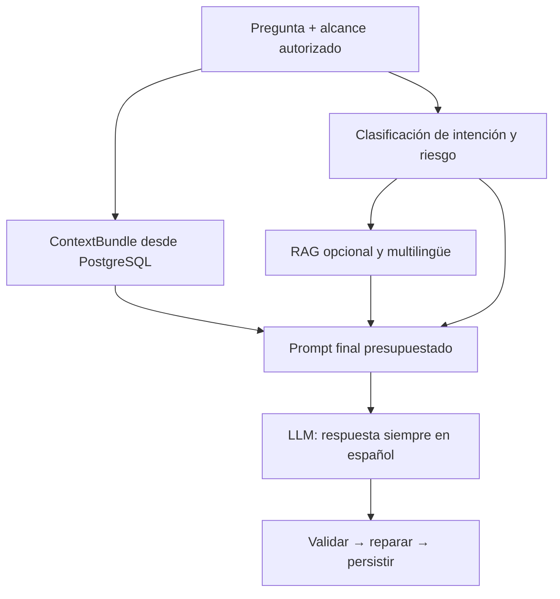

## Resultado de la auditoría

Revisé nuevamente el backend completo de `main`, fijado en el commit [`b9ddd75`](https://github.com/Code-Hdez/hemo/commit/b9ddd75af524c6cf9d7be5edc38bcf0a61b89504): 276 archivos y 74,716 líneas, incluyendo rutas activas, persistencia, RAG, prompts, configuración y pruebas del chat.

El problema no es uno solo. Encontré 24 grupos de defectos. La causa principal es esta:

> PostgreSQL y el motor ML sí producen información útil, pero el chat la recorta, la transforma en hechos no reclamables, obliga a usar RAG para explicar y finalmente rechaza muchas respuestas generadas.

No modifiqué el repositorio.

## Regla arquitectónica definitiva

Según tu requisito, debe cumplirse este invariante:

* La autorización, consultas SQL, selección de contexto, cálculos, clasificación de riesgo y validación pueden ser deterministas.
* Todo texto visible como respuesta del asistente debe ser generado por el LLM.
* Los valores clínicos siguen siendo hechos deterministas provenientes de PostgreSQL, pero el LLM redacta la respuesta.
* Si una respuesta generada es inválida, se intenta una regeneración controlada.
* Si el proveedor no responde o las regeneraciones fallan, se devuelve un error técnico tipado; no se fabrica una respuesta clínica fija y no se guarda un mensaje de asistente.
* Los mensajes técnicos de la API pueden ser deterministas porque no son una respuesta del asistente.

La recomendación anterior que describía respuestas de emergencia, valores o rechazos como “determinísticos” debe entenderse únicamente como lógica o datos deterministas internos, nunca como prosa visible.

## Situación real de los tres modos

| Modo                   | Qué obtiene actualmente                          | Por qué falla                                                                                                                                    |
| ---------------------- | ------------------------------------------------ | ------------------------------------------------------------------------------------------------------------------------------------------------ |
| General                | No carga ninguna mascota                         | La API prohíbe `pet_id` y el repositorio devuelve un contexto vacío                                                                              |
| Hemograma seleccionado | PostgreSQL carga el análisis y sus parámetros    | El selector reduce normalmente todo a 1–4 parámetros y el contrato impide expresar ML, perfil o interpretación                                   |
| Historial              | PostgreSQL carga todos los análisis y parámetros | El prompt compacto elimina clasificación ML, hallazgos, calidad y parte de las fechas; además, cambios clínicos pueden borrar la memoria visible |

Las consultas SQL de propiedad están correctamente protegidas: el modo seleccionado comprueba análisis, usuario y mascota, y el historial carga todos los análisis autorizados de esa mascota ([repositorio SQL, líneas 1711-1798](https://github.com/Code-Hdez/hemo/blob/b9ddd75af524c6cf9d7be5edc38bcf0a61b89504/backend/app/modules/llm_chat/infrastructure/repositories/sqlalchemy_repositories.py#L1711-L1798)). El fallo está principalmente después de la consulta.

# Errores críticos

### 1. El RAG todavía decide si el usuario merece respuesta

Cuando no hay resultados RAG:

* Con datos clínicos, se prohíben explicaciones, causas y mecanismos.
* Sin datos clínicos, se cambia la acción a `INSUFFICIENT_EVIDENCE`.
* El modelo recibe instrucciones para abstenerse.
* Incluso después de generar una respuesta, `ALLOW` puede cambiarse a `INSUFFICIENT_EVIDENCE`.

Esto está implementado en [`send_chat_message.py`, líneas 1049-1078](https://github.com/Code-Hdez/hemo/blob/b9ddd75af524c6cf9d7be5edc38bcf0a61b89504/backend/app/modules/llm_chat/application/use_cases/send_chat_message.py#L1049-L1078) y [líneas 1632-1638](https://github.com/Code-Hdez/hemo/blob/b9ddd75af524c6cf9d7be5edc38bcf0a61b89504/backend/app/modules/llm_chat/application/use_cases/send_chat_message.py#L1632-L1638). Los contratos también exigen evidencia documental para educación veterinaria general ([`response_contracts.py`, líneas 215-236](https://github.com/Code-Hdez/hemo/blob/b9ddd75af524c6cf9d7be5edc38bcf0a61b89504/backend/app/modules/llm_chat/application/services/response_contracts.py#L215-L236)).

Cambio necesario:

* Eliminar la transformación `no sources → INSUFFICIENT_EVIDENCE`.
* Registrar `rag_status=not_found|unavailable|used` solo como metadato.
* Permitir `PARAMETRIC_KNOWLEDGE` como soporte válido.
* Si hay datos de PostgreSQL, usarlos como fuente factual.
* Si hay RAG, enriquecer o respaldar la explicación.
* Si no hay RAG, responder igualmente mediante conocimiento general seguro.

### 2. Existen numerosas respuestas visibles hardcodeadas

El modo general evita completamente el LLM para dosis, medicamentos, diagnóstico, emergencia, tratamiento, prompt injection y fuera de dominio. Persiste respuestas con `llm_invoked=False` y origen `deterministic_safety_boundary` ([líneas 868-954](https://github.com/Code-Hdez/hemo/blob/b9ddd75af524c6cf9d7be5edc38bcf0a61b89504/backend/app/modules/llm_chat/application/use_cases/send_chat_message.py#L868-L954)).

Además, `_safety_fallback_answer()` contiene todos los mensajes fijos, incluido “No se recuperó evidencia documental suficiente...” ([líneas 4577-4643](https://github.com/Code-Hdez/hemo/blob/b9ddd75af524c6cf9d7be5edc38bcf0a61b89504/backend/app/modules/llm_chat/application/use_cases/send_chat_message.py#L4577-L4643)).

También se agrega directamente:

> “Conviene revisar estos resultados con un profesional veterinario.”

sin que lo genere el modelo ([líneas 3433-3463](https://github.com/Code-Hdez/hemo/blob/b9ddd75af524c6cf9d7be5edc38bcf0a61b89504/backend/app/modules/llm_chat/application/use_cases/send_chat_message.py#L3433-L3463)).

Cambio necesario:

* Eliminar `_safety_fallback_answer`.
* Eliminar `_with_required_clinical_referral`.
* Convertir el resultado del clasificador de seguridad en una política enviada al LLM.
* Exigir al envelope generado un claim `SAFETY_BOUNDARY` o `URGENT_REFERRAL`.
* Validar que el contenido requerido exista.
* Ante dos generaciones inválidas, devolver 502/503, no una respuesta fija.

### 3. Las respuestas deterministas pueden guardarse y después devolver 500

El caso anterior produce `response_origin="deterministic_safety_boundary"`, pero `ChatResponse` solo acepta:

* `llm`
* `safety_fallback`
* `legacy_deterministic`

[`api/schemas.py`, líneas 95-113](https://github.com/Code-Hdez/hemo/blob/b9ddd75af524c6cf9d7be5edc38bcf0a61b89504/backend/app/modules/llm_chat/api/schemas.py#L95-L113).

La serialización ocurre después de persistir el resultado ([`router.py`, líneas 522-549](https://github.com/Code-Hdez/hemo/blob/b9ddd75af524c6cf9d7be5edc38bcf0a61b89504/backend/app/modules/llm_chat/api/router.py#L522-L549)). Confirmé que Pydantic produce un `literal_error`.

Cambio necesario:

* Con la nueva arquitectura, todo mensaje completado debe tener `response_origin="llm"`.
* Los fallos del proveedor deben usar el envelope de error de la API, no `ChatResponse`.
* Mientras se migra, corregir inmediatamente el enum para evitar el 500.

### 4. El contrato estructurado impide que el modelo razone sobre la mascota

Cuando hay datos del paciente, el modelo solo puede producir `PATIENT_FACT`. Además:

* Debe copiar exactamente una oración proyectada por el backend.
* No puede modificar la redacción.
* No puede añadir una explicación sin fuente RAG.
* Solo admite hasta cuatro claims del paciente.
* La respuesta documental se limita a un claim.

Esto aparece en [`send_chat_message.py`, líneas 2261-2364](https://github.com/Code-Hdez/hemo/blob/b9ddd75af524c6cf9d7be5edc38bcf0a61b89504/backend/app/modules/llm_chat/application/use_cases/send_chat_message.py#L2261-L2364), [`structured_response.py`, líneas 566-639](https://github.com/Code-Hdez/hemo/blob/b9ddd75af524c6cf9d7be5edc38bcf0a61b89504/backend/app/modules/llm_chat/application/services/structured_response.py#L566-L639) y en la validación final de literalidad ([líneas 3349-3371](https://github.com/Code-Hdez/hemo/blob/b9ddd75af524c6cf9d7be5edc38bcf0a61b89504/backend/app/modules/llm_chat/application/use_cases/send_chat_message.py#L3349-L3371)).

Por eso el modelo puede “ver” parte del contexto, pero su respuesta se rechaza cuando intenta interpretarlo.

Cambio necesario: introducir claims diferenciados:

* `PATIENT_PROFILE_FACT`
* `STUDY_METADATA`
* `LAB_FACT`
* `ML_CLASSIFICATION`
* `ML_FINDING`
* `QUALITY_FLAG`
* `HISTORY_COMPARISON`
* `PARAMETRIC_VETERINARY_KNOWLEDGE`
* `DOCUMENTARY_EVIDENCE`
* `SAFETY_BOUNDARY`
* `LIMITATION`

Se deben validar IDs, números, unidades, pertenencia y seguridad; no exigir una oración exacta ni limitar el hemograma completo a cuatro claims.

### 5. El motor ML está en el contexto, pero no es reclamable

El estudio tiene `classifier_outcome`, observaciones y calidad ([`clinical.py`, líneas 160-234](https://github.com/Code-Hdez/hemo/blob/b9ddd75af524c6cf9d7be5edc38bcf0a61b89504/backend/app/modules/llm_chat/domain/clinical.py#L160-L234)). Sin embargo, para generación solo se materializan hechos cuyo tipo sea `lab_value`; los hechos derivados y ML se excluyen ([`send_chat_message.py`, líneas 814-839](https://github.com/Code-Hdez/hemo/blob/b9ddd75af524c6cf9d7be5edc38bcf0a61b89504/backend/app/modules/llm_chat/application/use_cases/send_chat_message.py#L814-L839)).

Cambio necesario:

* Crear IDs estables para cada clasificación, hallazgo, advertencia de calidad y metadato.
* Incluirlos en el conjunto de hechos reclamables.
* Permitir al modelo relacionar ML y valores sin convertir la clasificación en diagnóstico.

### 6. El modo general no puede conocer a la mascota

La API prohíbe `pet_id` en modo general ([`schemas.py`, líneas 47-60](https://github.com/Code-Hdez/hemo/blob/b9ddd75af524c6cf9d7be5edc38bcf0a61b89504/backend/app/modules/llm_chat/api/schemas.py#L47-L60)). El repositorio devuelve inmediatamente `ClinicalContext(mode="general")` ([líneas 1668-1690](https://github.com/Code-Hdez/hemo/blob/b9ddd75af524c6cf9d7be5edc38bcf0a61b89504/backend/app/modules/llm_chat/infrastructure/repositories/sqlalchemy_repositories.py#L1668-L1690)) y su payload no contiene paciente ([`clinical.py`, líneas 871-884](https://github.com/Code-Hdez/hemo/blob/b9ddd75af524c6cf9d7be5edc38bcf0a61b89504/backend/app/modules/llm_chat/domain/clinical.py#L871-L884)).

También rompe la búsqueda de veterinarias cercanas: esa funcionalidad exige `command.pet_id`, pero la API general lo impide ([líneas 1792-1817](https://github.com/Code-Hdez/hemo/blob/b9ddd75af524c6cf9d7be5edc38bcf0a61b89504/backend/app/modules/llm_chat/application/use_cases/send_chat_message.py#L1792-L1817)).

Cambio necesario:

* Permitir `pet_id` opcional en general.
* Verificar propiedad.
* Cargar solamente el perfil, sin hemogramas salvo que el alcance seleccionado lo autorice.
* Mantener `analysis_id` prohibido en general.

### 7. Se guardan datos de la mascota que nunca llegan al LLM

`Pet` contiene peso, notas, residencia, precisión y consentimiento ([`pets/models.py`, líneas 12-34](https://github.com/Code-Hdez/hemo/blob/b9ddd75af524c6cf9d7be5edc38bcf0a61b89504/backend/app/modules/pets/models.py#L12-L34)). `PatientContext` solo conserva nombre, raza, sexo y edad ([`clinical.py`, líneas 51-79](https://github.com/Code-Hdez/hemo/blob/b9ddd75af524c6cf9d7be5edc38bcf0a61b89504/backend/app/modules/llm_chat/domain/clinical.py#L51-L79)).

Cambio necesario:

* Añadir peso, notas sanitizadas y zona de residencia consentida.
* No enviar latitud/longitud exactas al LLM.
* Calcular edad con respecto a la fecha del estudio cuando corresponda.
* Agregar `species` a la tabla `pets` si el producto atenderá especies distintas de perros. Actualmente está hardcodeado como `canine`.

### 8. El hemograma seleccionado se recorta arbitrariamente

El selector prioriza siempre `WBC`, `HGB`, `HCT`, `PLT`, normalmente limita consultas amplias a cuatro parámetros y patrones a seis ([`clinical_context_selector.py`, líneas 23 y 170-207](https://github.com/Code-Hdez/hemo/blob/b9ddd75af524c6cf9d7be5edc38bcf0a61b89504/backend/app/modules/llm_chat/application/services/clinical_context_selector.py#L170-L207)). El materializador permite aproximadamente 42 hechos con el contexto actual, no el hemograma completo ([`send_chat_message.py`, líneas 802-810](https://github.com/Code-Hdez/hemo/blob/b9ddd75af524c6cf9d7be5edc38bcf0a61b89504/backend/app/modules/llm_chat/application/use_cases/send_chat_message.py#L802-L810)).

Para preguntas sobre patrón o preguntas al veterinario, también elimina cifras y unidades ([líneas 2134-2148](https://github.com/Code-Hdez/hemo/blob/b9ddd75af524c6cf9d7be5edc38bcf0a61b89504/backend/app/modules/llm_chat/application/use_cases/send_chat_message.py#L2134-L2148)).

Cambio necesario:

* El inventario completo del estudio seleccionado debe permanecer disponible.
* La intención puede ordenar por prioridad, pero no retirar hechos autorizados necesarios.
* Si el usuario pide el hemograma completo, deben materializarse todos los parámetros persistidos.
* Si el presupuesto obliga a omitir algo, la respuesta no puede afirmar que revisó todo.

### 9. Historial elimina ML, hallazgos y calidad

La versión completa de un estudio contiene `observations`, `quality_flags`, `extraction_confidence` y `classifier_outcome`. La versión compacta del historial los elimina ([`clinical.py`, líneas 237-288](https://github.com/Code-Hdez/hemo/blob/b9ddd75af524c6cf9d7be5edc38bcf0a61b89504/backend/app/modules/llm_chat/domain/clinical.py#L237-L288)). El chat usa siempre `compact_history=True`.

Cambio necesario:

Cada elemento histórico debe conservar como mínimo:

* Fecha de muestra y carga.
* Laboratorio y analizador.
* Parámetros relevantes.
* Resultado ML y etiquetas activas.
* Hallazgos.
* Indicadores de calidad y confianza.
* Revisión y procedencia.
* Comparaciones calculadas.

### 10. Cuatro parámetros CBC desaparecen antes de PostgreSQL

El catálogo compartido define 24 parámetros, incluyendo reticulocitos absolutos y porcentuales, PCT y basófilos porcentuales ([`cbc_fields.json`, líneas 1-25](https://github.com/Code-Hdez/hemo/blob/b9ddd75af524c6cf9d7be5edc38bcf0a61b89504/shared/cbc_fields.json#L1-L25)).

El formatter solo recorre 20 rangos ([`formatter.py`, líneas 87-108 y 274-331](https://github.com/Code-Hdez/hemo/blob/b9ddd75af524c6cf9d7be5edc38bcf0a61b89504/backend/app/modules/hematology/formatter.py#L87-L108)). Nunca crea:

* `Reticulocytes`
* `Reticulocytes_pct`
* `PCT`
* `Basophils_pct`

`save_analysis()` persiste exclusivamente lo que ya existe en `lab_values` ([`db/queries.py`, líneas 250-312](https://github.com/Code-Hdez/hemo/blob/b9ddd75af524c6cf9d7be5edc38bcf0a61b89504/backend/app/db/queries.py#L250-L312)).

Cambio necesario:

* Usar un solo registro canónico de los 24 parámetros.
* Separar “parámetro presente” de “rango disponible”.
* Persistir valores aunque el sistema no conozca un rango.
* Ejecutar backfill desde `_case_snapshot.cbc` o el JSON original para análisis antiguos cuando el dato exista.

### 11. El formatter afirma normalidad que el ML no demostró

Si el clasificador no activa ninguna etiqueta, el formatter escribe:

> “Los valores del hemograma se encuentran dentro de los rangos...”

y:

> “Sin patrones hematológicos fuera del rango esperado.”

[`formatter.py`, líneas 248-272](https://github.com/Code-Hdez/hemo/blob/b9ddd75af524c6cf9d7be5edc38bcf0a61b89504/backend/app/modules/hematology/formatter.py#L248-L272).

“No se detectó una etiqueta objetivo” no significa que todos los valores sean normales. Esas frases falsas terminan dentro de `observations` y pueden llegar al LLM.

Además, `_lab_status()` inventa criticidad cuando un valor supera en 30% el rango ordinario ([líneas 111-118](https://github.com/Code-Hdez/hemo/blob/b9ddd75af524c6cf9d7be5edc38bcf0a61b89504/backend/app/modules/hematology/formatter.py#L111-L118)). Un intervalo de referencia no equivale a un umbral crítico validado.

Cambio necesario:

* Guardar estados ML como datos estructurados.
* No generar diagnósticos o resúmenes clínicos en el formatter.
* No inferir normalidad desde ausencia de etiquetas.
* Solo marcar `critical` si el laboratorio lo proporciona o existe una tabla de umbrales críticos clínicamente aprobada.

### 12. Fechas de muestra, creación y carga están mezcladas

El formatter coloca la fecha de muestra en `created_at` y la fecha real de subida en `_uploaded_at` ([`formatter.py`, líneas 354-364](https://github.com/Code-Hdez/hemo/blob/b9ddd75af524c6cf9d7be5edc38bcf0a61b89504/backend/app/modules/hematology/formatter.py#L354-L364)). La persistencia usa ese mismo `created_at` tanto como creación del registro como `performed_at` ([`db/queries.py`, líneas 227-249](https://github.com/Code-Hdez/hemo/blob/b9ddd75af524c6cf9d7be5edc38bcf0a61b89504/backend/app/db/queries.py#L227-L249)).

Cambio necesario:

* `sampled_at`
* `resulted_at`
* `uploaded_at`
* `created_at` real del registro
* Origen y confianza de cada fecha

El historial debe ordenarse por fecha clínica y usar `uploaded_at`/secuencia como desempate.

### 13. Los IDs de análisis se reducen a ocho caracteres

El UUID de predicción se trunca con `[:8]` ([`application.py`, líneas 1009-1022](https://github.com/Code-Hdez/hemo/blob/b9ddd75af524c6cf9d7be5edc38bcf0a61b89504/backend/app/application.py#L1009-L1022) y [`hematology/service.py`, líneas 275-302](https://github.com/Code-Hdez/hemo/blob/b9ddd75af524c6cf9d7be5edc38bcf0a61b89504/backend/app/modules/hematology/service.py#L275-L302)). Posteriormente `session.merge()` puede reemplazar un análisis existente y borrar sus parámetros si ocurre una colisión ([`db/queries.py`, líneas 239-257](https://github.com/Code-Hdez/hemo/blob/b9ddd75af524c6cf9d7be5edc38bcf0a61b89504/backend/app/db/queries.py#L239-L257)).

Cambio necesario:

* UUID completo como clave primaria.
* ID corto únicamente como campo de presentación.
* Usar inserción que falle ante colisión, no `merge`.
* Mantener IDs antiguos estables durante la migración.

# Errores de memoria, idioma y configuración

### 14. La memoria depende de expresiones regulares españolas

Solo se considera seguimiento si la pregunta comienza con ciertas frases en español ([`conversation_memory.py`, líneas 45-118](https://github.com/Code-Hdez/hemo/blob/b9ddd75af524c6cf9d7be5edc38bcf0a61b89504/backend/app/modules/llm_chat/application/services/conversation_memory.py#L45-L118)). Después, el historial solo llega al modelo si ese regex detectó seguimiento o si la intención es `CHAT_HISTORY` ([`send_chat_message.py`, líneas 1089-1106](https://github.com/Code-Hdez/hemo/blob/b9ddd75af524c6cf9d7be5edc38bcf0a61b89504/backend/app/modules/llm_chat/application/use_cases/send_chat_message.py#L1089-L1106)).

Cambio necesario:

* Incluir una ventana reciente limitada en todos los turnos.
* Usar resolución semántica de referencias.
* Mantener un resumen estructurado.
* Utilizar el transcript de PostgreSQL como respaldo.
* No hacer que “¿y eso?”, “what about that?” o una reformulación dependan de un regex exacto.

### 15. Un nuevo hemograma puede borrar la memoria visible

Si cambia el fingerprint clínico, se incrementa la revisión, se reinicia el índice de turnos y se borran summary/state ([`sqlalchemy_repositories.py`, líneas 234-249](https://github.com/Code-Hdez/hemo/blob/b9ddd75af524c6cf9d7be5edc38bcf0a61b89504/backend/app/modules/llm_chat/infrastructure/repositories/sqlalchemy_repositories.py#L234-L249)). Luego `load_memory()` solo carga mensajes de la nueva revisión ([líneas 336-368](https://github.com/Code-Hdez/hemo/blob/b9ddd75af524c6cf9d7be5edc38bcf0a61b89504/backend/app/modules/llm_chat/infrastructure/repositories/sqlalchemy_repositories.py#L336-L368)).

Al mismo tiempo, el fingerprint activo omite perfil, ML, observaciones, calidad y analizador ([`clinical_context_revision.py`, líneas 17-70](https://github.com/Code-Hdez/hemo/blob/b9ddd75af524c6cf9d7be5edc38bcf0a61b89504/backend/app/modules/llm_chat/application/services/clinical_context_revision.py#L17-L70)).

Cambio necesario:

* Separar `conversation_revision` de `clinical_data_revision`.
* Actualizar los hechos clínicos en cada turno sin ocultar el diálogo anterior.
* Tener un único fingerprint canónico que incluya perfil, ML, calidad y procedencia.
* Conservar autorización estricta por mascota y análisis.

### 16. El `.env` sí carga, pero luego se neutraliza

Pydantic carga correctamente `.env` ([`core/config.py`, líneas 11-18](https://github.com/Code-Hdez/hemo/blob/b9ddd75af524c6cf9d7be5edc38bcf0a61b89504/backend/app/core/config.py#L11-L18)) y composición pasa los valores al cliente ([`composition.py`, líneas 461-475](https://github.com/Code-Hdez/hemo/blob/b9ddd75af524c6cf9d7be5edc38bcf0a61b89504/backend/app/modules/llm_chat/composition.py#L461-L475)).

El problema aparece después:

* Todos los perfiles fijan 512 tokens de salida y 4096 de contexto.
* `_bounded()` permite que `.env` reduzca esos valores, pero no que los aumente.
* El contrato estructurado vuelve a subir `num_predict` a 512.
* El modo general limita `num_ctx` a 3072.
* Reparaciones usan 64, 192, 256 o 512 y temperatura 0 hardcodeados.
* Producción exige exactamente 384/4096.

La prueba incluso exige que un `.env` con 384 termine enviando 512 ([`test_structured_send_chat_message.py`, líneas 274-289](https://github.com/Code-Hdez/hemo/blob/b9ddd75af524c6cf9d7be5edc38bcf0a61b89504/backend/tests/llm_chat/test_structured_send_chat_message.py#L274-L289)).

Cambio necesario:

* Un objeto único `GenerationProfileSettings`.
* Perfiles base y de reparación configurables.
* Loguear valores efectivos.
* No aplicar cambios silenciosos después de leer settings.
* Si producción requiere un perfil certificado, seleccionarlo explícitamente con una variable como `CHAT_QUALIFIED_PROFILE`, no sobrescribir arbitrariamente.

### 17. El presupuesto de contexto no mide realmente el contexto clínico

`maximum_tokens` se guarda como metadato, pero el materializador limita por cantidad de hechos, no por tokens ([`clinical_context_selector.py`, líneas 74-104](https://github.com/Code-Hdez/hemo/blob/b9ddd75af524c6cf9d7be5edc38bcf0a61b89504/backend/app/modules/llm_chat/application/services/clinical_context_selector.py#L74-L104)). El prompt puede eliminar RAG, memoria y resumen, pero nunca compacta adecuadamente el bloque clínico ([`prompt_builder.py`, líneas 207-242](https://github.com/Code-Hdez/hemo/blob/b9ddd75af524c6cf9d7be5edc38bcf0a61b89504/backend/app/modules/llm_chat/application/services/prompt_builder.py#L207-L242)).

Después se añade el contrato JSON y, si excede, se devuelve `context_budget_exceeded` ([`send_chat_message.py`, líneas 2394-2418](https://github.com/Code-Hdez/hemo/blob/b9ddd75af524c6cf9d7be5edc38bcf0a61b89504/backend/app/modules/llm_chat/application/use_cases/send_chat_message.py#L2394-L2418)). La API recomienda crear otra conversación, aunque eso no reduce el hemograma ([`router.py`, líneas 257-262](https://github.com/Code-Hdez/hemo/blob/b9ddd75af524c6cf9d7be5edc38bcf0a61b89504/backend/app/modules/llm_chat/api/router.py#L257-L262)).

Cambio necesario:

* Construir el prompt final de manera atómica.
* Contar con el tokenizer real del modelo.
* Presupuestar sistema, schema, respuesta, datos, memoria y RAG juntos.
* Compactar por prioridad y por tokens.
* Nunca recomendar “nueva conversación” para un problema de tamaño del contexto clínico.

### 18. El RAG es solo parcialmente multilingüe

El embedding configurado es multilingüe ([`config.py`, líneas 147-160](https://github.com/Code-Hdez/hemo/blob/b9ddd75af524c6cf9d7be5edc38bcf0a61b89504/backend/app/core/config.py#L147-L160)), pero después:

* Los aliases son manuales español-inglés.
* La tokenización solo admite `[a-z0-9]`.
* Un resultado semántico se descarta si no comparte términos lexicales reconocidos.
* BM25 elimina escrituras no latinas.
* El reranker es `NoopReranker`.

[`retrieval_service.py`, líneas 65-163](https://github.com/Code-Hdez/hemo/blob/b9ddd75af524c6cf9d7be5edc38bcf0a61b89504/backend/app/modules/llm_chat/application/services/retrieval_service.py#L65-L163), [filtro obligatorio, líneas 525-549](https://github.com/Code-Hdez/hemo/blob/b9ddd75af524c6cf9d7be5edc38bcf0a61b89504/backend/app/modules/llm_chat/application/services/retrieval_service.py#L525-L549), [`bm25_store.py`, líneas 18-21](https://github.com/Code-Hdez/hemo/blob/b9ddd75af524c6cf9d7be5edc38bcf0a61b89504/backend/app/modules/llm_chat/infrastructure/retrieval/bm25_store.py#L18-L21) y [`rerankers.py`, líneas 9-22](https://github.com/Code-Hdez/hemo/blob/b9ddd75af524c6cf9d7be5edc38bcf0a61b89504/backend/app/modules/llm_chat/application/services/rerankers.py#L9-L22).

Cambio necesario:

* Tokenización Unicode.
* Guardar `source_language`.
* Mantener el resultado semántico aunque no haya coincidencia léxica.
* Añadir reranker multilingüe.
* Validar soporte documental con entailment multilingüe, conservando el fragmento original.
* El modelo redacta siempre el claim final en español.

### 19. “Siempre en español” no está garantizado

El validador busca algunas palabras inglesas y caracteres Han ([`output_validator.py`, líneas 177-217](https://github.com/Code-Hdez/hemo/blob/b9ddd75af524c6cf9d7be5edc38bcf0a61b89504/backend/app/modules/llm_chat/application/services/output_validator.py#L177-L217)). Francés, alemán, portugués, árabe o cirílico pueden pasar.

Lo reproduje directamente:

* Una respuesta completa en francés: aceptada.
* Una respuesta completa en alemán: aceptada.
* Español: aceptado.

Cambio necesario:

* `output_language="es"` en schema y prompt.
* Detector real de idioma sobre todo el texto visible.
* Si no es español, una reparación LLM.
* Si la reparación falla, error tipado.
* No aplicar esta restricción al documento RAG original; solo a la respuesta visible.

### 20. El alcance sigue limitado a CBC canino

El clasificador es un conjunto de regex de hematología y por defecto devuelve `OUT_OF_DOMAIN` ([`intent_classifier.py`, líneas 294-415](https://github.com/Code-Hdez/hemo/blob/b9ddd75af524c6cf9d7be5edc38bcf0a61b89504/backend/app/modules/llm_chat/application/services/intent_classifier.py#L294-L415)). Confirmé que:

> “¿Por qué los perros jadean?”

se clasifica como `out_of_domain`.

Los prompts también se identifican exclusivamente como asistente de hemogramas caninos ([`conversational_es.txt`, líneas 1-7](https://github.com/Code-Hdez/hemo/blob/b9ddd75af524c6cf9d7be5edc38bcf0a61b89504/backend/app/modules/llm_chat/prompts/conversational_es.txt#L1-L7)).

Cambio necesario:

* Añadir intención `VETERINARY_EDUCATION`.
* Separar dominio veterinario de dominio hematológico.
* Usar clasificación semántica o un clasificador LLM corto después de las reglas de seguridad.
* Mantener fuera de dominio únicamente contenido no veterinario.

### 21. Los prompts se contradicen

El prompt principal permite conocimiento general y explicaciones, pero exige una recomendación veterinaria en respuestas clínicas ([`system_es.txt`, líneas 3-32](https://github.com/Code-Hdez/hemo/blob/b9ddd75af524c6cf9d7be5edc38bcf0a61b89504/backend/app/modules/llm_chat/prompts/system_es.txt#L3-L32)). El template RAG dice responder “solo con datos del contexto autorizado” ([`rag_es.txt`, líneas 24-31](https://github.com/Code-Hdez/hemo/blob/b9ddd75af524c6cf9d7be5edc38bcf0a61b89504/backend/app/modules/llm_chat/prompts/rag_es.txt#L24-L31)).

Cambio necesario:

* Un único prompt de política.
* Conocimiento general permitido.
* PostgreSQL como autoridad para datos de la mascota.
* RAG como apoyo opcional.
* Sin diagnóstico, tratamiento, medicamento, dosis ni recomendación personalizada.
* No recomendar veterinario en cada respuesta educativa.
* Referir al veterinario cuando el usuario insiste en una decisión clínica, pide acciones no permitidas o describe urgencia.

### 22. El health check trata el RAG como obligatorio

`chat_ready` requiere simultáneamente proveedor, módulo y RAG ([`availability.py`, líneas 115-143](https://github.com/Code-Hdez/hemo/blob/b9ddd75af524c6cf9d7be5edc38bcf0a61b89504/backend/app/core/availability.py#L115-L143)). Composición marca `rag_required=self.rag_enabled` ([`composition.py`, líneas 328-335](https://github.com/Code-Hdez/hemo/blob/b9ddd75af524c6cf9d7be5edc38bcf0a61b89504/backend/app/modules/llm_chat/composition.py#L328-L335)).

Cambio necesario:

* `chat_ready = provider_ready && module_ready`.
* `rag_ready` debe ser una capacidad degradable independiente.
* Un fallo de Chroma no debe apagar respuestas generales ni respuestas basadas en PostgreSQL.

### 23. Comparaciones históricas excesivamente restrictivas

Una comparación completa se invalida si cambian laboratorio, analizador, rango, procedencia, revisión o si falta alguna fecha ([`sqlalchemy_repositories.py`, líneas 2364-2435](https://github.com/Code-Hdez/hemo/blob/b9ddd75af524c6cf9d7be5edc38bcf0a61b89504/backend/app/modules/llm_chat/infrastructure/repositories/sqlalchemy_repositories.py#L2364-L2435)). Dos estudios el mismo día también se consideran no cronológicos.

Cambio necesario:

* Los valores exactos de cada estudio siempre deben poder mostrarse.
* Calcular delta cuando analito y unidad canónica sean compatibles.
* Si cambia laboratorio/rango, mostrar la comparación con advertencia, no ocultarla.
* Unificar normalización de unidades.
* Usar fecha de carga o secuencia para estudios del mismo día.

### 24. Las pruebas verdes certifican el comportamiento equivocado

Resultados locales:

* Todo el Python compiló.
* `ruff`: sin errores.
* Suite `tests/llm_chat`: 646 aprobadas, 1 omitida.

Pero las pruebas exigen que el LLM no se invoque para dosis y emergencias ([`test_send_chat_message.py`, líneas 751-802](https://github.com/Code-Hdez/hemo/blob/b9ddd75af524c6cf9d7be5edc38bcf0a61b89504/backend/tests/llm_chat/test_send_chat_message.py#L751-L802)). La única prueba con Ollama/Qwen real se omite salvo `RUN_OLLAMA_ACCEPTANCE=1` ([`test_ollama_qwen_acceptance.py`, líneas 44-46](https://github.com/Code-Hdez/hemo/blob/b9ddd75af524c6cf9d7be5edc38bcf0a61b89504/backend/tests/llm_chat/test_ollama_qwen_acceptance.py#L44-L46)).

Por eso tener toda la suite verde no demuestra que el chat funcione con PostgreSQL, Chroma y Qwen reales.

## Arquitectura objetivo

`ContextBundle` debería incluir:

* `patient_profile`
* `selected_study`
* `history`
* `ml_outcomes`
* `findings`
* `quality_and_provenance`
* `conversation_memory`
* `optional_rag_evidence`
* `safety_policy`

## Orden correcto de implementación

1. **Cambiar primero las pruebas de contrato**

   Añadir el invariante: ningún mensaje de asistente completado puede tener `llm_invoked=False`.

2. **Eliminar respuestas deterministas y el gate RAG**

   Quitar `_safety_fallback_answer`, `_with_required_clinical_referral`, `deterministic_boundary` y los cambios automáticos a `INSUFFICIENT_EVIDENCE`.

3. **Corregir el contrato estructurado**

   Introducir los nuevos tipos de claims y permitir conocimiento paramétrico, perfil, ML, calidad e historial.

4. **Crear el `ContextBundle` único**

   Cargarlo en todos los modos desde PostgreSQL, con propiedad y alcance verificados.

5. **Corregir persistencia clínica**

   Los 24 campos, UUID completo, fechas separadas, estados ML estructurados y migraciones/backfills.

6. **Corregir general, seleccionado e historial**

   General con mascota opcional; seleccionado con inventario completo; historial con ML, hallazgos y calidad.

7. **Reparar memoria**

   Ventana reciente siempre presente, resolución semántica y revisiones clínicas separadas de la conversación.

8. **Unificar configuración y presupuesto**

   Eliminar valores mágicos, mostrar configuración efectiva y contar tokens del prompt final completo.

9. **Completar español y RAG multilingüe**

   Unicode, reranking multilingüe, validación de idioma y evidencia interlingüística.

10. **Activar pruebas reales de aceptación**

PostgreSQL + Chroma + Ollama/Qwen en staging y como requisito de promoción.

11. **Refactorizar**

`send_chat_message.py` tiene 5,763 líneas. Debe dividirse en carga de contexto, routing, retrieval, prompt, generación, validación y persistencia. También hay implementaciones legacy que ya no participan en la ruta activa y deberían eliminarse después de la migración.

## Criterios mínimos para considerar el chat corregido

* “¿Qué son las plaquetas?” responde en español con RAG vacío o caído.
* La misma pregunta produce redacciones naturales distintas, no la misma abstención fija.
* Una fuente inglesa, francesa o alemana puede respaldar una respuesta española.
* General puede conocer el nombre, raza, edad, peso y zona consentida de la mascota.
* Seleccionado puede mencionar cualquier parámetro persistido, el hallazgo ML y la calidad.
* Historial puede enumerar todos los estudios y sus clasificaciones.
* Los 24 parámetros sobreviven extracción → PostgreSQL → prompt.
* Dosis, tratamiento, diagnóstico insistente y emergencia invocan el LLM para generar el límite.
* Si el LLM está caído, se devuelve error técnico y no se guarda una respuesta clínica fija.
* Francés o alemán visible es rechazado y regenerado en español.
* Cambiar `.env` cambia realmente la solicitud efectiva.
* Chroma caído deja el chat en modo degradado, pero funcional.
* Ninguna respuesta afirma haber revisado datos omitidos por presupuesto.

La base del proyecto es recuperable y tiene buenos componentes: control de propiedad, persistencia normalizada, trazabilidad, contratos y validadores. Lo que debe reemplazarse es la política que convierte esos mecanismos de seguridad en una prohibición casi total para que el modelo explique y converse.
