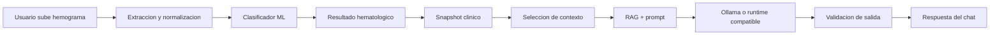
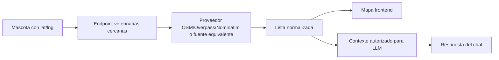

# Diagnostico tecnico LLM/conversacional HemoVet

> **Nota (2026-08-01):** la seccion 6 de este documento ("problema principal:
> contrato frontend-backend") describe el `frontend/` legado, que ya no existe
> en el repositorio (eliminado en `clean: eliminando frontend legacy`). El
> frontend activo es `frontend_4/`, que ya implementa el contrato nuevo
> descrito aqui. Ver [`docs/llm_architecture.md`](docs/llm_architecture.md)
> para el estado real verificado (topologia GCP, flujo LLM actualizado). El
> resto de este diagnostico (bateria formal a re-correr, panel administrativo
> pendiente) sigue vigente.

Fecha: 2026-08-02  
Repositorio revisado: `hemogramas-proyectoICC`  
Transcripcion base: reunion en General del 27 de julio de 2026  
Estado: diagnostico y plan. No se implementaron cambios de codigo.

## 1. Resumen ejecutivo

La reunion dejo tres pendientes principales para el modulo LLM:

1. Integrar los cambios de la LLM al modulo conversacional.
2. Documentar la arquitectura completa de la LLM.
3. Correr una bateria formal de pruebas y documentar resultados.

Ademas, se agregaron dos ejes complementarios: implementar la funcionalidad de mapa para veterinarias cercanas, conectandola tambien con el chat cuando el usuario pregunte por opciones proximas; y evaluar un panel administrativo para usuarios autorizados, donde se puedan ejecutar baterias de prueba, visualizar sus resultados y revisar graficamente las validaciones realizadas por medicos/veterinarios.

El diagnostico principal es este: el backend LLM/RAG esta mucho mas avanzado que la capa visual. Ya existen componentes de seguridad, RAG, memoria, validacion de salida, streaming, persistencia y contexto clinico con clasificacion ML. Sin embargo, el frontend del chat parece seguir usando un contrato anterior, por lo que la integracion visible sigue siendo el riesgo mas alto.

## 2. Revision GCP

La salida de `gcloud` muestra:

- Proyecto activo: `project-5b36701c-f44f-4c03-a12`
- Cuenta activa: `ea.andresbalbuena@gmail.com`
- Cuenta adicional autenticada: `edwinbalbuena189@gmail.com`
- Zona: `us-central1-a`

| VM | Estado | Tipo | vCPU | RAM | Disco | IP privada | IP publica | Preemptible |
| --- | --- | --- | ---: | ---: | ---: | --- | --- | --- |
| `hemovet-prod` | RUNNING | `e2-standard-8` | 8 | 32768 MB | 50 GB | `10.128.0.2` | `136.64.136.49` | No indicado |
| `hemovet-llm-gpu` | TERMINATED | `g2-standard-4` | 4 | 16384 MB | 100 GB | `10.128.0.3` | `34.45.75.48` | Si |

Lectura tecnica:

- `hemovet-prod` parece ser la maquina activa de produccion.
- `hemovet-llm-gpu` esta apagada y es preemptible; probablemente fue pensada para pruebas o inferencia LLM con GPU.
- Si las pruebas formales LLM se corren ahora, hay que decidir si se ejecutan en CPU sobre `hemovet-prod` o si se levanta temporalmente `hemovet-llm-gpu`.
- Si el chat productivo depende de Ollama GPU, la VM GPU terminada es un riesgo operativo. Si usa CPU o runtime externo compatible con OpenAI, eso debe quedar documentado.

## 3. Hallazgos desde la reunion

En la reunion se mencionaron estos problemas:

- La LLM no estaba recibiendo o considerando correctamente la clasificacion del ML.
- Las instrucciones del sistema tuvieron que reducirse/normalizarse por limites de contexto.
- El equipo habia trabajado sobre backend, pero no habia conectado completamente la capa visual.
- Faltaba documentar claramente la arquitectura del LLM.
- Faltaba una bateria formal de pruebas con resultados documentados.
- Se propuso que el modelo/chat pudiera recomendar veterinarias cercanas usando latitud/longitud de la mascota.

El codigo actual muestra que varias piezas ya existen en backend, pero falta cerrar integracion, documentacion y validacion actualizada.

## 4. Arquitectura LLM observada

Componentes principales revisados:

- API del chat: `backend/app/modules/llm_chat/api/router.py`
- Esquemas HTTP: `backend/app/modules/llm_chat/api/schemas.py`
- Caso de uso principal: `backend/app/modules/llm_chat/application/use_cases/send_chat_message.py`
- Construccion de prompts: `backend/app/modules/llm_chat/application/services/prompt_builder.py`
- Prompt RAG: `backend/app/modules/llm_chat/prompts/rag_es.txt`
- Runtime/composicion: `backend/app/modules/llm_chat/composition.py`
- Contexto clinico: `clinical_context_selector.py`, `clinical_facts.py`, `clinical_context_revision.py`
- Persistencia: `infrastructure/repositories/sqlalchemy_repositories.py`
- Snapshots clinicos: `backend/app/modules/llm_chat/snapshots.py`

Flujo conceptual:

Capacidades ya presentes:

- RAG con ChromaDB, FastEmbed y BM25.
- Adaptador Ollama y adaptador OpenAI-compatible.
- Politicas de seguridad.
- Validadores de salida y reclamaciones clinicas.
- Memoria conversacional.
- Streaming SSE.
- Persistencia de conversaciones, turnos, intentos y estados.
- Contexto por mascota, analisis e historial.

## 5. Clasificacion ML en el contexto LLM

El backend ya construye un puente entre ML y LLM:

- `backend/app/modules/hematology/service.py` ejecuta el analisis.
- `backend/app/modules/llm_chat/snapshots.py` crea `_case_snapshot`.
- El snapshot incluye `active_labels`, `qc_labels`, `probabilities`, `feature_values` y `classifier_outcome`.
- `classifier_outcome` incluye `classification_status`, etiquetas activas, probabilidades, version de modelo, version de politica y fecha.
- `backend/app/modules/llm_chat/domain/clinical.py` proyecta `classification_facts` en el contexto publico.

Conclusion: el dato de clasificacion ML ya existe en backend. El riesgo principal es asegurar que el chat visual use el pipeline nuevo y que las pruebas demuestren que la LLM realmente recibe y respeta esa clasificacion.

## 6. Problema principal: contrato frontend-backend

El backend actual espera un contrato nuevo:

- Request con `client_message_id`, `conversation_id`, `message`, `context_scope`, `analysis_id`, `pet_id`, `expected_context_revision`.
- Response con `conversation_id`, `turn_id`, `message_id`, `answer`, `scope`, `case_facts`, `sources`, `warnings`, `usage`, `route_trace`, `context`.

El frontend revisado parece seguir usando contrato anterior:

- Request con `session_id`, `mode`, `context_scope` como `general`, `analysis` o `history`.
- Response con `reply`, `session_id`, `resolved_context`, `generator`, `literature_sources`.

Archivos implicados:

- `frontend/src/features/chat/hooks/useChat.ts`
- `frontend/src/types/index.ts`
- `frontend/src/api/client.ts`
- `backend/app/modules/llm_chat/api/schemas.py`
- `backend/app/modules/llm_chat/api/router.py`

Tambien hay posible desfase de ruta:

- Frontend usa `BASE = "/api"` y llama `"/chat"`.
- Backend, pruebas y documentacion apuntan a `/api/v1/chat`.

Este es el primer punto que debe resolverse.

## 7. Validacion LLM existente

Existe una bateria formal en `validacion_llm/`:

- Casos.
- Scripts.
- Resultados.
- Figuras.
- Rubricas veterinarias.

Incluye:

| Bateria | Mide |
| --- | --- |
| A. Ambito/seguridad | Rechazo adversarial, aceptacion legitima y claridad fuera de ambito |
| B. Robustez ortografica | Respuesta ante preguntas con errores de escritura |
| C. Memoria multi-turno | Uso de contexto previo y analisis cargado |
| D. Consistencia | Variacion entre repeticiones y citas |
| E. Exactitud de contenido | Juicio veterinario sobre correctitud, citas y seguridad |

Limitacion: los resultados observados son del 11 de julio de 2026, antes de la reunion del 27 de julio de 2026. Sirven como antecedente, pero no sustituyen una corrida posterior a la integracion actual.

## 8. Mapa y veterinarias cercanas

Nuevo eje agregado al plan: implementar veterinarias cercanas respecto a la ubicacion de la mascota.

Objetivo:

- Mostrar veterinarias cercanas en el mapa.
- Permitir que el chat recomiende opciones cercanas cuando el usuario lo solicite.

Flujo propuesto:

Archivos candidatos:

- `backend/app/modules/maps/service.py`
- `backend/app/modules/maps/router.py`
- `backend/app/modules/maps/geocoder.py`
- `backend/app/modules/maps/schemas.py`
- `backend/app/modules/pets/models.py`
- `backend/app/modules/pets/schemas.py`
- `frontend/src/features/epidemiology/components/EpidemiologicalMap.tsx`
- `frontend/src/features/epidemiology/components/ResidenceZoneField.tsx`
- `frontend/src/features/chat/hooks/useChat.ts`

Contrato recomendado:

- `GET /api/v1/maps/nearby-veterinarians?lat=...&lng=...&radius_km=...`
- o `GET /api/v1/pets/{pet_id}/nearby-veterinarians`

Respuesta minima:

- `name`
- `lat`
- `lng`
- `distance_km`
- `address`
- `phone`, si existe
- `opening_hours`, si existe
- `source`

Reglas:

- No inventar veterinarias desde la LLM.
- Resolver veterinarias deterministicamente en backend.
- Pasar al prompt solo resultados autorizados.
- Incluir advertencia: llamar antes de acudir, especialmente en urgencias.
- Si no hay ubicacion, pedir configurar residencia o usar ubicacion manual.

## 9. Panel administrativo de validaciones y baterias

Tambien seria conveniente considerar un panel administrativo dentro de la app para ciertos tipos de usuario, por ejemplo administradores, investigadores o responsables de validacion. La idea es que la validacion del sistema no quede solamente como scripts, CSV, notebooks o documentos externos, sino que pueda observarse y, en algunos casos, ejecutarse desde la propia plataforma web.

Objetivos del panel:

- Visualizar baterias de prueba disponibles para LLM/RAG, ML, mapas, extraccion y seguridad.
- Ejecutar baterias controladas desde la app, cuando el entorno lo permita.
- Ver resultados historicos por fecha, version del modelo, VM usada, dataset/casos y estado del runtime.
- Consultar metricas de seguridad, robustez, memoria, consistencia, exactitud clinica y citas apropiadas.
- Visualizar de forma grafica las validaciones hechas por medicos/veterinarios.
- Comparar evaluadores, concordancia, desacuerdos y casos marcados como incorrectos o parcialmente correctos.
- Descargar evidencia en CSV/JSON/PDF para tesis o auditoria.

Este panel seria especialmente util para mostrar de forma mas clara la parte de validaciones que hoy vive en `validacion_llm/`, notebooks y archivos de resultados. En lugar de explicar solo que existen CSV o rubricas, se podria mostrar en la app:

- porcentaje de respuestas correctas/parcialmente correctas/incorrectas/alucinadas;
- porcentaje de respuestas clinicamente seguras;
- porcentaje de citas apropiadas;
- concordancia entre evaluadores;
- casos con desacuerdo;
- evolucion entre corridas de validacion;
- comparacion entre modelo anterior y modelo actual;
- resultados por bateria A-E.

Funcionalidades sugeridas:

1. Dashboard de validacion LLM:
   - tarjetas KPI;
   - graficos por bateria;
   - tabla de casos;
   - filtros por fecha, modelo, bateria y evaluador.

2. Dashboard de validacion medica/veterinaria:
   - carga o lectura de rubricas;
   - visualizacion por evaluador;
   - matriz de desacuerdos;
   - resumen de correctitud, seguridad clinica y citas.

3. Ejecucion de baterias:
   - boton para lanzar pruebas permitidas;
   - estado de ejecucion;
   - logs resumidos;
   - bloqueo por rol;
   - advertencia si requiere VM GPU o runtime Ollama activo.

4. Trazabilidad:
   - version del modelo;
   - version de politica;
   - fecha;
   - VM o entorno;
   - usuario que ejecuto la prueba;
   - archivos generados.

5. Exportacion:
   - CSV para analisis;
   - JSON para trazabilidad;
   - PDF/Markdown para anexos de tesis.

Consideraciones tecnicas:

- No todos los usuarios deben poder ejecutar baterias, porque pueden consumir recursos o afectar la VM.
- Las ejecuciones largas deberian correr como jobs asincronos, no como requests HTTP bloqueantes.
- El panel debe separar datos operativos de datos clinicos sensibles.
- La ejecucion de pruebas con LLM debe registrar el modelo efectivo y el estado del RAG.
- Si `hemovet-llm-gpu` esta apagada, el panel deberia mostrar que ciertas pruebas GPU no estan disponibles.
- Los resultados de validacion veterinaria pueden importarse desde los CSV actuales como primer paso.

Archivos/modulos candidatos:

- Frontend dashboard existente:
  - `frontend/src/features/dashboard/DashboardPage.tsx`
  - `frontend/src/features/dashboard/components/ModelTab.tsx`
  - `frontend/src/features/dashboard/components/DashboardTabs.tsx`
- Backend dashboard:
  - `backend/app/modules/dashboard/router.py`
  - `backend/app/modules/dashboard/service.py`
  - `backend/app/modules/dashboard/schemas.py`
- Validacion LLM:
  - `validacion_llm/resultados/`
  - `validacion_llm/scripts/`
  - `validacion_llm/rubrica_veterinarios/`
- Posible modulo nuevo:
  - `backend/app/modules/validation_admin/`
  - `frontend/src/features/admin-validation/`

Este panel no es indispensable para corregir el problema inmediato del chat, pero seria una mejora fuerte para defensa de tesis, porque permitiria demostrar de manera visual que el sistema fue validado, que resultados obtuvo y que evidencia respalda sus limites.

## 10. Plan actualizado

### Fase 1: Integrar LLM al chat visual

1. Actualizar tipos TypeScript del chat.
2. Generar `client_message_id` en frontend.
3. Reemplazar `session_id` por `conversation_id`.
4. Usar `answer` como contenido visible.
5. Mapear `sources`, `case_facts`, `warnings` y `context`.
6. Usar scopes canonicos: `general`, `selected_hemogram`, `hemogram_history`.
7. Confirmar ruta real `/api/v1/chat`.
8. Manejar errores estructurados del backend.

### Fase 2: Validar clasificacion ML en chat

1. Usar un analisis con etiquetas activas y probabilidades.
2. Preguntar por patrones hematologicos detectados.
3. Confirmar que la respuesta usa los datos del snapshot.
4. Verificar que no diagnostica ni inventa.
5. Agregar pruebas de regresion si falta cobertura.

### Fase 3: Implementar veterinarias cercanas

1. Revisar residencia y coordenadas de mascotas.
2. Crear servicio backend de busqueda cercana.
3. Crear endpoint versionado.
4. Mostrar resultados en mapa.
5. Integrar resultados al chat como contexto autorizado.
6. Probar casos sin coordenadas, sin resultados y orden por distancia.

### Fase 4: Documentar arquitectura completa LLM

Debe incluir:

1. Diagrama de despliegue: frontend, backend, PostgreSQL, ChromaDB, Ollama/runtime, VMs GCP.
2. Diagrama de flujo LLM: entrada, seguridad, contexto, RAG, prompt, modelo, validacion, respuesta.
3. Base de conocimiento: corpus RAG, snapshots clinicos, ML, historial, veterinarias cercanas.
4. Limitaciones: no diagnostica, no receta, no reemplaza veterinario.

### Fase 5: Reejecutar pruebas formales

1. Unitarias backend LLM.
2. Pruebas API `/api/v1/chat` y streaming.
3. Build TypeScript frontend.
4. Bateria LLM A-E.
5. Pruebas de mapa/veterinarias.

Guardar resultados con:

- Fecha.
- VM usada.
- Modelo usado.
- Estado de RAG.
- Resumen de metricas.
- Limitaciones.

### Fase 6: Panel administrativo de validacion

1. Definir roles autorizados: administrador, investigador, evaluador medico/veterinario.
2. Importar resultados existentes desde `validacion_llm/resultados/`.
3. Crear endpoints de lectura para resultados y rubricas.
4. Crear vista web con KPIs, graficos y tablas.
5. Agregar ejecucion controlada de baterias como jobs asincronos.
6. Registrar trazabilidad de cada corrida.
7. Exportar reportes para tesis.

## 11. Prioridades

Alta:

1. Contrato frontend-backend del chat.
2. Ruta `/api` vs `/api/v1`.
3. Demostrar uso de clasificacion ML en chat.
4. Reejecutar validacion formal posterior a integracion.

Media:

1. Veterinarias cercanas.
2. Integracion mapa-chat.
3. Panel administrativo de validaciones.
4. Documentacion final con diagramas.

Baja:

1. Optimizacion de latencia.
2. Mejoras visuales no bloqueantes.
3. Ampliacion del corpus RAG.

## 12. Conclusion

El backend LLM/RAG esta en buen estado arquitectonico, pero la entrega todavia no queda cerrada porque la capa conversacional visual parece desalineada con el contrato actual. La clasificacion ML ya esta disponible en snapshots clinicos, pero se debe demostrar su uso desde el chat real. La bateria formal existe, aunque debe actualizarse despues de integrar. El nuevo modulo de veterinarias cercanas debe implementarse como funcionalidad deterministica de backend/mapa y exponerse al chat como contexto autorizado. Adicionalmente, un panel administrativo de validacion ayudaria a convertir las pruebas, rubricas medicas y resultados en evidencia visible dentro de la propia aplicacion.

La ruta recomendada es: primero integrar frontend con backend LLM actual, luego implementar veterinarias cercanas, despues reejecutar pruebas formales, crear o planificar el panel administrativo de validaciones y finalmente consolidar la documentacion de arquitectura y resultados para tesis.
