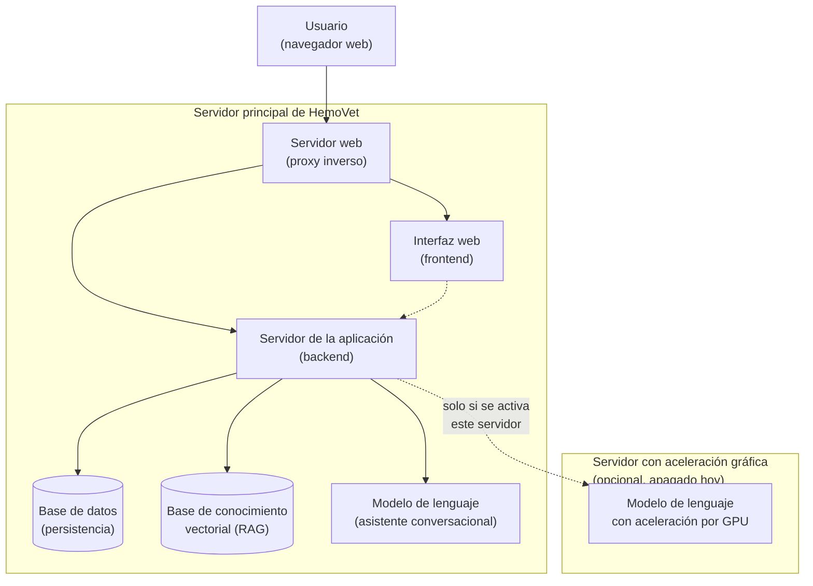
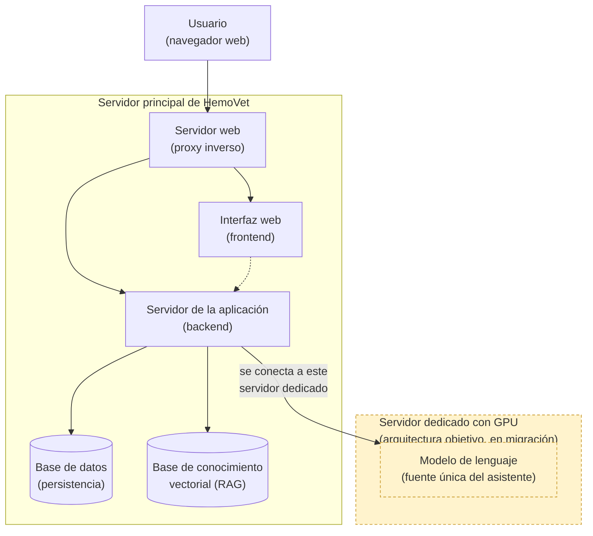
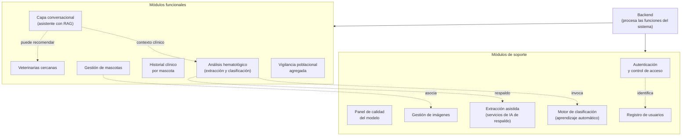
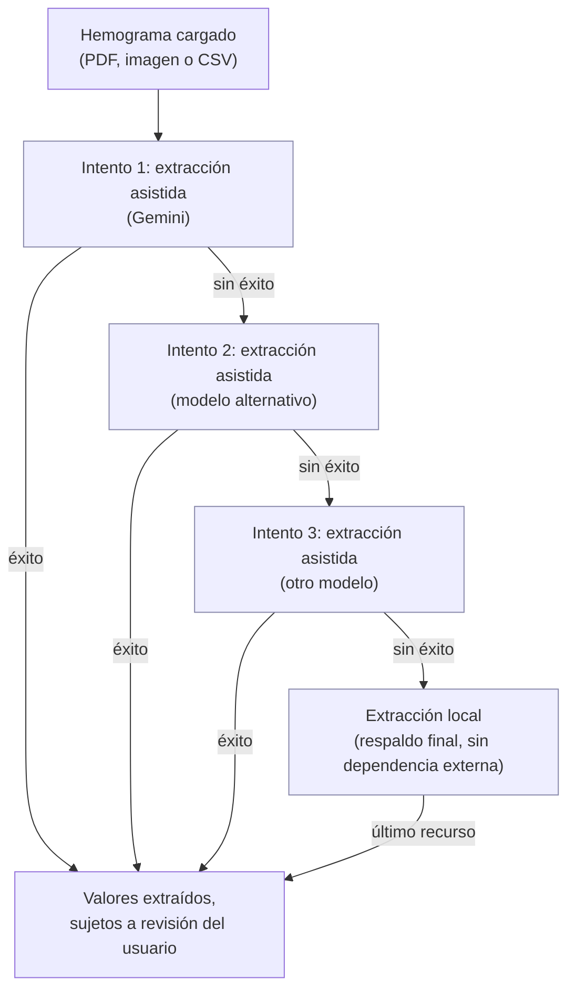
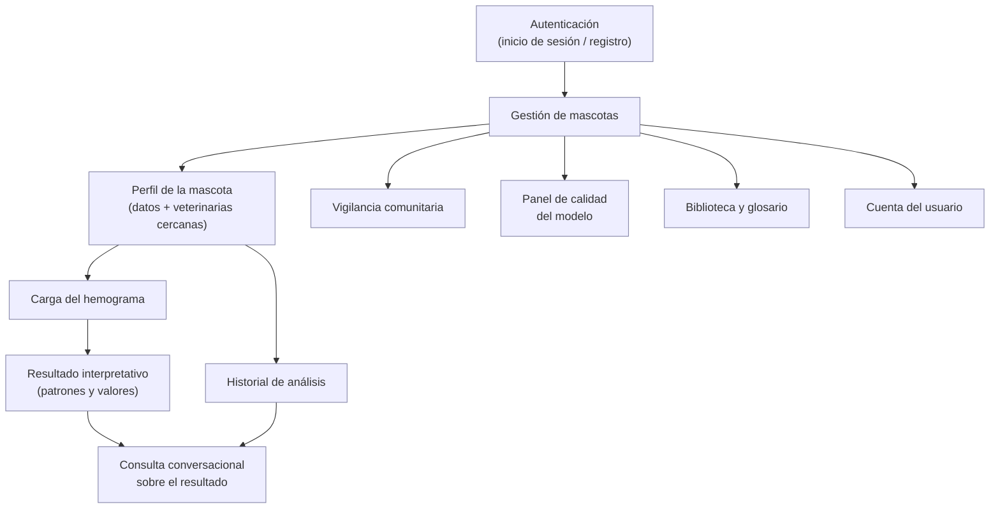
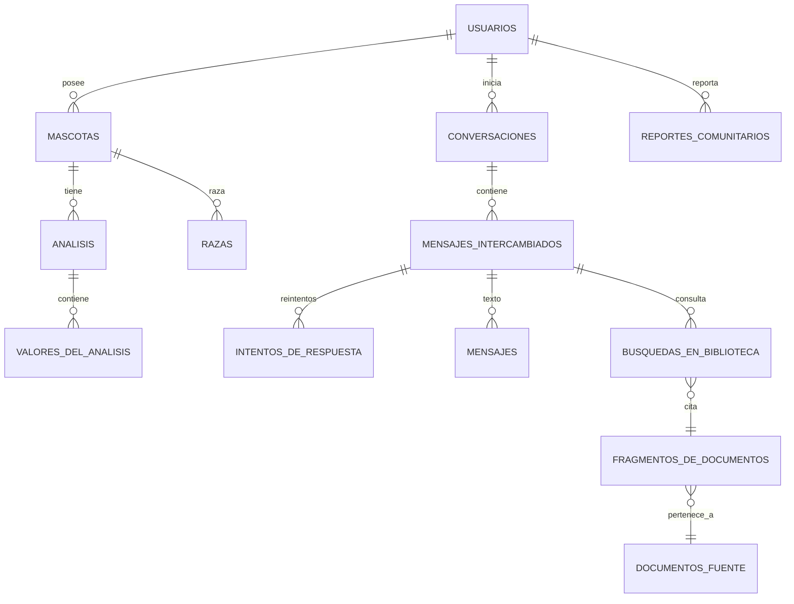
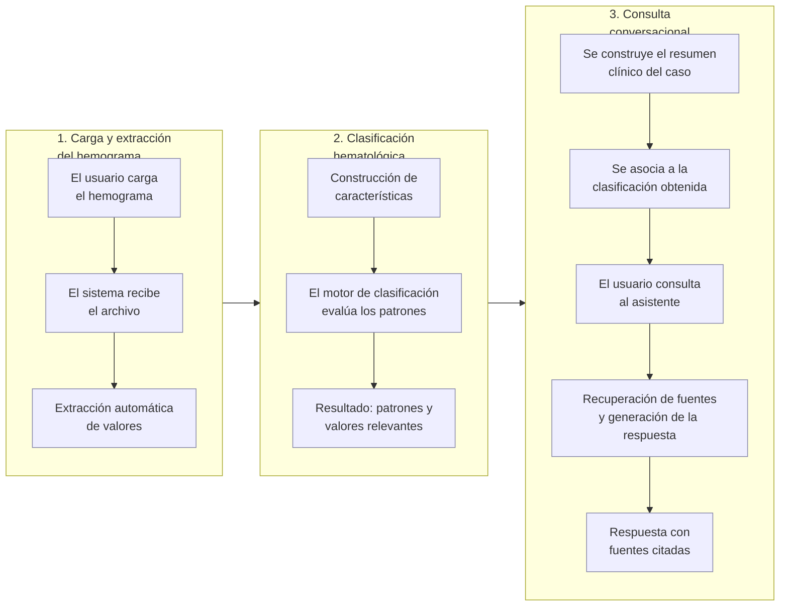
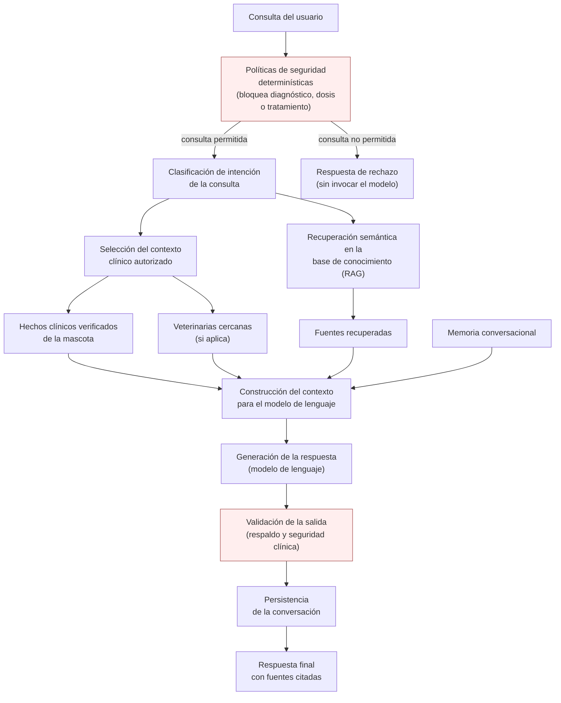
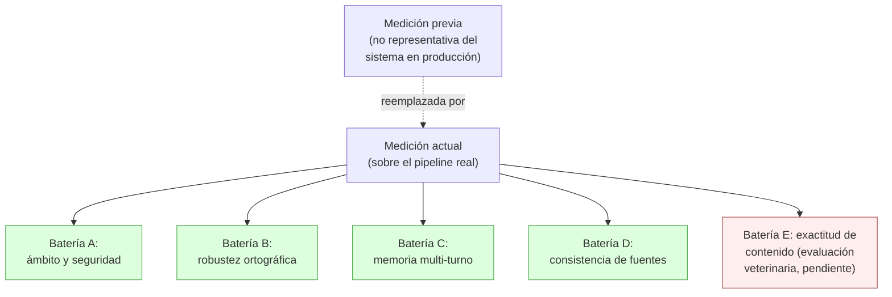

# Arquitectura completa de HemoVet

Fecha: 2026-08-02
Fuentes cruzadas: código actual (`backend/`, `frontend_4/`), `docs/llm_architecture.md`,
`backend/docs/architecture.md`, `backend/docs/llm-rag.md`, minuta de reunión
`Minuta_analitica_corregida_HemoVet_2026-07-20 (1).md`, y resultados en `validacion_llm/`
y `outputs/`.

Este documento cubre **todo el programa**, no solo el módulo LLM: despliegue,
módulos backend, frontend, modelo de datos, y el flujo ML→LLM que fue el foco
de la reunión del 20 de julio de 2026. Todos los diagramas son Mermaid; hay
versión renderizada (PNG) en `docs/diagramas/` para incluir en la tesis.

---

## 1. Despliegue en GCP

| VM | Estado | Tipo | Rol |
| --- | --- | --- | --- |
| `hemovet-prod` | RUNNING | `e2-standard-8` (8 vCPU, 32 GB) | Host único de producción: Caddy + frontend_4 (nginx) + backend FastAPI + PostgreSQL + ChromaDB + Ollama. **Todo CPU-only** por decisión deliberada (`fix(deploy): keep web host CPU-only`, 2026-07-26). |
| `hemovet-llm-gpu` | TERMINATED | `g2-standard-4` (4 vCPU, 16 GB, preemptible) | Host GPU opcional para offload de inferencia. Apagado por defecto; el perfil productivo no depende de él. |



*Nombres técnicos por si se necesitan citar exactamente: servidor web = Caddy;
interfaz web = frontend_4 (nginx); servidor de la aplicación = backend
FastAPI; modelo de lenguaje = Ollama con el modelo
`qwen3:4b-instruct-2507-q4_K_M`.*

### 1.1. Arquitectura objetivo (en migración): GPU como fuente única del LLM

El plan en curso es dejar de correr Ollama en `hemovet-prod` y mover la
inferencia del LLM por completo a `hemovet-llm-gpu`, apuntando
`OLLAMA_BASE_URL` a su IP privada (`10.128.0.3:11434`) sobre la red interna de
GCP. Esto **todavía no está desplegado** — hoy `hemovet-llm-gpu` sigue
desconectada (ver §1) — pero es la topología hacia la que se está migrando, no
solo una posibilidad remota, así que se documenta como diagrama objetivo
aparte del diagrama de estado verificado de arriba.



*Nombres técnicos: servidor dedicado = hemovet-llm-gpu; se conecta mediante
`OLLAMA_BASE_URL` apuntando a su IP privada (`10.128.0.3:11434`).*

Pendiente para que este diagrama deje de ser "objetivo" y pase a ser el
verificado: encender `hemovet-llm-gpu`, instalar/confirmar Docker + Ollama +
el modelo ahí, reconfigurar `OLLAMA_BASE_URL` en el `.env` de `hemovet-prod`
apuntando a la IP privada, y decidir si `docker-compose.gpu.yml` (hoy pensado
como overlay para GPU *en la misma* VM productiva, según su propio comentario)
se reescribe como manifiesto separado para `hemovet-llm-gpu`, o si el overlay
correcto es simplemente no levantar el servicio `ollama` local en
`hemovet-prod` cuando `OLLAMA_BASE_URL` ya apunta afuera.

---

## 2. Módulos del backend y API pública

`backend/app/api/v1/api.py` es el registro canónico. Todo cuelga de
`settings.API_V1_PREFIX` (`/api/v1`).



*Nombres técnicos por dominio: Análisis hematológico = `hematology`;
Capa conversacional = `llm_chat`; Motor de clasificación = `ml`; Extracción
asistida = `gemini_extraction`; Autenticación = `auth`. Todos
cuelgan de `/api/v1` (`backend/app/api/v1/api.py`).*

### 2.1. Cadena de extracción de datos (orden real, verificado en código)



*Nombres técnicos: extracción asistida (Gemini) = Google Gemini; modelo
alternativo = OpenRouter/Gemma; otro modelo = OpenRouter/Nemotron; extracción
local = pdfplumber + pandas + Tesseract. Orden confirmado en
`backend/app/modules/gemini_extraction/service.py:31-66`
(`build_default_attempts`). El P1 ICC (Cap II, §2.1) describe el orden al
revés — dice que Gemma es el método principal y Gemini el respaldo — ver
`revision_tesis_por_capitulo_agosto/04_capitulo_ii_solucion_propuesta/README.md`.*

`ml/` y `files/` y `users/` no exponen router propio: `ml` es invocado
internamente por `hematology.service`, `files` por `pets`, y `users` solo
define el modelo ORM que usa `auth`.

---

## 3. Frontend activo (`frontend_4`)

React + Vite. Contrato HTTP alineado con el backend actual (`/api/v1/*`,
`conversation_id`, `client_message_id`) — el `frontend/` legado con contrato
`session_id`/`reply` fue eliminado el 2026-08-01.



---

## 4. Modelo de datos (entidades principales)



*Nombres físicos de tabla (para quien necesite el detalle técnico):
`users`, `pets`, `analyses`, `analysis_parameters`, `breeds`,
`chat_sessions`, `chat_turns`, `chat_turn_attempts`, `chat_messages`,
`retrieval_events`, `rag_chunks`, `rag_sources`, `epidemiology_events`. A
nivel de API, `chat_sessions`/`chat_turns` se llaman `conversation`/`turn`
(ver sección 6).*

---

## 5. Flujo end-to-end: de la muestra al chat



---

## 6. Pipeline interno LLM/RAG



*Nombres técnicos: Políticas de seguridad = `SafetyPolicy`; Clasificación de
intención = `intent_classifier`/`chat_profile_policy`; Selección del contexto
= `clinical_context_selector`; Recuperación semántica = ChromaDB + FastEmbed
+ BM25; Construcción del contexto = `PromptBuilder`; Validación de la salida
= `OutputValidator`/`ClaimValidator`.*

---

## 7. Minuta 2026-07-20: diagnóstico ML→LLM y estado actual en código

La minuta (`Minuta_analitica_corregida_HemoVet_2026-07-20 (1).md`) documenta una
demo donde la profesora hizo preguntas normales (no adversariales) sobre 3
hemogramas cargados, y detectó que **la respuesta conversacional no estaba
subordinada de forma confiable al resultado del clasificador ML**. Seis casos,
severidad crítica en 4 de 6.

| Caso | Falla observada (20-jul) | Causa raíz señalada en la minuta | Evidencia en el código actual |
| --- | --- | --- | --- |
| 1 | Respuesta parcial: solo mencionó hemoglobina, ignoró comparación entre los 3 hemogramas | Historial no estructurado / recuperación parcial | `build_history_snapshot` (`snapshots.py:256`) arma `recent_analyses[]` cronológico con id+fecha+findings por estudio, y `trend_deltas` compara WBC/RBC/HGB/HCT/PLT entre el último y el anterior |
| 2 | Sugirió que 3 hemogramas compartían patrón cuando solo 2 lo tenían — **"posiblemente ya alucinó"** | Etiquetas no distinguidas por registro / mezcla de valores entre hemogramas | `test_natural_spanish_dates_reject_values_assigned_to_the_wrong_study`, `test_natural_spanish_dates_bind_each_measurement_to_its_study`, `test_temporal_fact_index_rejects_cross_patient_facts` (`test_clinical_snapshot_and_claims.py`) — prueban exactamente este tipo de mezcla cruzada |
| 3 | "No dispongo de fechas" + no listó patrones por hemograma, habló de "hechos clínicos autorizados" (fuga de vocabulario interno) | Fechas/etiquetas no forman parte de un objeto estructurado y verificable | `classifier_outcome.sample_date` y `uploaded_at` ahora son campos explícitos del snapshot (`snapshots.py:196-199`); persiste el riesgo de que el prompt exponga vocabulario interno — no hay prueba específica que lo cubra |
| 4 | Sin respuesta verificable (posible fallo de servidor) | No evaluado por la minuta | No hay caso de prueba reproducible para timeout/fallo del backend bajo este escenario exacto — **pendiente (P0-04)** |
| 5 | Advertencia genérica sin anclarse a la etiqueta cuando no había patrón detectado | No distinguía "sin patrón objetivo" de "todo normal" | `classification_status` ahora tiene el valor explícito `NO_TARGET_PATTERN_DETECTED` distinto de `CLASSIFIED` (`snapshots.py:182-188`), exactamente el campo que la minuta propuso en su §5.3 |
| 6 | Sin respuesta confiable a "¿cuál es el diagnóstico?" | Función no demostrada | El prompt (`rag_es.txt:27`) instruye explícitamente "No diagnostiques"; `claim_validation.py`/`output_claim_validator.py` rechazan afirmaciones de diagnóstico no ancladas — mitigado a nivel de política, pero **no hay un test reproducible con las 6 preguntas literales de la minuta (P0-04)** |

**Lectura general:** el trabajo hecho después del 20 de julio atacó directamente
la causa raíz que pidió la minuta — `classification_status` con
`NO_TARGET_PATTERN_DETECTED` explícito, `sample_date` por estudio, y una
batería de tests unitarios (`test_clinical_snapshot_and_claims.py`,
`test_rag_chat_context.py`) que verifican exactamente los modos de falla de
los Casos 2 y 5 (mezcla entre estudios, fechas mal atadas). Esto es evidencia
fuerte de que **P0-01, P0-02, P0-03 y P0-06 del plan de acción de la minuta ya
están implementados y probados a nivel unitario**.

Lo que **no** está confirmado con evidencia de código:

- **P0-04** — "crear pruebas automatizadas con las preguntas de esta reunión":
  existen pruebas unitarias sobre el snapshot/claims, pero no un test end-to-end
  que reproduzca literalmente las 6 preguntas de la minuta contra
  `send_chat_message` con 3 hemogramas cargados (2 con patrón, 1 sin patrón) y
  compare la respuesta esperada.
- **P1-03** — "mantener el contexto al cambiar de modo o mascota": no se
  verificó en este análisis si existe test de persistencia de contexto al
  cambiar de scope/mascota en frontend_4.
- **P2-01/P2-02** — validación con usuarios externos y veterinarios sobre las
  respuestas nuevas: no hay evidencia de que se haya hecho (ver sección 8).

---

## 8. Baterías de validación: antes y después

`validacion_llm/scripts/correr_eval_pipeline_real.py` reemplazó explícitamente
la medición anterior:



*Nombres técnicos: medición previa = `outputs/llm_guardrails_eval.json`
(código huérfano); medición actual =
`validacion_llm/resultados/eval_llm_pipeline_real.json`.*

**Estado verificado por archivo** (2026-08-02):

| Batería | Harness técnico re-corrido post-integración (2026-08-01) | Juicio veterinario/humano actualizado |
| --- | --- | --- |
| A — Ámbito/seguridad | Sí, `eval_ambito_seguridad.csv` | **No** — `evaluador_1.csv`/`evaluador_2.csv` son del 7–9 de julio, previos a la reunión del 20/27 de julio |
| B — Robustez ortográfica | Sí, `eval_robustez_ortografica.csv` | N/A (métrica automática) |
| C — Memoria multi-turno | Sí, `eval_memoria_multiturno.csv` (0 turnos omitidos) | No aplica juicio subjetivo separado |
| D — Consistencia | Sí, `eval_consistencia.csv` + `resumen_consistencia.csv` | Pendiente — el propio script indica que la equivalencia semántica "la juzgan los veterinarios sobre las respuestas exportadas"; no hay evidencia de que se haya hecho |
| E — Exactitud de contenido | Sí, `exactitud_contenido_crudo.csv` (30 casos) | **No** — `rubrica_contenido_llm_medico1.csv` / `_medico2.csv` tienen las 30 filas con columnas de juicio (`correctitud`, `cita_apropiada`, `seguridad_clinica`, `comentario`) completamente vacías |

Es decir: **la batería del LLM sí se corre** (guardrails, instrucciones,
memoria, consistencia, contenido crudo — todo contra el pipeline real, no el
código huérfano viejo). Lo que **no se corre automáticamente, y tampoco se ha
vuelto a hacer manualmente tras la integración**, es la evaluación de los
veterinarios sobre esas respuestas nuevas (Baterías A-subjetiva, D-subjetiva y
E completas). Ese es el paso humano que falta cerrar antes de poder afirmar
"cumplimiento total" ante el jurado, tal como pide la minuta en su §7 y en las
tareas P2.

---

## 9. Brechas abiertas (resumen)

1. **Juicio veterinario post-integración** (Fase 5 del diagnóstico, P2 de la
   minuta): batería E sin calificar, batería A-subjetiva desactualizada,
   batería D sin juicio de equivalencia semántica.
2. **Test end-to-end de los 6 casos de la minuta** (P0-04): falta un test que
   reproduzca literalmente las preguntas de la demo con 3 hemogramas (2 con
   patrón, 1 sin patrón) y verifique la respuesta contra `classifier_outcome`.
3. **Panel administrativo de validación** (Fase 6 del diagnóstico): no existe
   `validation_admin` ni vista de KPIs/rúbricas en `frontend_4`; el dashboard
   actual solo cubre calidad del modelo ML, no batería LLM.
4. **Mapa visual de veterinarias cercanas**: hoy es un panel de lista
   (`NearbyVeterinaryCarePanel.tsx`), no una capa sobre `SurveillanceMap`.

---

## Apéndice: generar los PNG localmente

El intento con `sudo npm install -g @mermaid-js/mermaid-cli` falla en este
WSL porque Puppeteer no logra descomprimir el Chrome que descarga
(`ERROR: Failed to set up chrome`) y además `/usr/lib/node_modules` requiere
root. La solución que funcionó en esta sesión usa el Chrome del sistema
(`/usr/bin/google-chrome`) y una instalación **local**, sin sudo:

```bash
mkdir -p ~/mermaid-tool && cd ~/mermaid-tool
npm init -y
PUPPETEER_SKIP_DOWNLOAD=true npm install @mermaid-js/mermaid-cli

cat > puppeteer-config.json << 'EOF'
{"executablePath": "/usr/bin/google-chrome", "args": ["--no-sandbox"]}
EOF

node_modules/.bin/mmdc -i diagrama.mmd -o diagrama.png -p puppeteer-config.json
```

`PUPPETEER_SKIP_DOWNLOAD=true` evita que Puppeteer intente bajar su propio
Chrome (el paso que fallaba); `puppeteer-config.json` le dice que use el que
ya está instalado en el sistema.
