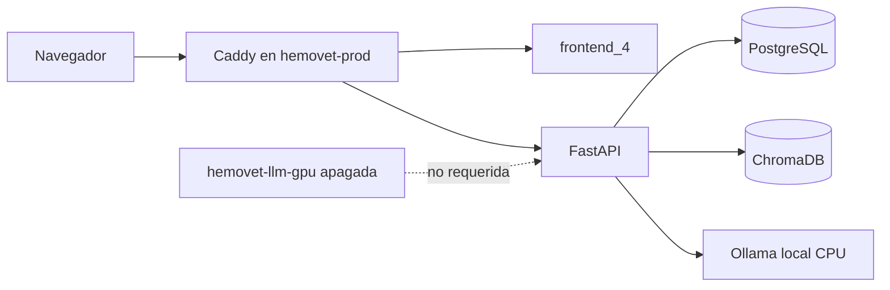

# Estado inicial verificado

Fecha de corte: 2026-08-02. Esta fuente de verdad conserva la línea base de la
migración y no sustituye una nueva inspección de GCP antes de modificar recursos.

## Repositorio

- Base autorizada para la Etapa 1: `origin/dev/agosto` en `a832a617`.
- Rama de trabajo: `dev-agosto/feat-gpu-deployment-separation`.
- `dips.md` era un archivo no rastreado previo del usuario y queda expresamente
  fuera de la migración.
- El router activo está en `backend/app/modules/llm_chat/api/router.py` y se
  registra bajo la API versionada.
- La persistencia real está en
  `backend/app/modules/llm_chat/infrastructure/repositories/sqlalchemy_repositories.py`.
- La promoción RAG prepara `.env.next` mediante
  `backend/scripts/prepare_rag_promotion.py`.

## Arquitectura operativa anterior a la separación

La línea base estableció que producción todavía incluía Ollama local y que la
VM GPU estaba apagada. La Etapa 1 no cambia esa topología.

## Bloqueos preexistentes abordados en la Etapa 1

| Hallazgo | Impacto previo |
| --- | --- |
| El router enviaba `browser_session_hash` a `turn_history()`, pero SQLAlchemy no lo aceptaba | `TypeError` real al recuperar turnos |
| El port no declaraba el contrato completo consumido por el router | Deriva silenciosa entre adaptadores y fakes |
| Compatibilidades por `TypeError` repetían operaciones sin el hash del navegador | Posible reducción del aislamiento de sesión |
| La instalación productiva utilizaba `mv .env.next .env` sin respaldo transaccional | Un fallo posterior podía dejar entorno y colección activa sin rollback exacto |

## Estado externo durante la Etapa 1

No se inspecciona ni modifica producción, GCP o GitHub durante esta etapa. Todo
estado externo debe considerarse `NO VERIFICADO` hasta la etapa que lo vuelva a
comprobar explícitamente.
