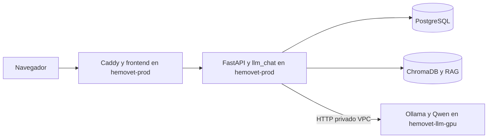

# Arquitectura objetivo



`hemovet-prod` conserva el monolito modular, autenticación, datos clínicos,
persistencia conversacional, RAG, guardrails y observabilidad. La VM GPU solo
ejecutará el runtime de inferencia y sus mecanismos de reconciliación.

## Decisiones vigentes

### D-001 — Conservar `llm_chat` en el monolito

**Alternativas consideradas:** microservicio de chat o bounded context interno.
**Opción seleccionada:** bounded context interno con runtime remoto.
**Motivo:** evita duplicar autenticación, RAG y persistencia.
**Consecuencias:** la caída del proveedor debe degradar solo el chat.
**Rollback:** mantener temporalmente el runtime local hasta completar las etapas
de separación.

### D-002 — Contrato de sesión explícito

**Alternativas consideradas:** compatibilidad dinámica por `TypeError` o port
tipado único.
**Opción seleccionada:** port tipado único con `auth_session_id` y
`browser_session_hash`.
**Motivo:** fallar cerrado ante una implementación incompatible.
**Consecuencias:** todos los fakes deben respetar la misma firma.
**Rollback:** revertir conjuntamente router, port, adaptador y pruebas.

### D-003 — Colecciones RAG inmutables y puntero transaccional

**Alternativas consideradas:** reescribir la colección activa o sustituir el
archivo de entorno completo con respaldo.
**Opción seleccionada:** validar el candidato, respaldar el entorno anterior y
reemplazar atómicamente el archivo completo.
**Motivo:** `RAG_COLLECTION_NAME` forma parte del mismo estado de release.
**Consecuencias:** el rollback restaura bytes exactos y nunca elimina Chroma.
**Rollback:** `manage_deploy_env.py rollback` con la transacción de esa revisión.

### D-004 — Integración CI diferida

**Alternativas consideradas:** modificar el workflow en Etapa 1 o entregar el
mecanismo versionado sin conectarlo.
**Opción seleccionada:** no modificar GitHub Actions, por restricción expresa.
**Motivo:** la Etapa 1 se limita a bloqueos preexistentes.
**Consecuencias:** el workflow existente aún no invoca el gestor transaccional;
su integración deberá aprobarse en la etapa de CI/CD.
**Rollback:** no aplica; no se cambió el workflow.

### D-005 — Liveness, readiness y proveedor son contratos distintos

**Alternativas consideradas:** un único health agregado o probes separados.
**Opción seleccionada:** `hemovet.availability/v1`, con liveness de proceso,
readiness del núcleo y disponibilidad de chat/proveedor independientes.
**Motivo:** una GPU apagada es un estado operativo esperado, no un fallo del
núcleo.
**Consecuencias:** solo una dependencia del núcleo puede producir
`core_ready=false`; Ollama o RAG degradan `chat_ready`.
**Rollback:** revertir el módulo de contrato y las proyecciones de health en un
único commit, conservando los aliases anteriores durante la transición.

### D-006 — RAG requerido para chat completo, no para el núcleo

**Alternativas consideradas:** convertir Chroma en dependencia del núcleo,
ignorar su caída o modelarla como capacidad del chat.
**Opción seleccionada:** cuando `RAG_ENABLED=true`, RAG es requisito de
`chat_ready`; si falta, `core_ready` permanece verdadero y el estado es
`degraded`.
**Motivo:** el código permite rutas conversacionales seguras sin evidencia,
pero las respuestas clínicas completas deben fallar cerradas.
**Consecuencias:** `rag_ready=false` no derriba usuarios, mascotas, hemogramas o
historial; bloquea nuevas generaciones en el frontend y las rutas clínicas
continúan fallando cerradas. No se cambia de colección silenciosamente. Este
comportamiento quedó implementado y probado en la Etapa 5; su uso como gate de
despliegue corresponde a la Etapa 8.
**Rollback:** desactivar la integración del contrato, nunca reescribir una
colección.

### D-007 — Puerto LLM remoto y taxonomía estable

**Alternativas consideradas:** llamadas HTTP dispersas o un port tipado y
versionado.
**Opción seleccionada:** `LLMGenerationPort` para el caso de uso,
`LLMProvider` para composición/health, más
`hemovet.llm-provider/v1`, compatible con Ollama nativo y, de forma opcional,
OpenAI-compatible.
**Motivo:** aplica segregación de interfaces y concentra timeout, reintentos,
cancelación, identidad del modelo y errores reintentables sin mover lógica
clínica a la GPU.
**Consecuencias:** el host privado nunca aparece en health; el request ID se
propaga mediante un header operativo fuera del prompt.
**Rollback:** volver al protocolo local anterior y retirar conjuntamente el
header y sus pruebas.

### D-008 — Un manifiesto inmutable relaciona ambos destinos

**Alternativas consideradas:** tags de imagen independientes, un archivo por VM
o un manifiesto de release único.
**Opción seleccionada:** `hemovet.release/v1`, cuyo `github_sha` debe coincidir
con aplicación y runtime GPU, y cuyas imágenes se identifican por digest.
**Motivo:** evita combinaciones no trazables entre backend, frontend, Ollama,
modelo y colección RAG.
**Consecuencias:** una revisión incompleta no es publicable; el ejemplo
versionado no representa artefactos reales.
**Rollback:** seleccionar un manifiesto anterior completo, sin reconstruir ni
mutar sus artefactos.

### D-009 — Estado deseado inmutable y estado observado separado

**Alternativas consideradas:** modificar el manifiesto al aplicar una revisión
o registrar la aplicación en un estado separado.
**Opción seleccionada:** el manifiesto declara `apply_on=next_boot`,
`pending_boot_validation` y `update_while_running=false`; la reconciliación
registrará el estado observado fuera del manifiesto.
**Motivo:** permite firmar y conservar el manifiesto, y evita actualizaciones en
caliente de una GPU encendida.
**Consecuencias:** la ubicación concreta del estado observado se define en la
Etapa 6.
**Rollback:** volver a publicar como deseado un manifiesto anterior inmutable.

## Topologías Compose formalizadas en la Etapa 4

```text
docker-compose.yml + docker-compose.local.yml
└── aplicación completa + Ollama local (desarrollo)

docker-compose.yml + docker-compose.prod.yml
└── aplicación completa + Caddy, sin Ollama (hemovet-prod)

docker-compose.gpu.yml
└── Ollama + bootstrap + GPU + volumen de modelos (hemovet-llm-gpu)
```

El archivo GPU no es un overlay y nunca se combina con la aplicación. El
backend productivo no depende de `ollama_setup`; `llm_chat`, RAG, historial y
persistencia continúan dentro del monolito. Las decisiones D-010 a D-013, sus
alternativas y rollback están en `14-compose-separation.md`.

## Decisiones de disponibilidad implementadas en la Etapa 5

### D-014 — Construir el módulo antes de preparar el proveedor

**Alternativas consideradas:** warmup/identidad bloqueantes; separar historial
en otro servicio; composición local completa con preparación best-effort.
**Opción seleccionada:** construir repositorios, persistencia, contexto, RAG y
caso de uso antes de iniciar un warmup en background.
**Motivo:** la GPU apagada es un estado esperado y no debe ocultar datos ni
impedir arrancar FastAPI.
**Consecuencias:** el contenedor del chat existe aun con el proveedor ausente;
solo la generación devuelve un error estructurado.
**Rollback:** revertir conjuntamente composición y pruebas, sin tocar datos.

### D-015 — Separar identidad instalada de residencia en GPU

**Alternativas consideradas:** usar `/api/ps` como health único o probes con
semántica explícita.
**Opción seleccionada:** `identity_status()` usa inventario/detalle del modelo y
`runtime_status()` conserva `/api/ps` como telemetría.
**Motivo:** un modelo puede estar instalado y autorizado sin permanecer en
VRAM.
**Consecuencias:** una falla de telemetría no derriba el chat; identidad,
digest o cuantización incorrectos sí fallan cerrados.
**Rollback:** revertir port, adaptadores, composición y pruebas como unidad.

### D-016 — Taxonomía pública independiente del adaptador

**Alternativas consideradas:** exponer errores nativos de cada proveedor o
normalizarlos en la frontera HTTP.
**Opción seleccionada:** códigos `LLM_PROVIDER_*` para HTTP, SSE, health e
historial; los códigos nativos permanecen dentro de infraestructura.
**Motivo:** evita acoplar frontend, observabilidad y registros persistidos a
Ollama.
**Consecuencias:** códigos históricos se traducen al leerlos y no se requiere
reescribir la base de datos.
**Rollback:** revertir normalizador, router y tipos frontend conjuntamente.

### D-017 — Polling frontend conservador y fail-closed

**Alternativas consideradas:** WebSocket adicional, reintento por cada acción o
polling HTTP periódico.
**Opción seleccionada:** `GET /api/v1/chat/health` cada 15 segundos, sin retry
interno ni polling en background, además de refresh al recuperar foco.
**Motivo:** recuperación automática simple sin crear un servicio adicional.
**Consecuencias:** una falla del probe bloquea solo generación; conversación,
historial y navegación permanecen intactos. La recuperación puede tardar hasta
un intervalo.
**Rollback:** retirar query, banner y gates del composer en el mismo revert.

El detalle operativo, matriz y evidencia están en
`15-degradable-backend-frontend.md`.
