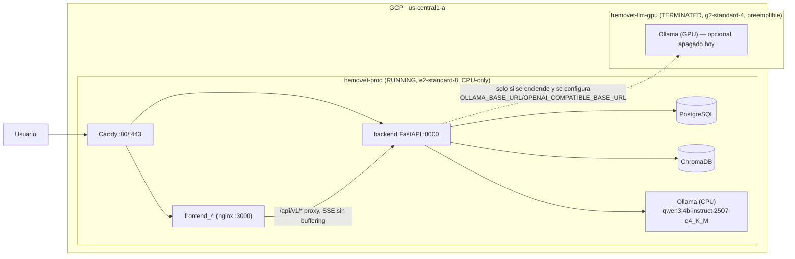
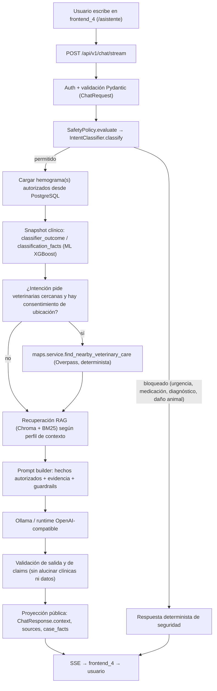

# Arquitectura del asistente LLM/RAG de HemoVet — estado real (2026-08-01)

Este documento es el punto de entrada para entender el asistente conversacional
de punta a punta: despliegue en GCP, flujo interno y contrato con el frontend
activo. No duplica el detalle ya documentado en:

- [`backend/docs/architecture.md`](../backend/docs/architecture.md) — capas del
  bounded context conversacional, flujo del turno, memoria y migraciones.
- [`backend/docs/llm-rag.md`](../backend/docs/llm-rag.md) — contrato RAG,
  runtime del modelo, contrato HTTP completo, pruebas/evaluación y limitaciones
  de diseño.

Este doc agrega lo que faltaba: la topología real en GCP y un diagrama de flujo
end-to-end actualizado, incluyendo el frontend activo (`frontend_4`, no el
`frontend/` legado que se eliminó el 1 de agosto de 2026).

## 1. Despliegue en GCP (estado verificado por `gcloud compute instances list`)

| VM | Estado | Tipo | Rol |
| --- | --- | --- | --- |
| `hemovet-prod` | RUNNING | `e2-standard-8` (8 vCPU, 32 GB) | Host único de producción: Caddy + frontend_4 (nginx) + backend FastAPI + Postgres + ChromaDB + Ollama, **todo CPU-only** por decisión deliberada (`fix(deploy): keep web host CPU-only`, 2026-07-26). |
| `hemovet-llm-gpu` | TERMINATED | `g2-standard-4` (4 vCPU, 16 GB, preemptible) | Host GPU dedicado y **opcional**, pensado para offload de inferencia. No es una falla operativa que esté apagada: el perfil productivo actual no depende de ella (`OLLAMA_BASE_URL`/`OPENAI_COMPATIBLE_BASE_URL` apuntarían a su endpoint privado solo si se decide usarla). Si una demo o batería de pruebas necesita GPU, hay que encenderla explícitamente antes. |

Consecuencia práctica: cualquier batería de validación LLM corrida en producción
hoy usa CPU en `hemovet-prod`. Usar GPU es una decisión explícita (encender
`hemovet-llm-gpu` y repuntar la config), no el estado por defecto.

## 2. Frontend activo

El `frontend/` legado (React + Vite, contrato `session_id`/`reply`) se eliminó
el 2026-08-01 (`clean: eliminando frontend legacy`, commit `d3c06fa`). El
frontend que corre hoy es **`frontend_4/`**, y ya implementa el contrato que
espera el backend actual — no el contrato legado que describía una versión
anterior de este diagnóstico:

- `frontend_4/src/app/api.ts` envía `client_message_id`, `conversation_id`,
  `context_scope`, `expected_context_revision` a `POST /api/v1/chat/stream`.
- Valida en runtime (`isChatResponse`) exactamente el esquema de
  `backend/app/modules/llm_chat/api/schemas.py`
  (`conversation_id`, `message_id`, `answer`, `scope`, `case_facts`, `sources`,
  `warnings`, `usage`, `response_origin`, `stream_mode`, `validation_status`, …).
- Consume el protocolo SSE completo (`turn`, `context`, `status`, `delta`,
  `sources`, `done`, `heartbeat`, `error`) con verificación estricta de
  secuencia y de identidad de conversación/turno.

## 3. Flujo LLM end-to-end (actualizado)

La rama de veterinarias cercanas (paso H/I) es la única pieza nueva respecto al
flujo que ya documenta `llm-rag.md`; el resto de este diagrama es una
proyección visual del mismo contrato descrito ahí en detalle. **Regla dura**:
el LLM nunca inventa nombres de clínicas — solo puede citar las que devuelve
`find_nearby_veterinary_care`, resueltas de forma determinista en el backend, y
la respuesta siempre debe incluir la advertencia de llamar antes de acudir,
especialmente en urgencias.

## 4. Limitaciones (sin cambios respecto a `llm-rag.md`)

- HemoVet es apoyo educativo: no diagnostica, no receta, no reemplaza al
  veterinario.
- Las veterinarias cercanas son informativas (fuente OpenStreetMap/Overpass),
  no una recomendación médica ni una garantía de disponibilidad/calidad.
- Encender `hemovet-llm-gpu` para pruebas o demo GPU es una acción explícita
  fuera de esta pasada de trabajo; no ocurre automáticamente.

## 5. Relación con `diagnostico_llm_gcp_plan.md`

Ese documento (2026-08-02) diagnosticó correctamente los pendientes de la
reunión del 27 de julio, pero su sección 6 ("problema principal: contrato
frontend-backend") describía el `frontend/` legado, que ya no existe. Este doc
reemplaza esa sección; el resto del diagnóstico (batería formal a re-correr,
panel administrativo pendiente) sigue vigente.
