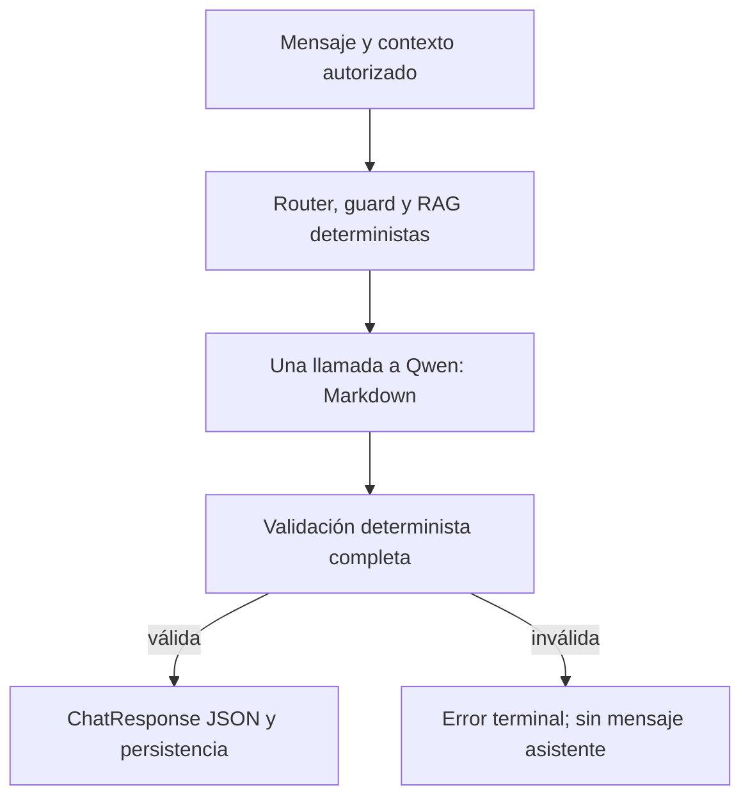

# Informe técnico: formato de salida y arquitectura de una sola generación para HemoVet

**Fecha:** 12 de agosto de 2026  
**Repositorio principal auditado:** `Code-Hdez/hemo`, commit `50954156d945ebea32d4f65c64e843f1bb734419`  
**Repositorio comparativo:** `cristiandlahoz/socratic-tutor`, commit `29b8c224940c6c200a3f4182fb1c4b9a2fcb1ebb`

## 1. Dictamen ejecutivo

La premisa inicial debe corregirse: **HemoVet sí utiliza salida estructurada**. La llamada a Ollama envía un JSON Schema en el campo `format`, el modelo produce un sobre `hemovet-response-v2`, Pydantic lo analiza y el backend devuelve además un `ChatResponse` JSON tipado al frontend. El problema no es la ausencia de formato; es que el formato interno actual intenta hacer demasiadas cosas a la vez.

La recomendación para este proyecto es:

1. **Salida del modelo:** texto natural en español con Markdown ligero, sin JSON interno, sin `claims`, sin identificadores de hechos o fuentes y sin banderas de seguridad autorreportadas.
2. **Validación interna:** validadores deterministas del backend sobre la respuesta completa —seguridad, idioma, valores, unidades, fechas, rangos y diagnóstico— sin pedir otra generación cuando algo falle.
3. **Salida pública de la API:** conservar el JSON tipado que ya existe: `answer`, `case_facts`, `sources`, `warnings`, `usage`, latencias y estado de validación.
4. **Ejecución:** exactamente **un `POST /api/chat` de Ollama por turno nuevo que alcanza la etapa de generación**, sin reparación, regeneración, `steer` posterior, último recurso generado, selección de herramientas por LLM ni reintento de conexión.
5. **Fallo:** si esa única respuesta no supera el contrato, el turno termina con un error tipado, no reintentable, y no se persiste un mensaje del asistente.

La alternativa aceptable, solo si se exige que incluso el contrato privado LLM→backend sea JSON, es un esquema mínimo de un campo:

```json
{
  "type": "object",
  "properties": {
    "answer_markdown": {"type": "string", "minLength": 1}
  },
  "required": ["answer_markdown"],
  "additionalProperties": false
}
```

No recomiendo mantener ni reducir parcialmente el sobre actual. Para un chat, los metadatos del turno deben ser calculados por el backend y no recitados por el modelo.

Tampoco recomiendo limitarse a cambiar `CHAT_MAX_GENERATION_ATTEMPTS=1`. En la batería A100 vigente, esa modificación aislada habría dejado 10 de 45 turnos sin respuesta válida: **22,2 % de fallo global y 46,7 % en historial**. Primero hay que simplificar el contrato y mover todo el direccionamiento antes de la llamada única.

## 2. Qué existe realmente hoy

### 2.1 Tres contratos distintos que estaban siendo confundidos

| Capa | Estado actual | Qué debería ocurrir |
|---|---|---|
| LLM → backend | JSON Schema complejo con sobre, claims, citas y seguridad | Markdown libre validable; o, como segunda opción, JSON Schema de un campo |
| Backend → frontend | `ChatResponse` JSON tipado | Mantenerlo como contrato canónico |
| Contenido visible | Texto reconstruido al unir `claims[].text` | Markdown conversacional generado por el modelo |

El contrato público ya es manipulable. [`ChatResponse`](https://github.com/Code-Hdez/hemo/blob/50954156d945ebea32d4f65c64e843f1bb734419/backend/app/modules/llm_chat/api/schemas.py#L164-L241) contiene `answer`, hechos del caso, fuentes, advertencias, modelo, tokens, duración, motivo de finalización, intentos y trazas públicas. No hace falta que el modelo duplique esa estructura.

### 2.2 El sobre privado actual

El modelo debe producir:

- `schema_version`;
- `response_type`;
- `intent`;
- entre 1 y 48 `claims`;
- por claim: `claim_id`, `text`, `claim_type`, `fact_ids`, `source_ids`, `policy_rule_ids` y `evidence_spans`;
- siete booleanos de seguridad: diagnóstico, medicamento, dosis, frecuencia, duración, tratamiento personalizado y urgencia.

La definición está en [`structured_response.py`](https://github.com/Code-Hdez/hemo/blob/50954156d945ebea32d4f65c64e843f1bb734419/backend/app/modules/llm_chat/application/services/structured_response.py#L103-L263). La llamada nativa a Ollama sí coloca el esquema en `payload["format"]`, como se comprueba en [`openai_compatible_client.py`](https://github.com/Code-Hdez/hemo/blob/50954156d945ebea32d4f65c64e843f1bb734419/backend/app/modules/llm_chat/infrastructure/llm/openai_compatible_client.py#L841-L871).

Medí el esquema estático de Pydantic en el commit auditado:

| Esquema | Caracteres compactos | Estimación del contador propio de HemoVet |
|---|---:|---:|
| Sobre actual, antes de enums dinámicos | 5.063 | 1.691 tokens |
| Un campo `answer_markdown` | 142 | 51 tokens |

Los enums dinámicos de hechos, fuentes y reglas aumentan el tamaño por turno. El propio código documenta una observación de **1.934 tokens de esquema** en el flujo con herramientas. El esquema mínimo reduciría aproximadamente un 97 % ese componente; el texto plano lo eliminaría.

### 2.3 El streaming actual no muestra los tokens del modelo

El cliente de Ollama soporta streaming NDJSON y el backend acumula sus fragmentos, pero las llamadas de respuesta pasan `on_chunk=None`. El usuario recibe eventos de estado y heartbeat; el contenido llega completo después de la validación. La función `_stream_mode()` devuelve siempre `buffered_validated`. Esto se observa en:

- [generación principal y reparación](https://github.com/Code-Hdez/hemo/blob/50954156d945ebea32d4f65c64e843f1bb734419/backend/app/modules/llm_chat/application/use_cases/send_chat_message.py#L1659-L1885);
- [acumulación de los chunks del proveedor](https://github.com/Code-Hdez/hemo/blob/50954156d945ebea32d4f65c64e843f1bb734419/backend/app/modules/llm_chat/application/use_cases/send_chat_message.py#L3414-L3484);
- [modo siempre bufferizado](https://github.com/Code-Hdez/hemo/blob/50954156d945ebea32d4f65c64e843f1bb734419/backend/app/modules/llm_chat/application/use_cases/send_chat_message.py#L4410-L4417).

Esto no es incorrecto: en una aplicación con datos clínicos, publicar texto antes de validarlo impide retirarlo si contiene un valor falso o una instrucción insegura. Sí es importante llamarlo por su nombre: es SSE de estado con entrega final bufferizada, no streaming visible de la respuesta.

## 3. Cuántas generaciones puede ejecutar hoy un turno

El parámetro `CHAT_MAX_GENERATION_ATTEMPTS=2` no representa el techo real de todo el flujo. En el commit auditado existen estas rutas:

| Orden potencial | Ruta | Condición | Nueva llamada al modelo |
|---:|---|---|---:|
| 0 | selección de hechos por herramientas | `CHAT_TOOLS_ENABLED=1`; hoy está desactivado en producción | hasta `CHAT_TOOL_MAX_ROUNDS` |
| 1 | generación principal | siempre que el turno llegue al proveedor | 1 |
| 2 | reparación | salida truncada o inválida y ventana temporal disponible | 1 |
| 3 | respuesta a pregunta reconducida | no existe candidato válido y el guard ofrece `STEER` | 1 |
| 4 | último recurso | sigue sin candidato y la salida estructurada está activa | 1 |

Las rutas 1–4 aparecen en [`send_chat_message.py`](https://github.com/Code-Hdez/hemo/blob/50954156d945ebea32d4f65c64e843f1bb734419/backend/app/modules/llm_chat/application/use_cases/send_chat_message.py#L1669-L2005). La selección opcional por herramientas está en [la misma clase](https://github.com/Code-Hdez/hemo/blob/50954156d945ebea32d4f65c64e843f1bb734419/backend/app/modules/llm_chat/application/use_cases/send_chat_message.py#L4419-L4491).

Por tanto, con herramientas desactivadas un turno puede intentar hasta cuatro respuestas generadas. Con herramientas activadas puede gastar llamadas adicionales antes de redactar la respuesta.

Hay además un segundo tipo de repetición: `OLLAMA_MAX_RETRIES=1` termina en `httpx.AsyncHTTPTransport(retries=1)`. HTTPX repite conexiones ante `ConnectError` o `ConnectTimeout`; su documentación lo especifica expresamente. Véanse [la composición de HemoVet](https://github.com/Code-Hdez/hemo/blob/50954156d945ebea32d4f65c64e843f1bb734419/backend/app/modules/llm_chat/composition.py#L666-L676) y la [documentación oficial de HTTPX](https://www.python-httpx.org/advanced/transports/).

Finalmente, el repositorio puede volver a adquirir un turno fallido, interrumpido o incompleto con el mismo `client_message_id`, incrementar `attempt_count` y generar otra vez. El frontend no lo hace silenciosamente —la ruta de chat configura `retry: false`—, pero ofrece el botón **Reintentar** y el backend publica `retry_same_turn`. Si el requisito es literal, un fallo de generación debe pasar a terminal y el mismo turno no debe ser readquirible.

No deben confundirse con regeneraciones del LLM:

- consultar el estado de un turno ya en curso;
- devolver una respuesta ya completada por idempotencia;
- heartbeats SSE;
- healthchecks o warmup fuera de un turno de usuario;
- recuperación RAG o embeddings.

Esas operaciones no redactan otra respuesta y pueden conservarse.

## 4. Evidencia cuantitativa del repositorio

Analicé `validacion_llm/resultados/rondas45_2026-08-10/bateria_a100.jsonl`, junto con los seis informes suministrados.

### 4.1 Primera pasada frente a resultado final

| Métrica | Resultado |
|---|---:|
| Turnos | 45 |
| Válidos en primera generación | 35 (77,8 %) |
| Turnos reparados | 10 (22,2 %) |
| Fallos finales registrados | 0 |
| Mediana sin reparación | 16,3 s |
| Media sin reparación | 16,26 s |
| Mediana con reparación | 44,05 s |
| Media con reparación | 46,14 s |

El “cero fallos finales” oculta el dato de producto relevante: casi uno de cada cuatro turnos necesitó otra generación. La reparación multiplicó la mediana por aproximadamente 2,7.

### 4.2 Por ámbito

| Ámbito | Reparaciones | Tasa de primera pasada fallida | Mediana sin reparación | Mediana con reparación |
|---|---:|---:|---:|---:|
| General | 0/15 | 0 % | 13,5 s | — |
| Hemograma seleccionado | 3/15 | 20,0 % | 16,45 s | 38,5 s |
| Historial | 7/15 | 46,7 % | 18,65 s | 46,3 s |

Los diez motivos de reparación fueron:

| Motivo | Casos |
|---|---:|
| `structured_json_invalid` | 1 |
| `structured_schema_invalid` | 1 |
| `structured_patient_fact_id_required` | 3 |
| `missing_evidence_attribution` | 2 |
| `content_free_answer` | 2 |
| `ambiguous_parameter_claim` | 1 |

Solo 2 de 10 fueron fallos puramente estructurales de JSON/esquema. Los otros 8 fueron incumplimientos semánticos o administrativos del contrato: el modelo no declaró un identificador, no atribuyó evidencia, clasificó ambiguamente un parámetro o produjo contenido insuficiente. **Cambiar de JSON a otro serializador no resolvería esos ocho casos.**

### 4.3 El formato no es el cuello de botella principal de decodificación

La ablación A100 aportada comparó el mismo modelo con y sin `format`: la penalización fue aproximadamente 0,332 ms por token, un 1,33 % de TPOT. La gramática no explica los saltos de 16 a 44–46 segundos; las segundas generaciones sí.

La simplificación del formato puede mejorar latencia por otras dos vías:

1. elimina alrededor de 1,7–1,9 mil tokens de esquema/instrucciones de contrato en el prompt;
2. evita generar claves, IDs, arrays, evidence spans y banderas que luego no se muestran.

El beneficio esperado proviene sobre todo de reducir prompt y salida, no de cambiar el motor de gramática.

## 5. Qué formato conviene

### 5.1 Comparación aplicada a HemoVet

| Formato del modelo | Ventajas | Riesgos/costos | Veredicto |
|---|---|---|---|
| Markdown/texto plano | Máxima naturalidad; sin fallos de parseo; menor prompt y salida; compatible con futuro streaming por frases | Los campos de negocio deben venir del backend | **Recomendado** |
| JSON Schema de un campo | Parseabilidad garantizada; contrato privado explícito; costo pequeño | Redundante si solo contiene la respuesta; dificulta el streaming visible; aún puede fallar semánticamente | Alternativa válida |
| Sobre JSON actual | Trazabilidad detallada por claim | Mucha metadata autorreportada, prompt grande, fallos de IDs/citas/flags, respuesta rígida | Rechazar para chat |
| `format: "json"` sin schema | JSON sintáctico | No garantiza claves ni tipos; no mejora la verdad del contenido | No usar |
| YAML/XML | Legibles en algunos casos | Sin soporte nativo equivalente en Ollama; más fragilidad y ambigüedad de parseo | No usar |

Un estudio de ACL sobre extracción desde notas clínicas encontró que JSON fue significativamente más parseable que YAML y XML. Ese resultado es útil **si** la tarea consiste en extraer atributos. HemoVet, en cambio, redacta una explicación; el backend ya posee los atributos y no necesita que el modelo los reconstruya. Véase [Neveditsin et al., 2025](https://aclanthology.org/2025.acl-srw.19.pdf).

La literatura también advierte que el efecto del formato depende de la tarea. En clasificación, restringir respuestas puede ayudar; en tareas de razonamiento o redacción, esquemas más estrictos pueden degradar desempeño y aumentar sensibilidad al prompt. Véase [Tam et al., EMNLP 2024](https://arxiv.org/html/2408.02442v1).

### 5.2 Por qué no conviene pedir al modelo metadatos conocidos

Antes de llamar a Ollama, el backend ya sabe:

- intención y ruta;
- política y acción de seguridad;
- hechos autorizados y sus IDs;
- fuentes retenidas en el prompt;
- alcance seleccionado;
- modelo, tokens, tiempos y motivo de finalización.

Pedir al modelo que vuelva a emitir esos valores no crea trazabilidad confiable. Crea una segunda representación probabilística de datos deterministas, y luego el backend rechaza la respuesta cuando ambas representaciones no coinciden.

En particular:

- `intent` y `response_type` deben proceder del router, no del modelo;
- `fact_ids` y `source_ids` deben proceder del contexto autorizado y la recuperación;
- las banderas de seguridad deben derivarse del texto mediante validadores, no de la autoevaluación del mismo modelo que redactó el texto;
- `claim_id` no aporta valor visible y puede asignarse en observabilidad si realmente se necesita;
- los `evidence_spans` pueden seleccionarse o comprobarse en backend, sin obligar al modelo a copiarlos.

Structured Outputs garantiza forma, no verdad. Ollama recomienda pasar un JSON Schema por `format`, validarlo con Pydantic/Zod y bajar la temperatura, pero eso solo resuelve el contrato estructural. La propia documentación de OpenAI sobre constrained decoding aclara que el modelo aún puede equivocarse dentro de los valores. Véanse [Ollama Structured Outputs](https://docs.ollama.com/capabilities/structured-outputs) y [las limitaciones explicadas por OpenAI](https://openai.com/index/introducing-structured-outputs-in-the-api/).

JSONSchemaBench evalúa 10.000 esquemas y separa explícitamente eficiencia, cobertura del esquema y calidad del contenido. Esa separación coincide con lo observado en HemoVet: cumplir una gramática y responder correctamente son métricas distintas. Véase [Geng et al., 2025](https://arxiv.org/html/2501.10868v3).

## 6. Qué aporta —y qué no— Socratic Tutor

Socratic Tutor usa dos patrones distintos:

1. La respuesta principal se entrega como texto en vivo mediante `stream().chatResponse()`; no existe un sobre de claims ni validación clínica posterior. Véase [`ChatService.chatStream()`](https://github.com/cristiandlahoz/socratic-tutor/blob/29b8c224940c6c200a3f4182fb1c4b9a2fcb1ebb/src/main/java/com/wornux/services/chat/ChatService.java#L56-L103).
2. Antes de la respuesta, un guard separado hace una clasificación estructurada de una pasada usando `BeanOutputConverter`, JSON Schema y temperatura 0. Véase [`GuardClassifierService`](https://github.com/cristiandlahoz/socratic-tutor/blob/29b8c224940c6c200a3f4182fb1c4b9a2fcb1ebb/src/main/java/com/wornux/ai/guard/GuardClassifierService.java#L68-L137).

Su `TutorGuardAdvisor` permite, reconduce o corta el flujo antes del tutor principal. En las rutas ALLOW/STEER hay normalmente una llamada de guardia y otra llamada de respuesta; en SHORT_CIRCUIT hay una llamada de guardia y texto directo. Por eso **no es un diseño de una sola llamada al modelo**. Véase [`TutorGuardAdvisor`](https://github.com/cristiandlahoz/socratic-tutor/blob/29b8c224940c6c200a3f4182fb1c4b9a2fcb1ebb/src/main/java/com/wornux/ai/advisor/TutorGuardAdvisor.java#L68-L159).

Lo transferible a HemoVet es el orden: decidir ALLOW/STEER/BOUNDARY antes de redactar. No es transferible copiar el clasificador LLM, porque HemoVet ya posee `SafetyPolicy` y `TurnGuard` deterministas. Tampoco es transferible omitir validación de salida: el tutor educativo no reproduce valores de pacientes.

La adaptación correcta es:

- clasificación determinista previa;
- una sola solicitud al Qwen para redactar la respuesta final o el límite de seguridad;
- validación determinista posterior;
- ningún segundo LLM.

Esto conserva la regla vigente de HemoVet de que todo texto visible lo escribe el modelo; el backend no introduce respuestas prefabricadas.

## 7. Arquitectura propuesta



### 7.1 Invariante formal

Para todo turno nuevo `t` que llega a generación:

```text
provider_chat_calls(t) = 1
generation_attempts(t) = 1
automatic_resubmissions(t) = 0
```

Si el turno no llega al proveedor por autorización, presupuesto de contexto o indisponibilidad previa, `provider_chat_calls(t)=0`. Nunca debe ser mayor que uno.

### 7.2 Solicitud al modelo

La solicitud debe contener solo:

- identidad y límites del asistente;
- pregunta o versión segura decidida antes de generar;
- hechos autorizados ya seleccionados determinísticamente;
- evidencia RAG retenida, cuando corresponda;
- historial/estado conversacional dentro del presupuesto;
- instrucciones breves de estilo y seguridad;
- un techo de salida coherente con respuestas reales.

Debe eliminarse del prompt la guía para construir el envelope, escoger tipos de claim, copiar IDs, reproducir evidence spans y marcar banderas de seguridad.

### 7.3 Respuesta del modelo y respuesta pública

Respuesta privada de Qwen:

```markdown
Un hemograma es un análisis que estudia las células de la sangre: glóbulos rojos,
glóbulos blancos y plaquetas. Ayuda a detectar patrones que el veterinario interpreta
junto con los síntomas, la exploración y otras pruebas.
```

Respuesta pública del backend:

```json
{
  "answer": "Un hemograma es un análisis...",
  "case_facts": [],
  "sources": [],
  "warnings": [],
  "validation_status": "valid",
  "generation_attempts": 1,
  "provider_calls": 1
}
```

La aplicación sigue recibiendo JSON manipulable; el modelo queda dedicado a la única parte que realmente necesita generar: el lenguaje.

### 7.4 Validación sin claims autorreportados

HemoVet ya dispone de un validador que opera sobre texto completo. [`OutputValidator.validate()`](https://github.com/Code-Hdez/hemo/blob/50954156d945ebea32d4f65c64e843f1bb734419/backend/app/modules/llm_chat/application/services/output_validator.py#L158-L275) comprueba, entre otras cosas:

- salida vacía;
- exposición de razonamiento o material interno;
- idioma;
- instrucciones de medicamento/dosis/tratamiento;
- diagnóstico definitivo;
- contrato de seguridad;
- coherencia con los hechos clínicos autorizados.

Ese validador debe convertirse en la frontera canónica. El registro de hechos puede comparar sobre el texto completo cada número, unidad, rango, fecha y estado. No necesita que el modelo declare un `fact_id` para saber qué hechos le fueron proporcionados.

Para fuentes documentales:

- devolver en la API las fuentes que realmente fueron retenidas en el prompt, con una etiqueta honesta como “fuentes consultadas”;
- si se exige prueba por proposición, segmentar el texto en oraciones y aplicar primero un filtro léxico y después el verificador ONNX de entailment ya presente en el repositorio;
- no usar `source_ids` autorreportados como sustituto de soporte semántico;
- si una afirmación obligatoriamente documentada no está respaldada, terminar el turno; no regenerar.

### 7.5 Fallo tipado

Ejemplo de contrato de error:

```json
{
  "code": "single_generation_contract_failed",
  "category": "model_output",
  "retryable": false,
  "recovery_action": "report_failure",
  "generation_attempts": 1,
  "provider_calls": 1,
  "validation_reason": "unsupported_patient_value"
}
```

No se debe persistir texto del asistente. Para depuración, se registran correlación, perfil, tokens, `done_reason`, código de validación, hash del contenido y métricas; cualquier texto clínico completo debe ir solo a un canal protegido y con retención definida.

## 8. Inventario concreto de cambios para eliminar reintentos

### 8.1 Caso de uso principal

En `send_chat_message.py`:

1. Conservar una sola llamada `_generate(request, generation_attempt=1)`.
2. Eliminar el bloque de reparación posterior a `needs_repair`.
3. Eliminar `_structured_repair_request`, `_compact_structured_repair_request`, `_repair_request`, perfiles y eventos de reparación.
4. Eliminar `_steered_candidate` como rescate posterior. La decisión de reconducir se calcula antes de construir la única solicitud.
5. Eliminar `_last_resort_candidate`. El “último recurso” debe ser una ruta pre-generación, no una generación adicional.
6. No seleccionar hechos con un tool-call del mismo LLM; mantener/mejorar `ClinicalContextSelector` determinista.
7. Reemplazar la lista de candidatos por una única respuesta y una única validación.
8. Eliminar estados/eventos `repairing`, `regeneration`, `repair_abandoned` y contadores mayores que uno.

### 8.2 Guard previo

`TurnGuard.check()` ya ejecuta parte de este patrón sin otro modelo. Debe ampliarse para que el diagnóstico con datos, que hoy puede llegar al `STEER` tardío, reciba desde el inicio una instrucción segura y fundamentada. El Qwen redacta una vez la explicación de valores y el límite diagnóstico.

No deben añadirse respuestas deterministas visibles. Un `SHORT_CIRCUIT` significa “usar una solicitud breve y sin contexto clínico”, no “devolver una plantilla del backend”. Esta intención ya está documentada en [`turn_guard.py`](https://github.com/Code-Hdez/hemo/blob/50954156d945ebea32d4f65c64e843f1bb734419/backend/app/modules/llm_chat/application/services/turn_guard.py#L1-L29).

### 8.3 Configuración

Cambios necesarios:

- retirar `CHAT_MAX_GENERATION_ATTEMPTS` en vez de dejarlo configurable;
- retirar opciones específicas de reparación: temperatura, `num_predict`, penalización y ventana temporal;
- fijar `OLLAMA_MAX_RETRIES=0` y `httpx.AsyncHTTPTransport(retries=0)`;
- fijar `CHAT_TOOLS_ENABLED=0` para esta ruta o eliminar la ruta de selección por LLM;
- mantener healthchecks y warmup, porque no generan respuestas de usuario;
- hacer que configuración inválida falle al arrancar si intenta habilitar reintentos.

### 8.4 Persistencia e idempotencia

Conservar:

- la reserva del turno;
- el lease para evitar dos ejecuciones simultáneas;
- la devolución de un resultado ya completado;
- el sondeo de un turno todavía activo.

Cambiar:

- un turno `FAILED`, `INTERRUPTED` o `INCOMPLETE` no se readquiere automáticamente con el mismo identificador si ya consumió su llamada;
- `attempt_count` no puede crecer por una recuperación de generación;
- los fallos de contrato son terminales y no reintentables;
- una pregunta enviada otra vez por decisión explícita del usuario debe ser un turno nuevo, no una repetición transparente del anterior.

### 8.5 API y frontend

- convertir `generation_attempts` de éxito en valor literal 1;
- añadir `provider_calls` medido en el adaptador, no inferido;
- quitar `retry_same_turn` para fallos de contrato/generación;
- eliminar el botón “Reintentar” para esos fallos si se adopta la interpretación estricta solicitada;
- conservar “Consultar estado”/`poll_turn`, porque no genera otra respuesta;
- mantener `retry: false` en la mutación/stream de chat;
- no eliminar reintentos de consultas ajenas al chat, como cargar una página de historial: no afectan la generación del LLM.

## 9. Latencia objetivo de 10–15 segundos

Eliminar las reparaciones retira la cola larga de 34–65 segundos, pero no basta para que todos los ámbitos queden debajo de 15 segundos. Los turnos válidos de primera pasada todavía muestran medianas de 13,5 s (general), 16,45 s (seleccionado) y 18,65 s (historial).

Prioridades:

1. **Eliminar el envelope y sus instrucciones.** Es la mejora directamente vinculada a este informe.
2. **Alinear el contexto residente.** Los informes documentan que Ollama puede cargar 65.536 y la solicitud real usar 16.384; el primer turno paga alrededor de 101 s al realinear. El proceso que valida/calienta la GPU debe usar exactamente el `num_ctx` productivo y la instancia no debe recibir tráfico hasta estar lista.
3. **Mantener el modelo residente.** `keep_alive=-1` es apropiado para el objetivo.
4. **Reducir la salida máxima con evidencia.** Las 45 respuestas visibles tienen mediana de 71 palabras, percentil 95 de 120 y máximo de 126. Un techo inicial de 384–512 tokens cubre ampliamente esa batería y evita que un desvío consuma 1.280 tokens; las preguntas que piden un hemograma completo deben probarse antes de fijar el valor definitivo.
5. **Selección clínica determinista.** No sustituir prompt largo por una llamada LLM de selección; eso violaría la invariante y añadiría TTFT.
6. **Medir tiempo de respuesta final, no solo TPOT.** Registrar cola, carga, prefill, TTFT, decode, validación y persistencia.

La documentación de Ollama señala que streaming permite renderizar contenido a medida que se produce. Para la primera versión de este cambio recomiendo conservar la entrega final bufferizada: seguridad y coherencia se validan antes de mostrar. Después puede evaluarse streaming por oraciones, donde cada oración completa se valida antes de emitirse; nunca deben mostrarse tokens crudos que todavía pueden resultar inseguros. Véase [Ollama Streaming](https://docs.ollama.com/capabilities/streaming).

## 10. Compatibilidad y riesgos de Ollama/Qwen

Hubo un bug de Ollama 0.17.6 en el que `format` se ignoraba con modelos Qwen3.5 cuando `think=false`. El arreglo fue incorporado el 7 de julio de 2026 en el [PR #15901](https://github.com/ollama/ollama/pull/15901), que generalizó el constraint a parsers con soporte de thinking. La versión auditada de HemoVet es 0.32.6 y las baterías demuestran que `format` sí funciona, por lo que aquel bug no explica los fallos actuales.

Existe además un [issue abierto #17434](https://github.com/ollama/ollama/issues/17434) sobre un crash CUDA con Qwen3.6 35B, JSON Schema y `think=false` en Ollama 0.32.5 sobre DGX Spark/GB10. No es el mismo modelo, GPU ni versión de HemoVet y no se reprodujo en la A100; no debe presentarse como causa. Sí justifica conservar un canary de structured outputs si se elige la alternativa JSON mínima. La salida Markdown recomendada evita por completo esa ruta de gramática.

No recomiendo migrar ahora a vLLM, SGLang, XGrammar u otro motor solo por este problema. La ablación local muestra que el costo gramatical es pequeño y la mayoría de reparaciones son semánticas. Cambiar de servidor aumentaría el área de riesgo sin atacar la causa principal.

## 11. Plan de validación antes de producción

La recomendación es sólida arquitectónicamente, pero HemoVet debe demostrarla en su propio modelo y corpus. Ejecutar una ablación controlada sin reintentos:

| Brazo | Salida LLM | Reintentos | Propósito |
|---|---|---:|---|
| A | envelope actual | 0 | línea base de primera pasada |
| B | Markdown | 0 | opción recomendada |
| C | JSON Schema de un campo | 0 | alternativa estructurada mínima |

Mantener iguales modelo, digest, cuantización, A100, contexto, prompts clínicos comparables, temperatura y seed. Evaluar como turnos independientes al menos las 45 preguntas actuales, todas las preguntas de seguridad y varias repeticiones/semillas; ninguna repetición debe ser un retry interno.

Criterios de aceptación propuestos:

- `provider_calls=1` en el 100 % de turnos que alcanzan generación;
- `generation_attempts=1` siempre;
- cero valores, unidades, rangos o fechas incorrectos;
- 100 % de cumplimiento en dosis, tratamiento, diagnóstico y urgencia;
- validez de primera pasada ≥ 98 % global antes de desplegar;
- medir por separado general, seleccionado e historial;
- mediana caliente ≤ 15 s global y percentil 95 ≤ 25 s;
- ningún usuario paga carga/realineación del runner;
- revisión veterinaria ciega de utilidad, corrección y naturalidad;
- error terminal tipado y sin persistencia cuando falle el contrato.

Instrumentación mínima:

- `provider_calls_total` por turno;
- ID de llamada correlacionado;
- perfil y ruta pre-generación;
- tokens de prompt/esquema/salida;
- `load_duration`, `prompt_eval_duration`, `eval_duration`, TTFT y cola;
- `finish_reason`;
- código exacto de validación;
- resultado de persistencia;
- contador de cualquier intento rechazado por la invariante.

El informe `LIMITACIONES(2).md` advierte que la API pública actual no permite reconstruir con certeza cada llamada cruda de Ollama. Por eso `provider_calls` debe incrementarse en el adaptador justo antes del `POST /api/chat`; no debe deducirse de `generation_attempts` ni del resultado final.

## 12. Orden de implementación recomendado

1. Añadir telemetría `provider_calls` y una aserción que falle si supera uno.
2. Crear la ruta de Markdown con el mismo `ChatResponse` público.
3. Mover toda reconducción y boundary a la planificación previa.
4. Adaptar validadores de texto completo y fuentes consultadas.
5. Ejecutar la ablación A/B/C con reintentos desactivados.
6. Corregir prompts/selección determinista hasta superar los gates de primera pasada.
7. Eliminar definitivamente código, configuración, estados y UI de regeneración.
8. Fijar reintentos de transporte en cero y hacer terminal el turno fallido.
9. Alinear warmup/contexto y ajustar `num_predict` con los percentiles reales.
10. Desplegar primero con entrega bufferizada; evaluar streaming por oraciones en una fase separada.

## 13. Decisiones que no recomiendo

- No cambiar únicamente `CHAT_MAX_GENERATION_ATTEMPTS` a 1.
- No sustituir JSON por YAML o XML.
- No confiar en `format: "json"` sin schema cuando se requieren campos.
- No mantener `claims` y limitarse a acortar sus nombres.
- No usar un segundo LLM como guard, crítico, reparador o formateador.
- No permitir que el modelo autoaudite sus propias banderas de seguridad.
- No enviar chunks visibles antes de poder garantizar que son publicables.
- No rellenar respuestas fallidas con texto clínico prefabricado del backend.
- No presentar “fuentes recuperadas” como prueba exacta de cada afirmación si no se validó esa relación.
- No cambiar de servidor de inferencia antes de medir el diseño simplificado.

## 14. Conclusión

La mejor solución no es “encontrar un JSON más rígido”. HemoVet ya tiene JSON Schema y precisamente parte de su fragilidad proviene de haber convertido una respuesta conversacional en un protocolo de anotación que el modelo debe completar mientras responde.

La arquitectura adecuada separa responsabilidades:

- Qwen redacta una sola respuesta natural;
- el backend decide contexto, seguridad y metadatos;
- los validadores comprueban la respuesta sin reescribirla;
- la API entrega JSON tipado;
- cualquier incumplimiento termina el turno y queda observable.

Esa separación elimina las causas administrativas de reparación, reduce prompt y salida, conserva la seguridad clínica y hace verificable la regla que se busca: **una pregunta, una llamada de respuesta, una validación y ningún reintento automático**.

## 15. Fuentes consultadas

### Evidencia propia del proyecto

- `INFORME_RECARACTERIZACION_A100(2).md`
- `LIMITACIONES(2).md`
- `mapeo_otel(2).md`
- `RESUMEN_EJECUTIVO(2).md`
- `informe(2).md`
- `Pasted text(20260811-215450)(3).txt`
- batería `validacion_llm/resultados/rondas45_2026-08-10/bateria_a100.jsonl`
- código de HemoVet en el commit fijado al inicio

### Documentación, código y literatura primaria

- [Ollama: Structured Outputs](https://docs.ollama.com/capabilities/structured-outputs)
- [Ollama: Streaming](https://docs.ollama.com/capabilities/streaming)
- [Ollama: API de chat](https://docs.ollama.com/api/chat)
- [HTTPX: transport retries](https://www.python-httpx.org/advanced/transports/)
- [Geng et al.: JSONSchemaBench](https://arxiv.org/html/2501.10868v3)
- [Tam et al.: impacto de restricciones de formato](https://arxiv.org/html/2408.02442v1)
- [Neveditsin et al.: JSON/XML/YAML en extracción clínica](https://aclanthology.org/2025.acl-srw.19.pdf)
- [OpenAI: Structured Outputs y limitaciones semánticas](https://openai.com/index/introducing-structured-outputs-in-the-api/)
- [Ollama PR #15901](https://github.com/ollama/ollama/pull/15901)
- [Ollama issue #17434](https://github.com/ollama/ollama/issues/17434)
- [HemoVet: repositorio](https://github.com/Code-Hdez/hemo)
- [Socratic Tutor: repositorio](https://github.com/cristiandlahoz/socratic-tutor)
