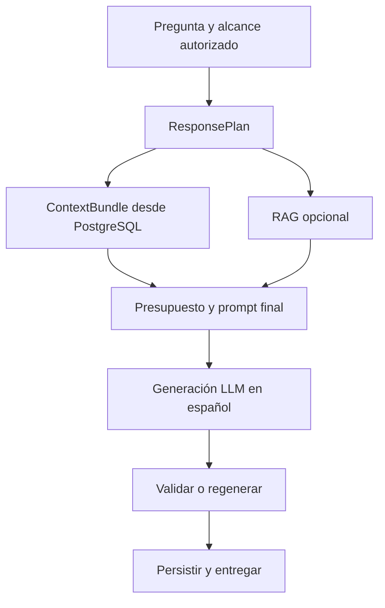

# Plan maestro de corrección del chat LLM de HemoVet

Confirmé que `main` continúa en el commit [`b9ddd75`](https://github.com/Code-Hdez/hemo/commit/b9ddd75af524c6cf9d7be5edc38bcf0a61b89504). El problema principal no es Qwen ni Ollama: la ruta actual recorta el contexto, convierte el RAG en requisito, sustituye respuestas por textos escritos en Python y después rechaza respuestas que el modelo sí intenta generar.

La corrección debe realizarse en **9 etapas consecutivas**, una por una. Cada etapa debe quedar cerrada antes de comenzar la siguiente. No se deben mezclar todos los cambios en una sola rama o PR.

## Condiciones obligatorias

Estas reglas gobiernan todo el trabajo:

1. Toda prosa visible del asistente será generada por el LLM.
2. No habrá respuestas clínicas, rechazos, derivaciones ni mensajes de “evidencia insuficiente” escritos en Python.
3. PostgreSQL será la autoridad para información de la mascota, hemogramas y resultados ML.
4. El RAG será apoyo opcional, nunca permiso para responder.
5. El conocimiento paramétrico del modelo podrá utilizarse para educación veterinaria segura.
6. Todas las respuestas visibles estarán en español, aunque las fuentes estén en otros idiomas.
7. El asistente no dará diagnósticos, tratamientos, medicamentos, dosis ni recomendaciones clínicas personalizadas.
8. Una insistencia o urgencia producirá una derivación al veterinario redactada por el LLM.
9. Una generación inválida se regenerará una vez.
10. Si el proveedor falla o ambas generaciones son inválidas, se devolverá un error técnico; no se guardará un mensaje del asistente.
11. No se crearán, editarán ni ejecutarán archivos de `tests/`.
12. No se modificará frontend, entrenamiento ML ni procesamiento de hemogramas, salvo adaptadores de lectura pertenecientes al módulo LLM.

## Alcance técnico

Incluido:

* `backend/app/modules/llm_chat/**`
* Prompts del chat.
* Adaptadores PostgreSQL del chat.
* RAG usado por el chat.
* Memoria y conversaciones del chat.
* Cliente Ollama.
* `app/core/config.py` y disponibilidad, solamente en lo relacionado con el LLM.
* Configuración de despliegue de Ollama y del modelo.
* `validate_deploy_env.py`, solo para eliminar el perfil LLM hardcodeado.

Excluido:

* `tests/**`
* Frontend.
* Entrenamiento o modificación del modelo ML.
* Extracción de archivos y formatter hematológico.
* Cambios generales a usuarios, autenticación, mapas u otros módulos.
* Curación manual del contenido veterinario.

## Arquitectura final



`SendChatMessageUseCase` conservará inicialmente su entrada actual, pero irá delegando en componentes nuevos. No conviene reescribir sus 5.763 líneas de una vez.

---

# Etapa 1 — Estabilización crítica y configuración única

## Objetivo

Eliminar los errores técnicos que pueden corromper información, guardar respuestas inválidas o ignorar el `.env`.

## Cambios

### 1. Crear una única configuración efectiva

Introducir `GenerationProfileSettings` como fuente única para:

* Modelo.
* Contexto.
* Tokens de salida.
* Temperatura.
* `top_p`.
* `top_k`.
* `repeat_penalty`.
* Thinking.
* Timeouts.
* Memoria.
* Recuperación RAG.
* Perfil de reparación.
* Concurrencia.

`Settings` deberá construirse una sola vez e inyectarse en los componentes. Se eliminarán lecturas directas de `os.getenv()`.

### 2. Eliminar límites silenciosos

Quitar de la lógica activa:

* Contexto fijo de `4096`.
* Recorte adicional a `3072`.
* Salida fija de `512`.
* Perfil de producción `384/4096`.
* Valores RAG impuestos por `ChatProfilePolicy`.
* Ajustes posteriores que contradigan el `.env`.

`ChatProfilePolicy` podrá seleccionar comportamiento, pero no reemplazar silenciosamente los límites globales.

### 3. Registrar la configuración efectiva

Por cada generación deben quedar registrados como metadatos técnicos:

* Modelo efectivo.
* `num_ctx`.
* `num_predict`.
* Sampling efectivo.
* Thinking.
* Tokens estimados de entrada.
* RAG solicitado y RAG utilizado.
* Número de intentos de generación.

Nunca se registrará el prompt clínico completo ni información sensible.

### 4. Corregir el error `150 → 15`

En `conversation_memory.py`, `_decimal_text()` elimina ceros finales incluso en números enteros.

Debe distinguir:

* `150` → `"150"`
* `150.00` → `"150"`
* `15.20` → `"15.2"`

Este cambio es crítico porque actualmente la memoria puede alterar valores clínicos.

### 5. Evitar “guardar y después devolver 500”

La secuencia correcta será:

1. Generar.
2. Validar el envelope.
3. Construir `ChatResponse`.
4. Completar la transacción.
5. Devolver la respuesta.

Durante la transición se puede aceptar temporalmente `deterministic_safety_boundary` en el enum para evitar el `literal_error`, pero esa variante debe desaparecer definitivamente en la etapa 4.

### 6. Hacer fallar explícitamente `complete_turn()`

Si la operación compare-and-set no actualiza el turno esperado:

* No debe retornar silenciosamente.
* Debe lanzar un error de concurrencia tipado.
* No se debe informar al cliente que la respuesta quedó guardada.

## Archivos principales

* `app/core/config.py`
* `llm_chat/composition.py`
* `chat_profile_policy.py`
* `conversation_memory.py`
* `api/schemas.py`
* `api/router.py`
* `sqlalchemy_repositories.py`
* `scripts/validate_deploy_env.py`

## Resultado de la etapa

El `.env` controla realmente la aplicación, no se deforman números y ninguna respuesta se persiste antes de validar que la API puede devolverla.

---

# Etapa 2 — `ResponsePlan` y desacoplamiento completo del RAG

## Objetivo

Eliminar la equivalencia actual:

> Sin RAG = sin respuesta.

## Nuevo modelo interno

El booleano `use_rag` debe sustituirse por conceptos separados:

```text
retrieval_policy:
NONE | OPTIONAL | REQUIRED_FOR_CITATIONS

retrieval_status:
NOT_NEEDED | HIT | NO_MATCH | UNAVAILABLE

knowledge_mode:
PARAMETRIC
DATABASE_GROUNDED
RAG_AUGMENTED
```

Los tres modos de conocimiento podrán coexistir.

### `ResponsePlan`

Cada mensaje producirá internamente un plan como:

```text
scope
intent
risk_level
retrieval_policy
allowed_knowledge_modes
required_context
response_language
safety_requirements
generation_profile
```

Este plan será determinista e interno. No será la respuesta visible.

## Cambios

1. Eliminar cualquier conversión automática de `NO_MATCH` a `INSUFFICIENT_EVIDENCE`.
2. Eliminar `INSUFFICIENT_EVIDENCE` como acción de seguridad.
3. Convertir la falta de documentos en metadato.
4. Permitir conocimiento paramétrico para preguntas veterinarias educativas.
5. Usar PostgreSQL como soporte factual suficiente para preguntas sobre la mascota.
6. Cuando el usuario pida bibliografía y el RAG no esté disponible, el LLM deberá generar una explicación transparente sin inventar fuentes.
7. Cambiar disponibilidad:

```text
chat_ready = provider_ready AND module_ready
```

8. Exponer `rag_ready` como capacidad degradable independiente.
9. Eliminar `use_llm` de los perfiles: toda respuesta completada utilizará obligatoriamente el LLM.
10. Mantener `OUT_OF_DOMAIN` como intención, no como bypass del modelo.

## Archivos principales

* `domain/value_objects.py`
* `response_contracts.py`
* `conversation_routing.py`
* `safety_policy.py`
* `intent_classifier.py`
* `application/availability.py`
* `core/availability.py`
* `composition.py`
* `send_chat_message.py`

## Resultado de la etapa

ChromaDB puede estar vacío, deshabilitado o caído y el asistente seguirá respondiendo mediante PostgreSQL o conocimiento general seguro.

---

# Etapa 3 — `ContextBundle` completo para los tres modos

## Objetivo

Garantizar que el modelo reciba los datos correctos de la mascota, el hemograma, el ML, el historial y la conversación.

## Estructura propuesta

```text
ContextBundle
├── patient_profile
├── selected_study
├── historical_studies
├── ml_outcomes
├── findings
├── quality_and_provenance
├── historical_comparisons
├── conversation_memory
├── optional_rag_evidence
└── safety_policy
```

Cada dato clínico debe tener:

* ID estable.
* Tipo.
* Valor.
* Unidad.
* Fecha.
* Procedencia.
* Nivel de confianza.
* Análisis y mascota a los que pertenece.

Ejemplos de IDs:

```text
pet:{pet_id}:weight
analysis:{analysis_id}:lab:WBC
analysis:{analysis_id}:ml:classification
analysis:{analysis_id}:quality:extraction_confidence
```

## Modo general

* Permitir `pet_id` opcional.
* Sin `pet_id`: educación veterinaria general.
* Con `pet_id`: cargar perfil autorizado.
* Mantener `analysis_id` prohibido.
* No cargar hemogramas completos salvo que el alcance seleccionado lo autorice.

Perfil disponible:

* Nombre.
* Raza.
* Sexo.
* Fecha de nacimiento.
* Edad actual.
* Peso.
* Notas sanitizadas.
* Especie.
* Zona general de residencia consentida.

No se enviarán coordenadas exactas.

## Hemograma seleccionado

Debe incluir:

* Perfil completo autorizado.
* Todos los parámetros persistidos del análisis.
* Valor, unidad, referencia y flag.
* Fecha clínica y fecha de carga cuando estén disponibles.
* Laboratorio y analizador.
* Clasificación ML.
* Hallazgos.
* Calidad y confianza de extracción.
* Procedencia.
* Conversación reciente.

La intención puede ordenar los valores, pero no eliminar arbitrariamente todo excepto `WBC`, `HGB`, `HCT` y `PLT`.

## Historial

Cada estudio debe conservar:

* ID.
* Fecha.
* Laboratorio.
* Analizador.
* Parámetros.
* ML.
* Hallazgos.
* Calidad.
* Procedencia.
* Referencias usadas.
* Comparaciones disponibles.

Para comparaciones:

* Mostrar siempre valores exactos compatibles.
* Calcular delta cuando analito y unidad sean compatibles.
* Un cambio de laboratorio o rango producirá una advertencia contextual, no la desaparición de la comparación.
* Estudios del mismo día utilizarán secuencia o fecha de carga como desempate.

## Mitigación de datos aguas arriba

Como no se modificará hematología:

1. Los valores normalizados de PostgreSQL serán la fuente primaria.
2. El snapshot autorizado podrá rellenar valores ausentes, marcándolos como `snapshot_fallback`.
3. Texto libre como “todo está normal” no será un hecho clínico autorizado.
4. Se utilizarán resultados ML estructurados, no conclusiones narrativas del formatter.
5. Si una fecha es ambigua, se marcará como `legacy_date_unknown`; no se inventará una cronología.
6. El LLM tratará IDs existentes como opacos y no los truncará nuevamente.
7. Si un valor nunca fue persistido ni existe en el snapshot, el chat no podrá recuperarlo y no deberá afirmar que revisó el hemograma completo.

## Presupuesto

`ContextBundle` contendrá todo lo autorizado antes de compactar. El `PromptBudgetPlanner` elegirá qué enviar al modelo en este orden:

1. Política y pregunta actual.
2. Datos clínicos directamente solicitados.
3. Estudio seleccionado completo.
4. Ventana conversacional reciente.
5. Índice de todos los estudios históricos.
6. Datos históricos relevantes.
7. RAG.
8. Resumen antiguo.

La compactación nunca debe cambiar cifras, unidades o IDs.

## Archivos principales

* `api/schemas.py`
* `application/dto.py`
* `domain/clinical.py`
* `domain/verified_context.py`
* `sqlalchemy_repositories.py`
* `clinical_context_selector.py`
* `clinical_facts.py`
* `clinical_claim_parser.py`
* `prompt_builder.py`
* `token_budget.py`

## Resultado de la etapa

Los tres modos dejan de depender de contextos parciales y el modelo tiene acceso autorizado a toda la información necesaria para cada alcance.

---

# Etapa 4 — Contrato generativo y eliminación de toda respuesta hardcodeada

## Objetivo

Hacer cumplir el invariante principal: todo mensaje visible del asistente proviene del LLM.

## Envelope recomendado

```json
{
"language": "es",
"answer": "Texto generado por el modelo",
"claims": [
{
"type": "LAB_FACT",
"claim_text": "Texto generado",
"fact_ids": ["analysis:123:lab:WBC"],
"evidence_ids": []
}
],
"safety": {
"boundary_included": false,
"urgent_referral": false
},
"citations": []
}
```

Tipos de claim:

* `PATIENT_PROFILE_FACT`
* `STUDY_METADATA`
* `LAB_FACT`
* `ML_CLASSIFICATION`
* `ML_FINDING`
* `QUALITY_FLAG`
* `HISTORY_COMPARISON`
* `PARAMETRIC_VETERINARY_KNOWLEDGE`
* `DOCUMENTARY_EVIDENCE`
* `SAFETY_BOUNDARY`
* `URGENT_REFERRAL`
* `LIMITATION`

## Eliminaciones obligatorias

* `_safety_fallback_answer()`
* `_with_required_clinical_referral()`
* Mensaje fijo de evidencia insuficiente.
* Recomendación veterinaria agregada al final por Python.
* Oraciones canónicas que reemplazan lo generado.
* Respuestas sin invocar al modelo.
* `safety_fallback`.
* `legacy_deterministic`.
* `deterministic_safety_boundary`.
* Cualquier `response_origin` distinto de `llm` en mensajes completados.

## Validaciones permitidas

La validación seguirá siendo determinista, pero no escribirá la respuesta:

* Todos los `fact_ids` existen y pertenecen al usuario.
* Cifras y unidades coinciden con PostgreSQL.
* Las citas corresponden a chunks recuperados.
* No se inventan datos de la mascota.
* No hay diagnóstico directo.
* No hay tratamiento, dosis o recomendación personalizada.
* La derivación requerida está semánticamente presente.
* La respuesta visible está en español.
* No hay citas falsas.
* No se afirma haber revisado información omitida.

No se exigirá copiar una oración exacta producida por el backend.

## Regeneración

Flujo:

1. Generación principal con temperatura no determinista.
2. Validación.
3. Si falla, reparación LLM con una descripción estructurada de los errores.
4. Segunda validación.
5. Si vuelve a fallar, error técnico `invalid_model_output`.
6. No guardar mensaje del asistente.

La reparación puede utilizar menor temperatura, pero nunca una respuesta fija.

## Español

* Campo obligatorio `language="es"`.
* Prompt explícito de redacción en español.
* Detector real de idioma sobre `answer` y `claim_text`.
* Regeneración si la salida es predominantemente francesa, alemana, inglesa u otro idioma.
* Abreviaturas, unidades, títulos de libros y nombres técnicos pueden conservar su idioma original.

## Archivos principales

* `send_chat_message.py`
* `structured_response.py`
* `output_validator.py`
* `response_contracts.py`
* `clinical_response.py`
* `domain/ports/llm.py`
* `openai_compatible_client.py`
* `prompts/*.txt`

## Resultado de la etapa

No queda ninguna ruta donde Python fabrique, agregue o sustituya la prosa del asistente.

---

# Etapa 5 — Memoria y persistencia conversacional reales

## Objetivo

Resolver los seguimientos que actualmente pierden el contexto.

## Cambios

1. Incluir una ventana reciente en todos los turnos, no solamente cuando un regex detecte seguimiento.

2. Mantener de 8 a 12 turnos recientes según presupuesto.

3. Guardar un resumen estructurado de lo anterior.

4. Mantener el transcript completo en PostgreSQL.

5. Resolver referencias utilizando memoria y entidades activas:

* “¿Y eso?”
* “¿Es preocupante?”
* “¿Y el anterior?”
* “Explícamelo más sencillo.”
* “¿Qué pasa con las plaquetas?”

6. Separar:

```text
conversation_revision
clinical_data_revision
```

Un hemograma nuevo actualizará el contexto clínico, pero no borrará la conversación.

7. El fingerprint clínico debe incluir:

* Perfil.
* Análisis.
* ML.
* Hallazgos.
* Calidad.
* Procedencia.

8. Las conversaciones no deben borrarse después de una hora.
9. El TTL debe aplicarse a leases y recursos temporales, no al transcript.
10. Abrir una conversación no debe eliminar sesiones expiradas de todos los usuarios.
11. La conversación debe pertenecer al usuario autenticado, no a un navegador específico.
12. `conversation_id` deberá ser obligatorio para continuar una conversación existente.
13. `complete_turn()` deberá confirmar persistencia atómica.
14. Los valores clínicos en memoria conservarán representación exacta.

## Estado de seguridad persistente

La memoria también almacenará:

```json
{
"blocked_action": "medication_request",
"blocked_action_count": 2,
"last_safety_level": "referral_required"
}
```

Esto permitirá detectar insistencia real en etapas posteriores.

## Resultado de la etapa

El chat puede mantener conversaciones naturales, conservar contexto al subir nuevos hemogramas y continuar usando datos exactos.

---

# Etapa 6 — Seguridad, ámbito veterinario e insistencia

## Objetivo

Ampliar el asistente a educación veterinaria general sin permitir decisiones clínicas personalizadas.

## Clasificación

El orden conceptual será:

1. Seguridad e inyección real.
2. Posible urgencia.
3. Solicitud clínica prohibida.
4. Educación veterinaria.
5. Explicación de datos.
6. Fuera de ámbito.

## Correcciones

* “¿Cuántos tipos de leucocitos existen?” no puede interpretarse como dosis.
* `cuánto/cuántos` solo será dosis si también hay medicamento, cantidad o unidad.
* “¿Qué es la anemia?” será educación, no solicitud de diagnóstico.
* “Usa tu conocimiento general” no será prompt injection.
* “No uses el RAG” será una preferencia válida, no un ataque.
* “¿Por qué jadean los perros?” será educación veterinaria.
* Las preguntas no veterinarias recibirán un límite de ámbito generado naturalmente.
* Las reglas regex se limitarán a coincidencias de alta confianza.
* En casos ambiguos, el sistema no bloqueará preventivamente: generará con restricciones y validará la salida.

## Comportamiento esperado

### Pregunta permitida

El modelo responde normalmente y no añade una recomendación veterinaria automática.

### Petición de diagnóstico, tratamiento o dosis

El modelo genera:

* Un límite claro.
* Una explicación educativa segura, si es posible.
* Ninguna dosis, tratamiento o decisión personalizada.

### Insistencia

Si el usuario vuelve a solicitar la acción bloqueada:

* Incrementar `blocked_action_count`.
* Generar una respuesta más firme.
* Indicar que esa decisión debe revisarse con un veterinario.

### Urgencia

El `ResponsePlan` exigirá `URGENT_REFERRAL`. El LLM redactará la respuesta y el validador comprobará que la urgencia y la derivación estén presentes.

## Prompt canónico

Los tres prompts actuales deben dejar de contradecirse. La política única establecerá:

* Respuesta en español.
* Educación veterinaria permitida.
* PostgreSQL como autoridad de la mascota.
* RAG opcional.
* Conocimiento general permitido.
* No diagnóstico.
* No tratamiento.
* No medicamentos o dosis.
* No recomendación personalizada.
* Derivación únicamente por insistencia, decisión clínica no permitida o urgencia.
* No inventar datos.
* No mostrar razonamiento privado.

## Resultado de la etapa

El chat deja de ser exclusivamente hematológico, responde preguntas veterinarias normales y aplica límites sin mensajes repetitivos ni rígidos.

---

# Etapa 7 — RAG opcional, multilingüe y degradable

## Objetivo

Convertir el RAG en una fuente de apoyo real, capaz de utilizar documentos en varios idiomas.

## Recuperación

1. Mantener embeddings multilingües.
2. Cambiar BM25 a tokenización Unicode.
3. No eliminar un resultado semántico porque no comparta palabras españolas.
4. Usar variantes normalizadas de términos clínicos.
5. Incorporar reranker multilingüe configurable.
6. Conservar `source_language`.
7. Utilizar el idioma del documento durante recuperación y reranking.
8. Conservar el fragmento original.
9. Redactar siempre la explicación final en español.

## Resiliencia

* Si dense falla, continuar con BM25.
* Si BM25 falla, continuar con dense.
* Utilizar `return_exceptions=True` y degradación independiente.
* Un documento mal formado no debe abortar toda la ingesta.
* Parsear booleanos correctamente; `"false"` no puede convertirse en `True`.
* Usar hashes por documento, no una revisión global que fuerce toda la reindexación.
* Expandir chunks vecinos cuando aporten continuidad.
* Mostrar al modelo solamente fuentes realmente indexadas.
* Ajustar segmentación para textos no latinos.
* Normalizar correctamente metadatos de especie.

## Uso y citación

Separar:

```text
retrieval_allowed
generation_use_allowed
citation_allowed
display_title
```

Un documento puede servir como contexto interno aunque la interfaz no deba citarlo directamente.

Las fuentes visibles mostrarán:

* Nombre legible del libro o documento.
* Sección o capítulo.
* Idioma.
* Identificador del chunk.
* Fragmento original.

## Grounding interlingüístico

Eliminar la regla de aproximadamente 60% de coincidencia de palabras. Una respuesta española no tiene que copiar literalmente una fuente inglesa.

La validación deberá basarse en:

* `evidence_id`.
* Compatibilidad semántica.
* Números y unidades.
* Entidades clínicas.
* Procedencia.

## Resultado de la etapa

Una fuente inglesa, francesa, alemana o de otro idioma puede apoyar una respuesta española sin ser rechazada por falta de coincidencia léxica.

---

# Etapa 8 — Qwen3.6 27B y uso completo de la L4

## Objetivo

Activar el modelo y el contexto elegidos solamente después de eliminar los bloqueos del backend.

## Perfil objetivo

```env
OLLAMA_MODEL=qwen3.6:27b-q4_K_M
OLLAMA_EXPECTED_QUANTIZATION=Q4_K_M

OLLAMA_CONTEXT_LENGTH=65536
CHAT_MAX_INPUT_TOKENS=60000
OLLAMA_NUM_PREDICT=2048

OLLAMA_THINK=false
OLLAMA_TEMPERATURE=0.6
OLLAMA_TOP_P=0.8
OLLAMA_TOP_K=20
OLLAMA_REPEAT_PENALTY=1.0

OLLAMA_FLASH_ATTENTION=1
OLLAMA_KV_CACHE_TYPE=q8_0
OLLAMA_NUM_PARALLEL=1
OLLAMA_MAX_LOADED_MODELS=1
OLLAMA_KEEP_ALIVE=-1

CHAT_MAX_CONCURRENT_GENERATIONS=1
```

## Cambios

* El cliente Ollama enviará exactamente estos valores.
* Se utilizará JSON Schema mediante `format`.
* No se configurará semilla fija.
* La reparación utilizará temperatura baja, pero no cero.
* `thinking` será una configuración del servidor, no algo manipulable por el usuario.
* El parámetro `thinking` deberá eliminarse de la API pública si siempre será `false`.
* El digest del modelo se declarará por entorno después de descargarlo.
* `validate_deploy_env.py` validará el perfil declarado, no el modelo anterior hardcodeado.
* El tokenizer exacto de Qwen se conectará al `PromptBudgetPlanner`.
* Todo el schema debe contarse antes de cerrar el presupuesto.
* Las fuentes se recortarán por chunks completos, nunca por caracteres a mitad de una tabla.
* No se utilizará `num_predict=-1`.
* No se permitirá offload deliberado a CPU.

## Por qué el cambio de modelo está aquí

Instalar un 27B al principio no arreglaría:

* RAG obligatorio.
* Contratos literales.
* Memoria eliminada.
* Contexto clínico incompleto.
* Respuestas hardcodeadas.
* `.env` sobrescrito.

Primero se libera al modelo; después se aumenta su capacidad.

## Resultado de la etapa

HemoVet utiliza Qwen3.6 27B con 64K reales desde la aplicación, no solamente desde el `.env` o Modelfile.

---

# Etapa 9 — Streaming honesto, observabilidad y eliminación de legacy

## Objetivo

Cerrar la migración y reducir el monolito sin volver a cambiar comportamiento.

## Streaming

Por tratarse de contenido clínico validado, no conviene mostrar tokens antes de validarlos.

El SSE debe utilizar eventos coherentes:

```text
start
context_ready
retrieval_completed
generation_started
final
done
error
```

* No emitir `delta` si realmente se acumuló toda la respuesta.
* `final` y `done` deben contener la misma versión.
* Mantener heartbeats.
* No mostrar al usuario una respuesta que luego deba retirarse.
* Los errores técnicos no deben guardarse como mensajes del asistente.

## División de `send_chat_message.py`

El caso de uso debe quedar como coordinador y delegar en:

* `ResponsePlanner`
* `ContextBundleBuilder`
* `RetrievalPlanner`
* `PromptBudgetPlanner`
* `ResponseGenerator`
* `ResponseValidator`
* `ConversationMemoryService`
* `ChatTurnPersistenceService`

Durante las etapas anteriores se extraerán componentes gradualmente. Esta última etapa solamente eliminará bloques ya sustituidos.

## Limpieza

* Eliminar implementaciones legacy que no participan en la ruta activa.
* Eliminar imports y configuraciones duplicadas.
* Eliminar textos clínicos visibles fuera de prompts.
* Eliminar enums de fallback determinista.
* Eliminar el `NoopReranker` como configuración efectiva.
* Eliminar rutas alternativas antiguas de modelo o RAG.
* Mantener una sola composición.
* Mantener una sola ruta de generación.

## Observabilidad

Registrar sin contenido clínico sensible:

* Latencia de PostgreSQL.
* Latencia RAG.
* Latencia de prefill.
* Latencia de generación.
* Tokens de entrada y salida.
* Intentos de reparación.
* Estado RAG.
* Modo de chat.
* Uso completo de GPU cuando esté disponible.
* Motivo de error técnico.
* Persistencia completada o rechazada.

## Resultado de la etapa

La ruta final es comprensible, no tiene implementaciones paralelas y el streaming representa honestamente lo que ocurre.

---

# Cobertura de todos los hallazgos

| Hallazgo auditado                               | Resolución                                                                     |
| ----------------------------------------------- | ------------------------------------------------------------------------------ |
| RAG obligatorio                                 | Etapas 2 y 7                                                                   |
| Respuestas hardcodeadas                         | Etapa 4                                                                        |
| `response_origin` incompatible y 500 posterior  | Etapas 1 y 4                                                                   |
| Contrato literal y restrictivo                  | Etapa 4                                                                        |
| ML no reclamable                                | Etapas 3 y 4                                                                   |
| General sin mascota                             | Etapa 3                                                                        |
| Perfil incompleto                               | Etapa 3                                                                        |
| Seleccionado recortado                          | Etapa 3                                                                        |
| Historial sin ML/calidad                        | Etapa 3                                                                        |
| Cuatro parámetros no persistidos                | Fallback de snapshot en etapa 3; la pérdida definitiva sigue siendo externa    |
| Falsa normalidad del formatter                  | No autorizar texto libre como hecho, etapa 3                                   |
| Fechas mezcladas                                | Procedencia y fecha incierta en etapa 3                                        |
| UUID corto                                      | Tratar ID como opaco; colisiones ya ocurridas no son recuperables desde el LLM |
| Memoria basada en regex                         | Etapa 5                                                                        |
| Cambio clínico borra memoria                    | Etapa 5                                                                        |
| `.env` neutralizado                             | Etapas 1 y 8                                                                   |
| Presupuesto incorrecto                          | Etapas 3 y 8                                                                   |
| RAG parcialmente multilingüe                    | Etapa 7                                                                        |
| Español no garantizado                          | Etapas 4 y 7                                                                   |
| Dominio limitado a CBC                          | Etapas 2 y 6                                                                   |
| Prompts contradictorios                         | Etapas 4 y 6                                                                   |
| Health check exige RAG                          | Etapa 2                                                                        |
| Comparaciones demasiado restrictivas            | Etapa 3                                                                        |
| Valor `150 → 15`                                | Etapa 1                                                                        |
| Conversaciones con TTL destructivo              | Etapa 5                                                                        |
| Condición de carrera en persistencia            | Etapas 1 y 5                                                                   |
| Falsos positivos de dosis/diagnóstico/injection | Etapa 6                                                                        |
| No existe insistencia real                      | Etapas 5 y 6                                                                   |
| Fallo de dense aborta BM25 y viceversa          | Etapa 7                                                                        |
| `citation_allowed` elimina contexto             | Etapa 7                                                                        |
| BM25, vecinos, catálogo y metadatos defectuosos | Etapa 7                                                                        |
| SSE no transmite realmente tokens               | Etapa 9                                                                        |
| `thinking` aceptado pero ignorado               | Etapas 8 y 9                                                                   |
| Código legacy y monolito                        | Etapa 9                                                                        |
| Comportamiento incorrecto fijado en `tests/`    | Fuera del alcance por instrucción explícita                                    |

## Orden estricto de ejecución

```text
Etapa 1
↓
Etapa 2
↓
Etapa 3
↓
Etapa 4
↓
Etapa 5
↓
Etapa 6
↓
Etapa 7
↓
Etapa 8
↓
Etapa 9
```

No recomiendo comenzar varias etapas simultáneamente. La primera intervención debe limitarse a la **Etapa 1** y detenerse al terminar para revisar los cambios antes de autorizar la Etapa 2.

## Definición final de “LLM corregido”

El módulo podrá considerarse funcionalmente corregido cuando:

* Todo mensaje completado tenga `llm_invoked=True` y `response_origin="llm"`.
* No exista prosa clínica visible escrita en Python.
* RAG vacío o caído no impida responder.
* El chat general responda veterinaria más allá de hemogramas.
* General con mascota conozca su perfil autorizado.
* Seleccionado vea el hemograma completo disponible, ML y calidad.
* Historial conozca todos los estudios y pueda compararlos.
* La memoria se incluya en todos los turnos.
* Las fuentes extranjeras puedan respaldar respuestas en español.
* Toda respuesta visible esté en español.
* Los límites de seguridad sean generados, naturales y no repetitivos.
* La insistencia produzca derivación generada al veterinario.
* No se den diagnósticos, tratamientos, medicamentos, dosis o decisiones personalizadas.
* Cambiar el `.env` cambie realmente la petición enviada a Ollama.
* Qwen3.6 27B utilice el perfil de 64K sin límites ocultos.
* Un fallo del proveedor produzca error técnico y no una respuesta clínica falsa.
* Ninguna respuesta afirme haber analizado datos que no estaban disponibles.

No realicé cambios en el repositorio. Este es el orden que utilizaría para comenzar la corrección, iniciando exclusivamente por la Etapa 1.
