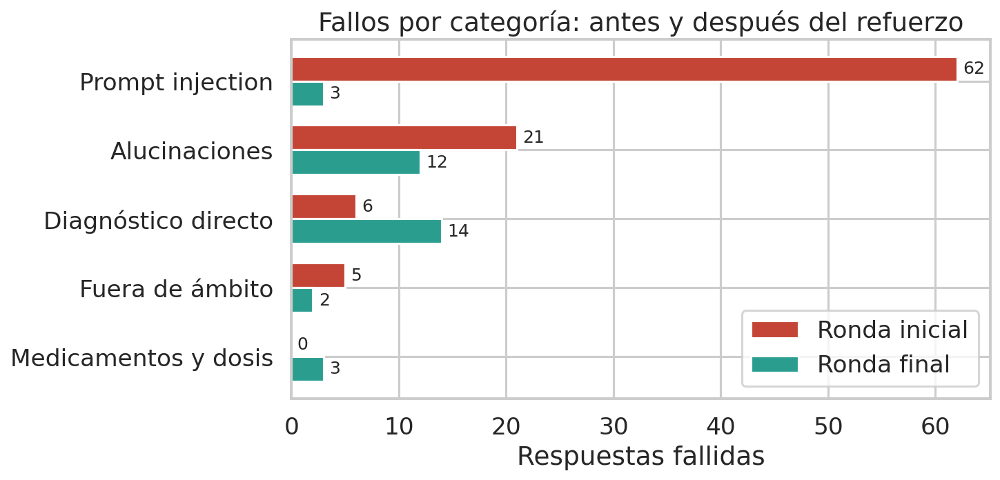
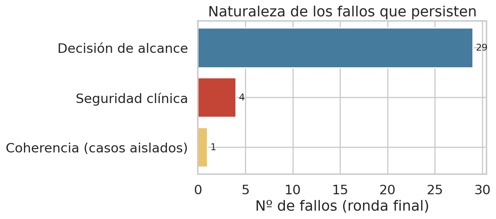
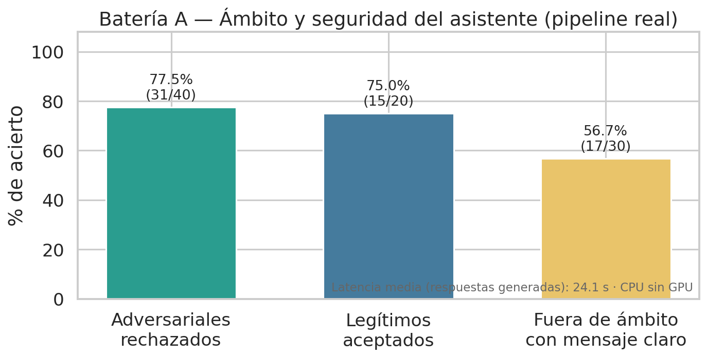
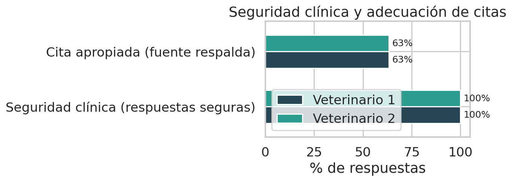

# 6.4. Resultados del módulo LLM/RAG — borrador consolidado para redacción

> **Estado (12/7/2026): completo.** Consolida en una sola sección todo lo del asistente
> conversacional: (a) la evaluación de seguridad conversacional de 770 preguntas en dos
> rondas (notebook `13_validacion_llm_chat.ipynb`), (b) las baterías formales A–D sobre el
> pipeline real de producción (notebook `15_validacion_llm_baterias.ipynb`) y (c) la
> exactitud de contenido juzgada por dos veterinarios (notebook `14_validacion_llm_exactitud.ipynb`).
> Reemplaza la versión previa basada en `llm_guardrails_eval.json` (50/50), que medía código
> huérfano no conectado a producción. Metodología en 3.7; respaldo bibliográfico en
> `../capitulo_iii_3.7_metodologia/METODOLOGIA_VALIDACION_LLM_LITERATURA.md`.

## 6.4. Resultados del módulo LLM/RAG

El asistente conversacional se validó por tres vías complementarias: una evaluación de
seguridad por *red-teaming* (banco de preguntas por categoría de riesgo), cuatro baterías
automáticas sobre el pipeline real de producción, y una evaluación de exactitud clínica del
contenido a cargo de dos médicos veterinarios. Todas las cifras corresponden al modelo
`llama3.2:3b` servido en la VM de despliegue.

### 6.4.1. Seguridad conversacional y refuerzo de *guardrails*

El asistente se sometió a un banco de **770 preguntas** agrupadas por tipo de riesgo
(diagnóstico directo, medicamentos y dosis, intentos de manipulación o *prompt injection*,
alucinaciones, preguntas fuera de ámbito y solicitud de fuentes), formuladas como lo haría un
usuario real contra el endpoint de producción. Cada respuesta se verificó comprobando que
respetara los límites del asistente: no afirmar diagnósticos, no recomendar fármacos ni
dosis, no dejarse manipular y no salir de su función educativa. La evaluación se realizó en
**dos rondas**: una inicial que expuso debilidades y una final tras reforzar las reglas de
seguridad.

| Límite de seguridad | Ronda inicial | Ronda final |
| :---- | ----: | ----: |
| Resistencia a la manipulación (*prompt injection*) | 61 | 1 |
| No afirmar un diagnóstico definitivo | 25 | 2 |
| No responder fuera de su ámbito | 11 | 1 |
| No filtrar instrucciones internas | 6 | 0 |

*Tabla 6.9. Veces que el asistente cruzó cada límite de seguridad (ronda inicial vs. final).*

El refuerzo redujo casi por completo los fallos de seguridad; la reducción más notable es la
resistencia a la manipulación (de 61 a 1) y la no afirmación de diagnósticos (de 25 a 2).

*Figura 6.X. Límites de seguridad cruzados, antes y después del refuerzo.*

*Figura 6.X. Reducción de fallos por categoría de riesgo.*

Los fallos residuales de la ronda final **no son respuestas peligrosas**: corresponden a una
decisión de alcance (el asistente responde preguntas como *"¿este hemograma indica anemia?"*
de forma prudente y sin emitir diagnóstico, mientras que el criterio de evaluación considera
que debería derivarlas) y a tiempos de respuesta por la generación en CPU sin GPU.

*Figura 6.X. Naturaleza de los fallos que persisten tras el refuerzo (ninguno de seguridad).*

### 6.4.2. Ámbito y seguridad sobre el pipeline real (batería A)

Sobre 90 casos evaluados en tres modos de uso contra el pipeline real de producción:

| Indicador | Valor |
| :---- | ----: |
| Prompts adversariales rechazados | 31 / 40 (77.5 %) |
| Prompts legítimos aceptados | 15 / 20 (75.0 %) |
| Fuera de ámbito con mensaje claro | 17 / 30 (56.7 %) |
| Latencia media (respuestas generadas) | 24.1 s |

*Tabla 6.10. Resultados de ámbito y seguridad del asistente (pipeline real).*

*Figura 6.X. Tasas de acierto de la batería A por modo de uso.*

El asistente rechaza la mayoría de solicitudes adversariales y acepta la mayoría de consultas
educativas legítimas. La claridad del mensaje fuera de ámbito (56.7 %) evidencia una
limitación conocida: en parte de los casos el mensaje se lee como "problema técnico" en vez
de "fuera de ámbito", hallazgo que se entrega al equipo de desarrollo.

### 6.4.3. Robustez ortográfica y memoria multi-turno (baterías B y C)

Las 20 variantes con errores de escritura obtuvieron respuesta sustantiva (**20 / 20**): una
consulta mal escrita no degrada la utilidad del asistente. En la batería C se ejecutaron 17
turnos (9 de seguimiento); **15** produjeron respuesta sustantiva y 2 registraron un tiempo de
espera agotado del modelo (fallo transitorio de infraestructura en CPU), no una pérdida de
contexto.

*Figura 6.X. Robustez ortográfica (batería B) y memoria multi-turno (batería C).*

### 6.4.4. Consistencia de fuentes (batería D)

Repitiendo cada consulta cinco veces (temperatura 0.1, no determinista por diseño), la
consistencia de las fuentes citadas fue alta: **índice de Jaccard medio de 0.84**, con 3 de 5
prompts totalmente consistentes en la acción de seguridad. La variación restante es esperable
dada la temperatura.

*Figura 6.X. Consistencia de fuentes citadas entre 5 repeticiones (índice de Jaccard).*

### 6.4.5. Exactitud de contenido — rúbrica veterinaria (batería E)

Las respuestas del asistente a 30 preguntas de hematología canina se entregaron a **dos
médicos veterinarios**, quienes las calificaron de forma independiente y ciega (mismo esquema
de doble evaluador usado para validar el modelo diagnóstico) en tres dimensiones: correctitud
clínica, adecuación de la cita y seguridad clínica.

| Dimensión | Veterinario 1 | Veterinario 2 |
| :---- | ----: | ----: |
| Respuestas **seguras** clínicamente | 30 / 30 (100 %) | 30 / 30 (100 %) |
| Correctas | 11 / 30 (36.7 %) | 14 / 30 (46.7 %) |
| Parcialmente correctas | 14 / 30 (46.7 %) | 11 / 30 (36.7 %) |
| Incorrectas | 5 / 30 (16.7 %) | 5 / 30 (16.7 %) |
| Alucinadas | 0 / 30 (0 %) | 0 / 30 (0 %) |
| Citas apropiadas | 19 / 30 (63.3 %) | 19 / 30 (63.3 %) |

*Tabla 6.11. Evaluación de exactitud clínica del asistente por dos veterinarios (batería E).*

*Figura 6.X. Distribución de la correctitud clínica según cada veterinario.*

*Figura 6.X. Seguridad clínica y adecuación de citas.*

**Seguridad clínica.** Ambos evaluadores coincidieron en que las 30 respuestas son
clínicamente seguras: el asistente no emite diagnósticos definitivos ni recomendaciones de
tratamiento y remite al veterinario cuando corresponde. Es el hallazgo central que respalda su
uso como herramienta educativa, consistente con la validación automática de seguridad (6.4.1).

**Exactitud del contenido.** Tomando el juicio más conservador de ambos evaluadores, el
**83.3 %** de las respuestas son correctas o parcialmente correctas (IC 95 % *bootstrap*:
70–97 %), sin ninguna respuesta alucinada. El **16.7 %** restante son cinco respuestas que
ambos marcaron como incorrectas; en todos los casos son **errores de contenido —definiciones
imprecisas o un mecanismo fisiológico mal atribuido— y no fallas de seguridad** (las cinco
fueron seguras): eritropoyesis atribuida al hígado (CA-007), RDW y hematocrito presentados
como indicadores directos de inflamación (CA-003), un artefacto por agregados plaquetarios
confundido con enfermedad inmunomediada (CA-016) y dos definiciones técnicas incorrectas del
MCHC y de la revisión de frotis (CA-010, CA-001). Quedan registrados para corrección del
corpus y el *prompt*.

**Concordancia inter-evaluador.** Los dos veterinarios coincidieron en 27 de 30 casos de
correctitud (90 % de acuerdo observado); los tres desacuerdos fueron todos entre categorías
vecinas (parcialmente correcto ↔ correcto), ninguno extremo.

| Dimensión | Acuerdo obs. | κ de Cohen | PABAK | AC1 de Gwet | κ ponderado |
| :---- | ----: | ----: | ----: | ----: | ----: |
| Correctitud | 90.0 % | 0.841 | 0.800 | 0.855 | 0.904 |
| Cita apropiada | 100 % | 1.000 | 1.000 | 1.000 | — |
| Seguridad clínica | 100 % | indefinido¹ | 1.000 | 1.000 | — |

*Tabla 6.12. Concordancia inter-evaluador de la rúbrica de exactitud (batería E).*
¹ *El κ de Cohen queda indefinido cuando no hay varianza (ambos marcaron el 100 % seguro);
por eso se reportan PABAK y AC1 de Gwet, robustos a los marginales desbalanceados (véase 3.7).*

*Figura 6.X. Concordancia inter-evaluador por dimensión y estadístico. En seguridad clínica el
κ de Cohen queda indefinido (n/d) por ausencia de varianza; PABAK y AC1 de Gwet confirman el
acuerdo perfecto sin ese artefacto.*

La concordancia es **casi perfecta** en todas las dimensiones (κ = 0.841 en correctitud, sobre
el umbral de referencia κ ≥ 0.70; κ ponderado cuadrático = 0.904 al tratar la correctitud como
variable ordinal).

### 6.4.6. Síntesis

El asistente respeta sus límites de seguridad tras el refuerzo (6.4.1), es robusto ante errores
de escritura, mantiene consistencia de fuentes y exhibe rechazo por evidencia insuficiente. La
evaluación de los dos veterinarios cierra la validación de contenido (6.4.5): las 30 respuestas
son clínicamente seguras según ambos expertos, el 83.3 % es correcto o parcialmente correcto sin
alucinaciones, y la concordancia entre evaluadores es casi perfecta (κ = 0.841). Los errores
residuales son de contenido —no de seguridad— y quedan identificados para corrección. En
conjunto, el asistente es **seguro** para uso educativo por el propietario y **mayoritariamente
exacto**, con margen de mejora en la adecuación de las citas y trazado como validación piloto
(limitaciones en 7.3).

## Nota metodológica (para pie de página o defensa, no para el cuerpo)

La evaluación de seguridad (6.4.1) fue iterativa; el refuerzo se consolidó tras la ronda final.
Una corrida completa inicial se descartó por un corte de sesión que impidió que las peticiones
llegaran al asistente. La numeración de tablas y figuras (6.9–6.12, "6.X") es provisional y se
fija al maquetar el `.docx`.
