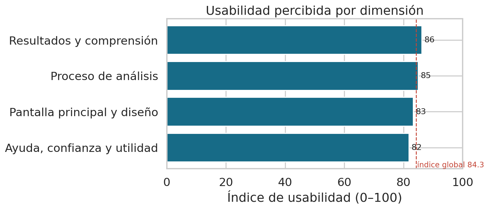
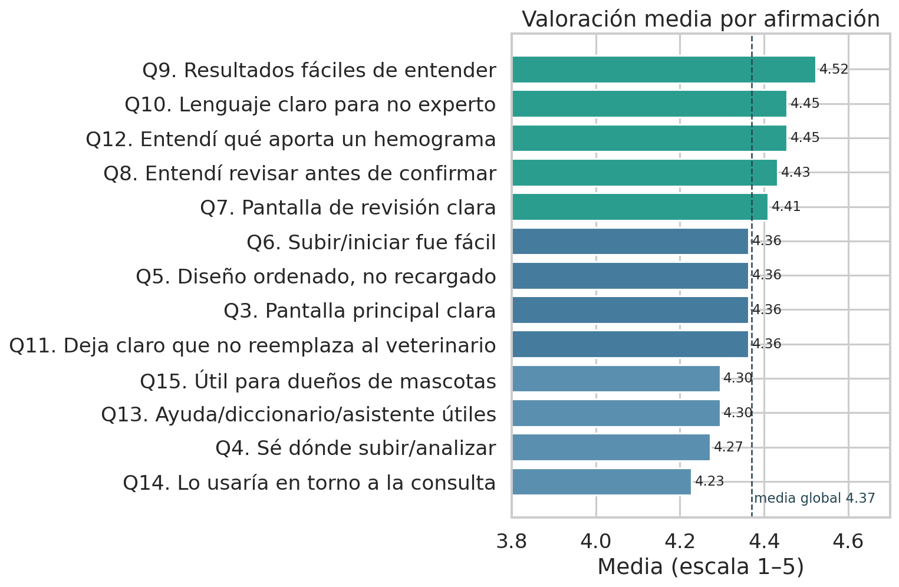
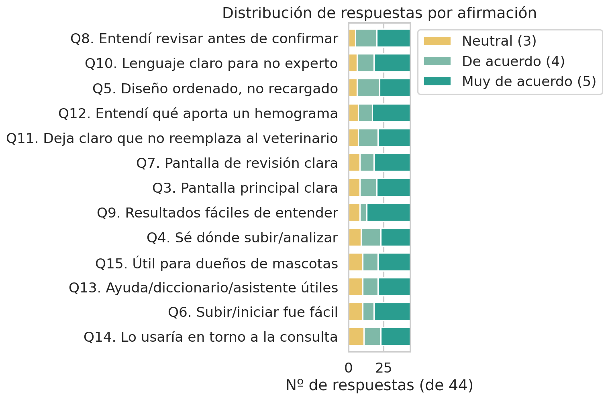

# Redacción — Sección 6.7: Validación de usabilidad del prototipo

> Texto propuesto para el Capítulo VI, con cifras REALES de la encuesta de usabilidad
> (44 participantes). Datos fuente: `Respuestas - Validación HemoVet.xlsx`. Análisis y
> figuras: `notebooks/validacion/16_validacion_usabilidad.ipynb`. Es una vía de validación
> complementaria a la del modelo diagnóstico (6.3) y la del asistente (6.4); evalúa la
> experiencia de uso de la aplicación, no la exactitud clínica.

## 6.7. Validación de usabilidad del prototipo

Se aplicó una encuesta de usabilidad a **44 participantes** que usaron el prototipo de
HemoVet. El instrumento constó de 13 afirmaciones en escala Likert de 1 (muy en desacuerdo)
a 5 (muy de acuerdo), organizadas según el recorrido del usuario (pantalla principal,
proceso de análisis, resultados y comprensión, y ayuda/utilidad), más tres preguntas
abiertas. La muestra es representativa del público objetivo: el **50 %** son dueños de
mascota y el **77 %** nunca había visto un hemograma, es decir, usuarios legos que dependen
de que la aplicación explique la información.

### 6.7.1. Resultados cuantitativos

La valoración fue **consistentemente positiva**: media global de **4.37/5**, equivalente a
un **índice de usabilidad de 84/100** (normalizando la media Likert como `(media−1)/4×100`).
El **81.6 %** de las respuestas fueron favorables (4 o 5) y **ninguna** fue desfavorable
(no se registró ningún 1 ni 2 en los 13 ítems).

| Dimensión | Media | % favorable | Índice /100 |
| :---- | ----: | ----: | ----: |
| Pantalla principal y diseño | 4.33 | 82.6 % | 83.3 |
| Proceso de análisis | 4.40 | 82.6 % | 85.0 |
| Resultados y comprensión | 4.45 | 84.1 % | 86.2 |
| Ayuda, confianza y utilidad | 4.27 | 76.5 % | 81.8 |
| **Global** | **4.37** | **81.6 %** | **84.3** |

*Tabla 6.12. Usabilidad percibida por dimensión (n = 44).*

*Figura 6.X. Índice de usabilidad (0–100) por dimensión.*

Las afirmaciones mejor valoradas fueron que los **resultados son fáciles de entender**
(4.52), el **lenguaje es claro para una persona no experta** (4.45), el usuario **entendió
qué aporta un hemograma** (4.45) y que **debía revisar los valores antes de confirmar**
(4.43). Estas cifras respaldan directamente dos decisiones de diseño centrales: la
traducción del hemograma a lenguaje llano y la revisión humana obligatoria. Los ítems con
más respuestas neutrales —*"lo usaría en torno a la consulta"* (25 % neutral) y las
secciones de ayuda/utilidad— no reflejan rechazo, sino margen para comunicar mejor el valor
añadido.

*Figura 6.X. Media por afirmación (13 ítems, escala 1–5).*

*Figura 6.X. Distribución de respuestas por afirmación (solo se registraron valores 3–5).*

### 6.7.2. Resultados cualitativos (preguntas abiertas)

Las tres preguntas abiertas se codificaron por temas. Los **aciertos más citados** (Q16,
44 respuestas) coinciden con las decisiones de diseño intencionales: el **diccionario/
glosario**, la **guía de 3 pasos**, poder **corregir los valores mal leídos**, el **resumen
final**, los **colores semánticos** (verde/rojo) de los resultados, el **aviso de que no
reemplaza al veterinario** y el **modo invitado**.

*Figura 6.X. Aspectos mejor valorados (Q16).*

Las **confusiones** (Q17) y **mejoras pedidas** (Q18) son concretas y accionables, no
estructurales, y varias confirman limitaciones ya conocidas del sistema:

- **Chat:** mayor **velocidad** (6 menciones) y **memoria conversacional** (5) — coincide
  con la latencia en CPU sin GPU documentada en 6.4 y con la naturaleza multi-turno del
  asistente.
- **Resultados:** una **leyenda de colores fija** (4) y mostrar los **rangos normales junto
  a los valores** (2).
- **Compartir:** exportar el resultado por **WhatsApp/correo** (4).
- **Accesibilidad:** un **modo de alto contraste** (3) y **menos texto** para personas
  mayores (1).
- **Confusiones puntuales:** el objetivo del **mapa/zona en el registro** (4), si las
  **fuentes del chat son reales** (3) —confirmado como reales en la validación veterinaria
  del asistente, 6.4.4—, si las **ediciones se guardan** (3), el **formato de archivo**
  aceptado (3), la diferencia de **contexto del chat** (2) y la ubicación del **toggle de
  tema oscuro** (2). Se reportó además que el **tour de bienvenida no arrancaba**, hallazgo
  que se corrige como trabajo de desarrollo.

*Figura 6.X. Temas más mencionados en confusiones (Q17) y mejoras (Q18).*

### 6.7.3. Síntesis

La aplicación se percibe **clara, ordenada y útil** por una muestra mayoritariamente lega,
con un índice de usabilidad de 84/100 y sin valoraciones desfavorables. Los aciertos
percibidos validan las decisiones de diseño orientadas a la seguridad y la comprensión, y
las mejoras solicitadas alimentan una hoja de ruta priorizada (velocidad y memoria del chat,
leyenda de colores, compartir, alto contraste, mini-tutorial), recogida en las
recomendaciones (7.5). La limitación de esta validación se declara en 7.3: es usabilidad
*percibida* con muestra de conveniencia y un instrumento propio (no un SUS estandarizado),
sin medición cronometrada de tareas.
