# 6. Capítulo VI · Análisis de los resultados — CAPÍTULO COMPLETO (borrador para reemplazo)

> **Qué es este archivo (12/7/2026).** Ensambla el **Capítulo VI entero** listo para pegar
> en el `.docx`: el contenido actual (6.1–6.3, 6.5, 6.6) tal como está en el documento, con
> dos cambios integrados por las validaciones nuevas:
> 1. **6.4 (LLM/RAG) — REEMPLAZADA por completo.** El "50 de 50 / 20 de 20" del documento
>    actual es INVÁLIDO (medía `context.detect_intent`, código huérfano que no ejercía el
>    asistente real). Aquí va la sección real y completa (seguridad conversacional +
>    baterías A–E + exactitud veterinaria).
> 2. **6.7 (Usabilidad del prototipo) — NUEVA.** Encuesta de 44 participantes.
>
> La antigua "6.7 Síntesis crítica" pasa a **6.8** y se actualiza. Todas las figuras están
> en esta misma carpeta (rutas locales). **La numeración de tablas y figuras (6.1–6.15 /
> 6.1–6.29) es provisional y se confirma al maquetar.**
> Fuentes: notebooks `13`, `14`, `15`, `16` en `notebooks/validacion/`; datos en
> `validacion_llm/resultados/`, `tools/llm_cbc_eval/results/`, `Respuestas - Validación HemoVet.xlsx`.

---

# 6. Capítulo VI · Análisis de los resultados

Este capítulo presenta el análisis de los resultados obtenidos por HemoVet en sus
componentes principales: motor de clasificación hematológica, validación externa con el Dog
Aging Project, validación clínica con médicos veterinarios, módulo conversacional LLM/RAG,
pruebas técnicas, rendimiento de inferencia, vigilancia poblacional agregada y usabilidad del
prototipo. A diferencia del capítulo de desarrollo, el objetivo aquí no es describir cómo se
construyó la plataforma, sino interpretar el comportamiento del sistema a partir de la
evidencia generada durante las fases de prueba y validación.

El análisis se organiza separando resultados de aprendizaje automático, resultados clínicos y
resultados de ingeniería. Esta separación evita atribuir al modelo conclusiones que dependen
del criterio clínico humano, y evita presentar métricas técnicas como si fueran validación
diagnóstica. En consecuencia, los resultados se interpretan como evidencia de desempeño
orientativo y de preparación operativa, no como autorización para uso diagnóstico autónomo.

## 6.1. Resultados del motor de clasificación hematológica

El estado final del sistema quedó registrado como listo para producción con limitaciones.
Esta condición indica que el sistema se considera funcional y desplegable para escenarios
controlados, pero con limitaciones documentadas. El motor final opera con siete etiquetas
oficiales y conserva una política explícita para etiquetas de bajo soporte. En particular,
PATRON_ANEMIA_REGENERATIVA se mantiene como etiqueta exploratoria debido a que el conjunto de
prueba incluyó solo 6 casos positivos para esa clase.

En el conjunto de prueba, el sistema alcanzó un PR-AUC macro de 0.9529, un F1 macro de 0.8727
y un recall macro de 0.9205. Estos valores indican un rendimiento global alto para un problema
multilabel desbalanceado; sin embargo, la interpretación debe realizarse por etiqueta, porque
las clases presentan soportes y costos de error diferentes.

| Indicador | Valor |
| :---- | :---- |
| Estado del sistema | READY_FOR_PRODUCTION_WITH_LIMITATIONS |
| Versión reportada | 4.0.0 |
| Etiquetas oficiales | 7 |
| PR-AUC macro final | 0.9529 |
| F1 macro final | 0.8727 |
| Recall macro final | 0.9205 |
| Brier macro final | 0.0298 |
| Conteo TP/FP/FN/TN | 585 / 54 / 49 / 1895 |

*Tabla 6.1. Resumen del estado final del sistema HemoVet.*

### 6.1.1. Métricas finales por etiqueta

La Tabla 6.2 muestra el rendimiento final por etiqueta en el conjunto de prueba. La lectura por
etiqueta evidencia que los patrones inflamatorio, leucograma de estrés, anemia no regenerativa,
hemólisis/MCHC y policitemia presentan valores altos de PR-AUC y F1. En cambio,
QC_REQUIERE_FROTIS y PATRON_ANEMIA_REGENERATIVA requieren interpretación más cuidadosa por menor
F1 o menor soporte positivo.

| Etiqueta | n+ | Umbral | TP | FP | FN | Recall | Precisión | Espec. | F1 | PR-AUC |
| :---- | :---- | :---- | :---- | :---- | :---- | :---- | :---- | :---- | :---- | :---- |
| QC requiere frotis | 136 | 0.300 | 93 | 26 | 43 | 0.684 | 0.781 | 0.888 | 0.729 | 0.846 |
| Patrón inflamatorio | 198 | 0.641 | 197 | 4 | 1 | 0.995 | 0.980 | 0.977 | 0.988 | 0.993 |
| Leucograma de estrés | 172 | 0.300 | 171 | 11 | 1 | 0.994 | 0.940 | 0.944 | 0.966 | 0.983 |
| Anemia no regenerativa | 42 | 0.456 | 42 | 1 | 0 | 1.000 | 0.977 | 0.997 | 0.988 | 0.972 |
| Hemólisis/MCHC | 48 | 0.714 | 45 | 3 | 3 | 0.938 | 0.938 | 0.991 | 0.938 | 0.988 |
| Policitemia | 32 | 0.900 | 32 | 0 | 0 | 1.000 | 1.000 | 1.000 | 1.000 | 1.000 |
| Anemia regenerativa | 6 | 0.479 | 5 | 9 | 1 | 0.833 | 0.357 | 0.975 | 0.500 | 0.889 |

*Tabla 6.2. Métricas finales del modelo por etiqueta en conjunto de prueba.*

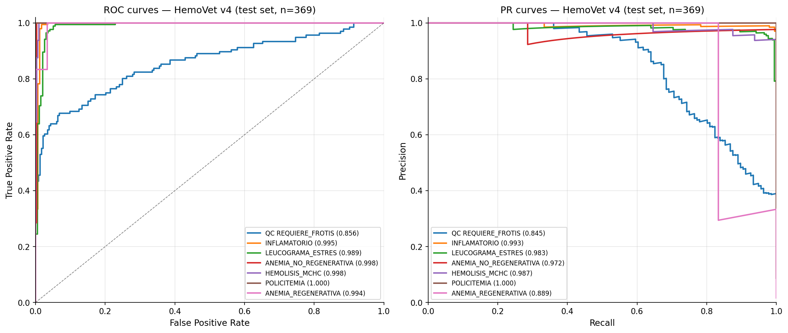
*Figura 6.1. Curvas ROC y Precision-Recall del modelo HemoVet v4 en el conjunto de prueba.*

Las curvas ROC y Precision-Recall confirman que la separación de clases es sólida para la
mayoría de las etiquetas. No obstante, en clasificación clínica desbalanceada se prioriza la
lectura del PR-AUC y del F1 operativo, porque estas métricas penalizan con mayor claridad los
falsos positivos y falsos negativos sobre la clase positiva.

### 6.1.2. Intervalos de confianza bootstrap

Para estimar la incertidumbre de las métricas, se calcularon intervalos de confianza al 95%
mediante bootstrap. La Tabla 6.3 muestra que las etiquetas con mayor soporte mantienen
intervalos estrechos, mientras que PATRON_ANEMIA_REGENERATIVA presenta intervalos amplios,
coherentes con su soporte reducido. Esta amplitud justifica que dicha etiqueta se mantenga como
resultado oficial de bajo soporte, no como salida plenamente consolidada.

| Etiqueta | Recall medio | IC95 Recall | F1 medio | IC95 F1 | PR-AUC medio | IC95 PR-AUC |
| :---- | :---- | :---- | :---- | :---- | :---- | :---- |
| QC requiere frotis | 0.681 | [0.6046, 0.7561] | 0.726 | [0.6617, 0.7843] | 0.844 | [0.7932, 0.8889] |
| Patrón inflamatorio | 0.995 | [0.9838, 1.0] | 0.987 | [0.9746, 0.9974] | 0.993 | [0.9792, 1.0] |
| Leucograma de estrés | 0.994 | [0.9819, 1.0] | 0.966 | [0.946, 0.9858] | 0.983 | [0.962, 0.9965] |
| Anemia no regenerativa | 1.000 | [1.0, 1.0] | 0.988 | [0.96, 1.0] | 0.973 | [0.9117, 1.0] |
| Hemólisis/MCHC | 0.936 | [0.8571, 1.0] | 0.936 | [0.8764, 0.9811] | 0.987 | [0.9603, 1.0] |
| Policitemia | 1.000 | [1.0, 1.0] | 1.000 | [1.0, 1.0] | 1.000 | [1.0, 1.0] |
| Anemia regenerativa | 0.832 | [0.4429, 1.0] | 0.485 | [0.1654, 0.7619] | 0.887 | [0.562, 1.0] |

*Tabla 6.3. Intervalos de confianza bootstrap al 95% por etiqueta.*

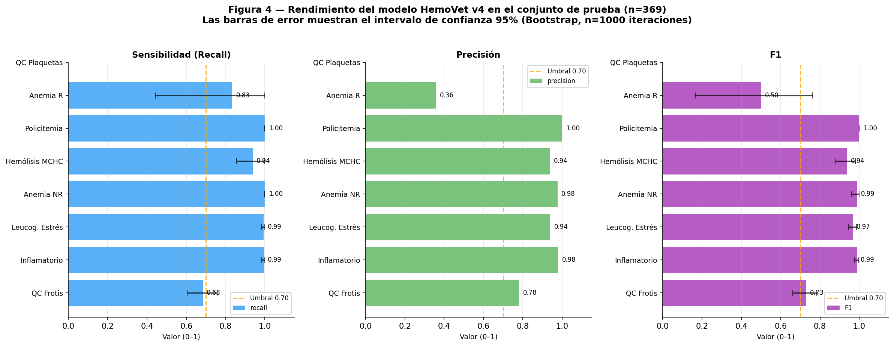
*Figura 6.2. Rendimiento final del modelo HemoVet v4 con intervalos de confianza al 95%.*

### 6.1.3. Evolución del modelo v3 a v4

La comparación entre v3 y v4 muestra que la actualización no produjo una mejora uniforme en
PR-AUC, pero sí permitió elevar el recall macro y mejorar el comportamiento operativo de
etiquetas específicas. El cambio más relevante se observa en QC_REQUIERE_FROTIS, donde el
recall aumentó a costa de mayor número de falsos positivos, y en PATRON_POLICITEMIA, donde el
recall pasó de 0.8750 a 1.0000 en el conjunto de prueba.

| Etiqueta | PR-AUC v3 | PR-AUC v4 | Δ PR-AUC | F1 v3 | F1 v4 | Δ F1 | Recall v3 | Recall v4 | Δ Recall |
| :---- | :---- | :---- | :---- | :---- | :---- | :---- | :---- | :---- | :---- |
| QC requiere frotis | 0.861 | 0.846 | -0.015 | 0.711 | 0.729 | +0.018 | 0.588 | 0.684 | +0.096 |
| Patrón inflamatorio | 0.994 | 0.993 | -0.001 | 0.988 | 0.988 | +0.000 | 0.995 | 0.995 | +0.000 |
| Leucograma de estrés | 0.986 | 0.983 | -0.003 | 0.972 | 0.966 | -0.006 | 0.994 | 0.994 | +0.000 |
| Anemia no regenerativa | 0.985 | 0.972 | -0.013 | 0.988 | 0.988 | +0.000 | 1.000 | 1.000 | +0.000 |
| Hemólisis/MCHC | 0.992 | 0.988 | -0.005 | 0.936 | 0.938 | +0.001 | 0.917 | 0.938 | +0.021 |
| Policitemia | 1.000 | 1.000 | +0.000 | 0.933 | 1.000 | +0.067 | 0.875 | 1.000 | +0.125 |
| Anemia regenerativa | 0.886 | 0.889 | +0.003 | 0.500 | 0.500 | +0.000 | 0.833 | 0.833 | +0.000 |

*Tabla 6.4. Comparación de métricas entre v3 y v4 en conjunto de prueba.*

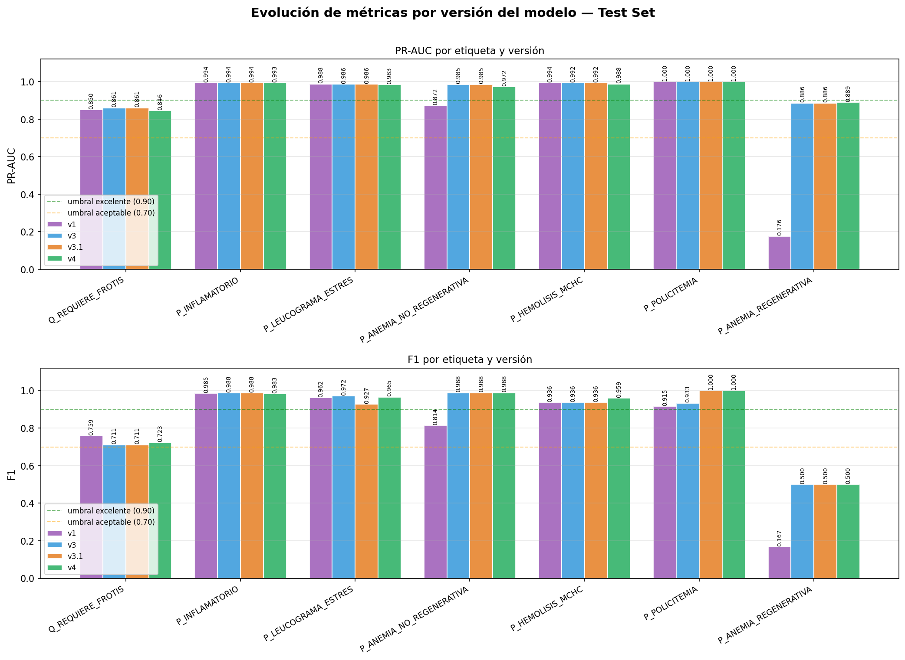
*Figura 6.3. Evolución de PR-AUC y F1 por versión del modelo en el conjunto de prueba.*

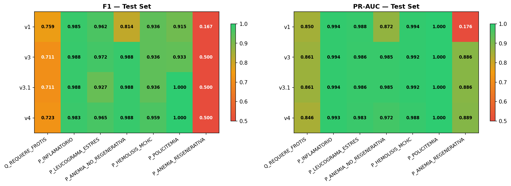
*Figura 6.4. Heatmap comparativo de F1 y PR-AUC por versión del modelo.*

El comportamiento observado confirma una tensión esperada entre sensibilidad y precisión. En un
sistema orientativo para propietarios, aumentar la sensibilidad puede ser aceptable cuando la
salida se presenta como señal de revisión y no como diagnóstico definitivo. Sin embargo, este
aumento debe controlarse para evitar alarmas excesivas, especialmente en etiquetas de control de
calidad o patrones con alta superposición clínica.

### 6.1.4. Explicabilidad mediante SHAP

La explicación global de características mediante SHAP permitió verificar si el modelo apoyaba
sus decisiones en variables hematológicas coherentes con cada etiqueta. En las etiquetas
eritroides predominan HCT, HGB, RBC y variables de reticulocitos; en las etiquetas leucocitarias
predominan Monocytes, Lymphocytes, WBC y ratios derivados; y en las etiquetas asociadas a MCHC o
policitemia aparecen variables directamente relacionadas con los índices eritroides. Este patrón
es consistente con la interpretación hematológica esperada.

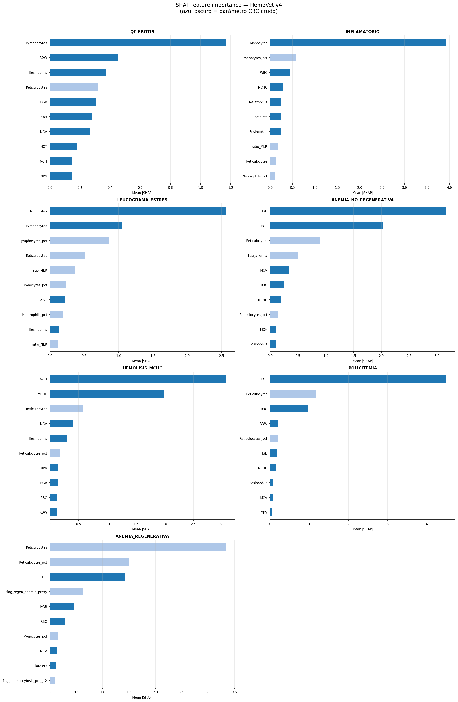
*Figura 6.5. Importancia global de características por etiqueta mediante SHAP.*

## 6.2. Validación externa con Dog Aging Project

La validación externa se realizó con 1301 registros del Dog Aging Project. Esta cohorte no
contiene etiquetas compatibles con el esquema supervisado de HemoVet, por lo que no se calcularon
F1 ni PR-AUC sobre DAP. Su función fue evaluar desplazamiento de dominio y coherencia biológica
mediante tasas de activación, sin reentrenar el modelo ni modificar umbrales.

El análisis identificó desplazamiento severo en Monocytes, RDW, y desplazamiento moderado en WBC,
Neutrophils, Platelets, HCT, MCHC, MPV, MCV. Esta diferencia es esperable porque el corpus IDEXX
procede de una población clínica local, mientras que DAP corresponde a una cohorte externa
predominantemente sana y geográficamente distinta.

| Etiqueta | Activación IDEXX | Activación DAP | Ratio DAP/IDEXX | Diagnóstico de coherencia |
| :---- | :---- | :---- | :---- | :---- |
| QC requiere frotis | 36.86% | 28.52% | 0.774 | aprox comparable |
| Patrón inflamatorio | 53.66% | 1.77% | 0.033 | OK esperado (DAP sano) |
| Leucograma de estrés | 46.61% | 19.14% | 0.411 | aprox comparable |
| Anemia no regenerativa | 11.38% | 0.61% | 0.054 | OK esperado (DAP sano) |
| Hemólisis/MCHC | 13.01% | 1.84% | 0.142 | OK esperado (DAP sano) |
| Policitemia | 8.67% | 2.15% | 0.248 | OK esperado (DAP sano) |
| Anemia regenerativa | 0.00% | 0.08% | inf | WARNING ALTO -- posible sobreprediccion |

*Tabla 6.5. Tasas de activación comparativas entre IDEXX y DAP.*

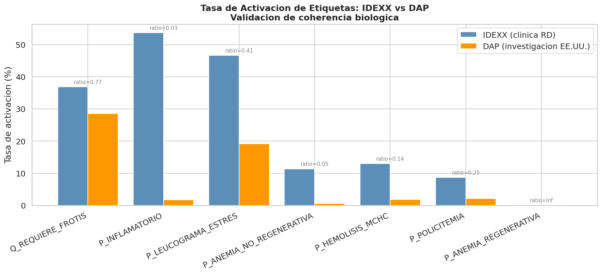
*Figura 6.6. Comparación de tasas de activación entre IDEXX y DAP.*

Las tasas de activación de PATRON_INFLAMATORIO, PATRON_ANEMIA_NO_REGENERATIVA,
PATRON_HEMOLISIS_MCHC y PATRON_POLICITEMIA fueron sustancialmente menores en DAP que en IDEXX.
Este resultado es coherente con la diferencia entre una población clínica y una cohorte externa
de investigación. En cambio, QC_REQUIERE_FROTIS y PATRON_LEUCOGRAMA_ESTRES muestran tasas menos
distantes, por lo que requieren seguimiento en despliegues futuros para confirmar que no exista
sobre-activación en entornos no clínicos.

## 6.3. Validación clínica con médicos veterinarios

La validación clínica se realizó durante el periodo 25 mayo – 18 junio 2026, con 60 batches, 526
casos totales, 509 casos evaluables con modelo, 2 evaluadores veterinarios y 4 semanas de
revisión. El modelo v3 se utilizó en S1, S2 y S3, mientras que v4 se evaluó en S4.

| Semana | Periodo | Batches | Casos | Modelo |
| :---- | :---- | :---- | :---- | :---- |
| S1 | 25-29 may 2026 | 12 | 116 | v3 |
| S2 | 2-7 jun 2026 | 12 | 100 | v3 |
| S3 | 9-13 jun 2026 | 12 | 105 | v3 |
| S4 | 14-18 jun 2026 | 24 | 205 | v4 |

*Tabla 6.6. Distribución semanal de la validación clínica.*

| Métrica | Valor |
| :---- | :---- |
| Casos totales | 526 |
| Casos evaluables con modelo | 509 |
| Evaluadores veterinarios | 2 |
| Semanas evaluadas | 4 |
| Batches revisados | 60 |
| Macro kappa M1 vs M2 | 0.684 |
| Macro kappa modelo vs M1 | 0.629 |
| Macro F1 modelo vs M1 | 0.704 |

*Tabla 6.7. Resumen global de la validación clínica.*

La validación clínica no se interpretó como una comparación contra una verdad absoluta. En
hematología, el criterio humano también presenta variabilidad, especialmente en patrones con
superposición fenotípica o soporte bajo. Por esta razón, primero se examinó la concordancia entre
los dos médicos veterinarios y luego se contrastó el modelo contra cada evaluador.

### 6.3.1. Concordancia interevaluador

La concordancia entre Médico 1 y Médico 2 funcionó como referencia del techo humano del problema.
El macro kappa M1 vs M2 fue 0.684, lo cual indica una concordancia sustancial, pero no perfecta.
Este resultado es metodológicamente importante porque impide interpretar automáticamente toda
discrepancia modelo-clínico como error del modelo.

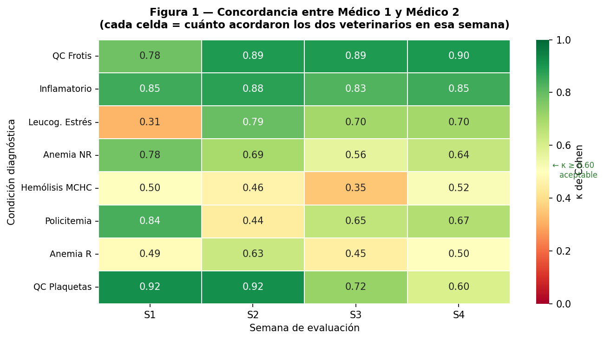
*Figura 6.7. Concordancia entre Médico 1 y Médico 2 por semana y etiqueta.*

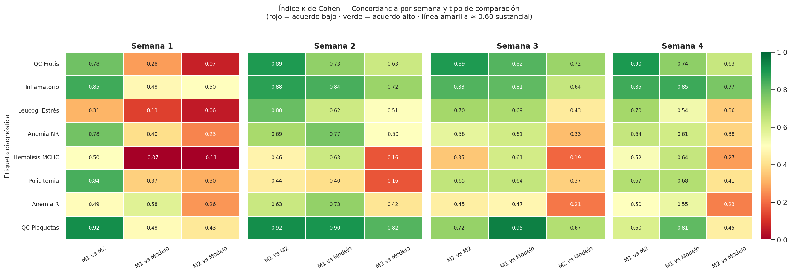
*Figura 6.8. Mapa completo de Cohen kappa por semana, etiqueta y tipo de comparación.*

### 6.3.2. Concordancia modelo-clínico

El macro kappa modelo vs Médico 1 fue 0.629 y el macro F1 modelo vs Médico 1 fue 0.704. Estos
valores indican que el sistema se aproximó al criterio clínico principal en un grado comparable
al nivel de variabilidad observado entre evaluadores, aunque con debilidades claras por etiqueta.
El mejor desempeño se observó en PATRON_INFLAMATORIO y QC_AGREGADOS_PLAQUETARIOS. Las debilidades
se concentraron en leucograma de estrés, policitemia y hemólisis/MCHC.

| Etiqueta | F1 | Sensibilidad | Especificidad |
| :---- | :---- | :---- | :---- |
| QC requiere frotis | 0.788 | 0.768 | 0.884 |
| Patrón inflamatorio | 0.863 | 0.901 | 0.876 |
| Leucograma de estrés | 0.689 | 0.841 | 0.733 |
| Anemia no regenerativa | 0.652 | 0.548 | 0.974 |
| Hemólisis/MCHC | 0.597 | 0.597 | 0.944 |
| Policitemia | 0.592 | 0.463 | 0.981 |
| Anemia regenerativa | 0.610 | 0.514 | 0.987 |
| Agregados plaquetarios | 0.839 | 0.743 | 0.998 |

*Tabla 6.8. Resultados globales del modelo frente al Médico 1 en validación clínica.*

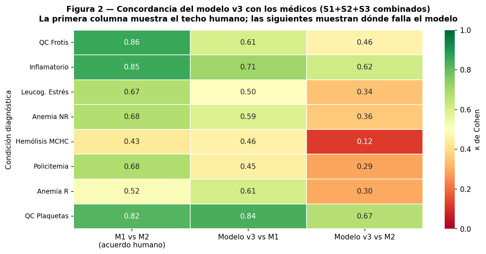
*Figura 6.9. Concordancia del modelo v3 frente a médicos veterinarios en S1-S3.*

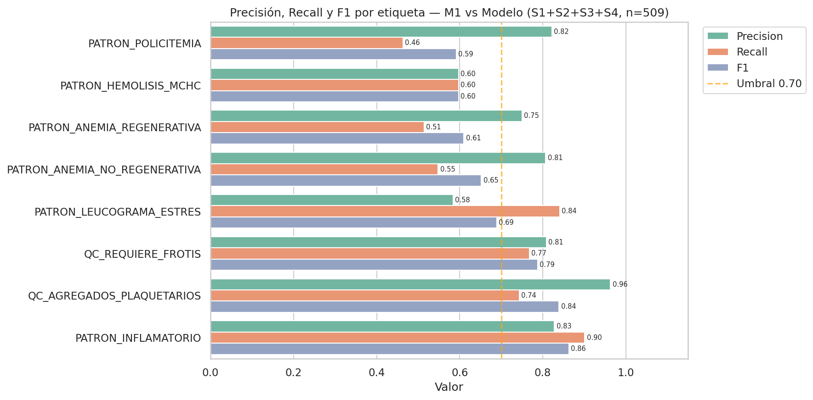
*Figura 6.10. Precisión, recall y F1 por etiqueta frente al Médico 1 en la validación clínica global.*

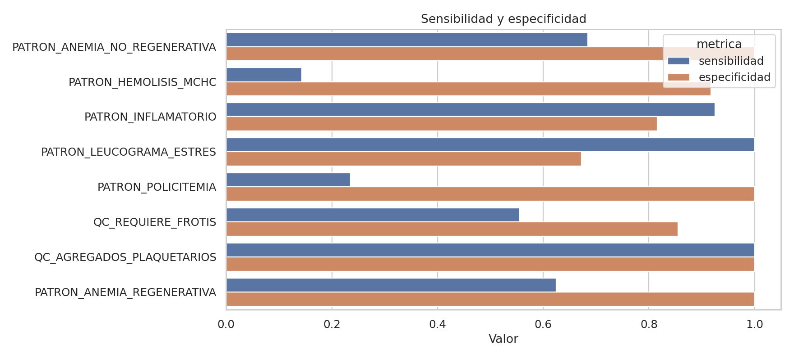
*Figura 6.11. Sensibilidad y especificidad por etiqueta en la validación clínica.*

### 6.3.3. Impacto del reentrenamiento clínico v3 a v4

El reentrenamiento hacia v4 respondió a los desacuerdos observados durante las tres primeras
semanas de validación. La comparación de kappa entre periodos previos y S4 muestra mejoras en
QC_FROTIS, PATRON_INFLAMATORIO, PATRON_HEMOLISIS_MCHC y PATRON_POLICITEMIA frente al Médico 1,
mientras que PATRON_ANEMIA_REGENERATIVA disminuyó ligeramente. Esta lectura confirma que el ajuste
mejoró varias señales operativas, pero no eliminó las limitaciones en etiquetas de bajo soporte o
con alto desacuerdo clínico.

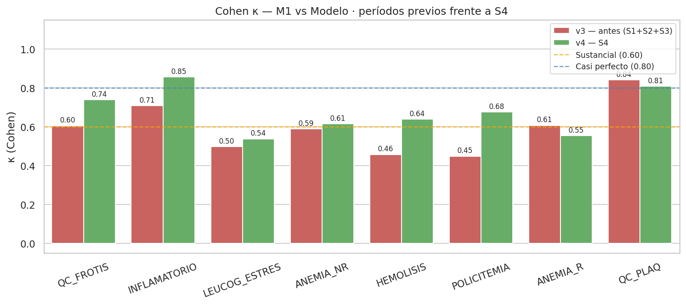
*Figura 6.12. Cohen kappa del modelo frente al Médico 1 antes y después del reentrenamiento.*

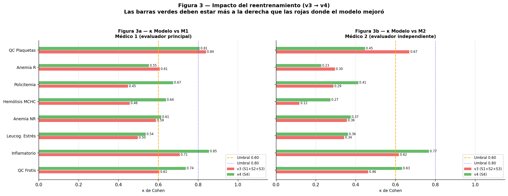
*Figura 6.13. Impacto del reentrenamiento v3 a v4 en la concordancia con médicos veterinarios.*

### 6.3.4. Análisis de desacuerdos

El análisis de desacuerdos mostró que PATRON_LEUCOGRAMA_ESTRES concentró falsos positivos frente
al Médico 1, lo que sugiere que el modelo detecta configuraciones hematológicas compatibles con
estrés en casos donde el evaluador no asignó esa etiqueta. PATRON_POLICITEMIA mostró falsos
negativos, lo que refleja una tendencia más conservadora del modelo en esta clase cuando se
compara contra el criterio clínico. PATRON_HEMOLISIS_MCHC presentó una combinación de desacuerdos
atribuibles tanto a criterios clínicos como a riesgo de circularidad por el uso de MCHC.

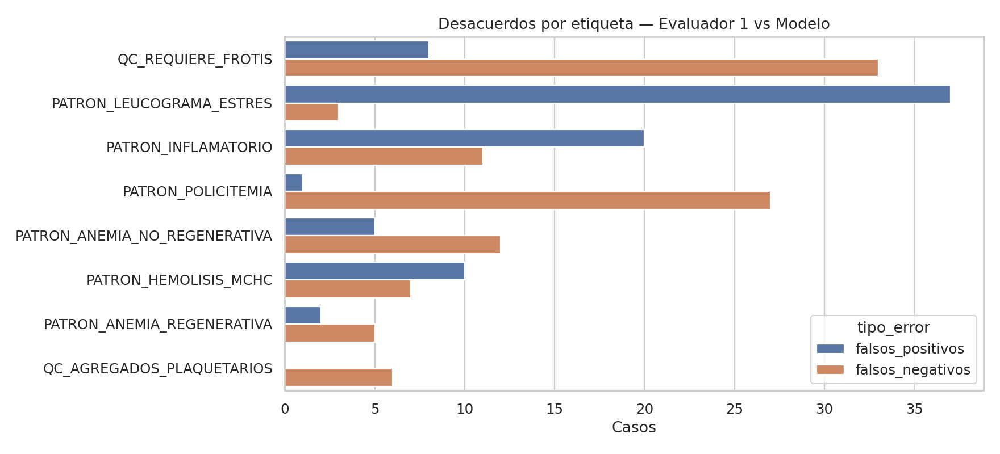
*Figura 6.14. Falsos positivos y falsos negativos por etiqueta frente al Médico 1.*

Estos desacuerdos deben interpretarse con prudencia. En un sistema orientativo, un falso positivo
puede generar una recomendación de revisar el caso con el veterinario, mientras que un falso
negativo puede omitir una señal relevante para la conversación clínica. Por ese motivo, la
estrategia de comunicación del sistema prioriza lenguaje de orientación, advertencias de alcance y
derivación explícita al profesional.

## 6.4. Resultados del módulo LLM/RAG

> **Nota:** esta sección reemplaza la versión previa del documento (Tabla "50 de 50 / 20 de 20"),
> que provenía de `llm_guardrails_eval.json` y medía una función determinista (`context.detect_intent`)
> no conectada a la ruta de producción. Los resultados siguientes corresponden al **pipeline real**
> (modelo `llama3.2:3b`) y a la evaluación de dos médicos veterinarios.

El asistente conversacional se validó por tres vías complementarias: una evaluación de seguridad
por *red-teaming* (banco de preguntas por categoría de riesgo), cuatro baterías automáticas sobre
el pipeline real de producción, y una evaluación de exactitud clínica del contenido a cargo de dos
médicos veterinarios.

### 6.4.1. Seguridad conversacional y refuerzo de guardrails

El asistente se sometió a un banco de 770 preguntas agrupadas por tipo de riesgo (diagnóstico
directo, medicamentos y dosis, intentos de manipulación o *prompt injection*, alucinaciones,
preguntas fuera de ámbito y solicitud de fuentes), formuladas como lo haría un usuario real contra
el endpoint de producción. La evaluación se realizó en dos rondas: una inicial que expuso
debilidades y una final tras reforzar las reglas de seguridad.

| Límite de seguridad | Ronda inicial | Ronda final |
| :---- | ----: | ----: |
| Resistencia a la manipulación (*prompt injection*) | 61 | 1 |
| No afirmar un diagnóstico definitivo | 25 | 2 |
| No responder fuera de su ámbito | 11 | 1 |
| No filtrar instrucciones internas | 6 | 0 |

*Tabla 6.9. Veces que el asistente cruzó cada límite de seguridad (ronda inicial vs. final).*

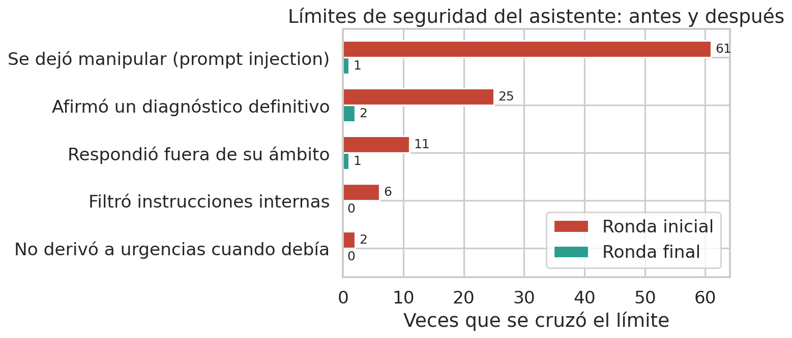
*Figura 6.15. Límites de seguridad cruzados, antes y después del refuerzo.*

*Figura 6.16. Reducción de fallos por categoría de riesgo.*

Los fallos residuales de la ronda final no son respuestas peligrosas: corresponden a una decisión
de alcance (el asistente responde preguntas como *"¿este hemograma indica anemia?"* de forma
prudente y sin emitir diagnóstico, mientras que el criterio de evaluación considera que debería
derivarlas) y a tiempos de respuesta por la generación en CPU sin GPU.

*Figura 6.17. Naturaleza de los fallos que persisten tras el refuerzo (ninguno de seguridad).*

### 6.4.2. Ámbito y seguridad sobre el pipeline real (batería A)

Sobre 90 casos evaluados en tres modos de uso contra el pipeline real de producción:

| Indicador | Valor |
| :---- | ----: |
| Prompts adversariales rechazados | 31 / 40 (77.5 %) |
| Prompts legítimos aceptados | 15 / 20 (75.0 %) |
| Fuera de ámbito con mensaje claro | 17 / 30 (56.7 %) |
| Latencia media (respuestas generadas) | 24.1 s |

*Tabla 6.10. Resultados de ámbito y seguridad del asistente (pipeline real).*

*Figura 6.18. Tasas de acierto de la batería A por modo de uso.*

El asistente rechaza la mayoría de solicitudes adversariales y acepta la mayoría de consultas
educativas legítimas. La claridad del mensaje fuera de ámbito (56.7 %) evidencia una limitación
conocida: en parte de los casos el mensaje se lee como "problema técnico" en vez de "fuera de
ámbito", hallazgo que se entrega al equipo de desarrollo.

### 6.4.3. Robustez ortográfica y memoria multi-turno (baterías B y C)

Las 20 variantes con errores de escritura obtuvieron respuesta sustantiva (20 / 20): una consulta
mal escrita no degrada la utilidad del asistente. En la batería C se ejecutaron 17 turnos (9 de
seguimiento); 15 produjeron respuesta sustantiva y 2 registraron un tiempo de espera agotado del
modelo (fallo transitorio de infraestructura en CPU), no una pérdida de contexto.

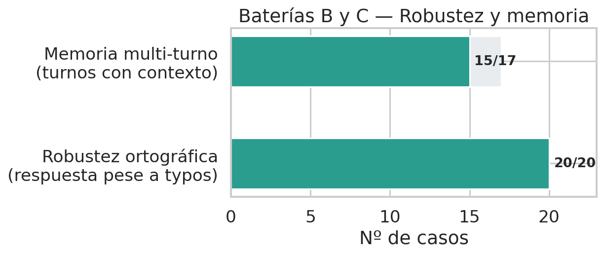
*Figura 6.19. Robustez ortográfica (batería B) y memoria multi-turno (batería C).*

### 6.4.4. Consistencia de fuentes (batería D)

Repitiendo cada consulta cinco veces (temperatura 0.1, no determinista por diseño), la consistencia
de las fuentes citadas fue alta: índice de Jaccard medio de 0.84, con 3 de 5 prompts totalmente
consistentes en la acción de seguridad.

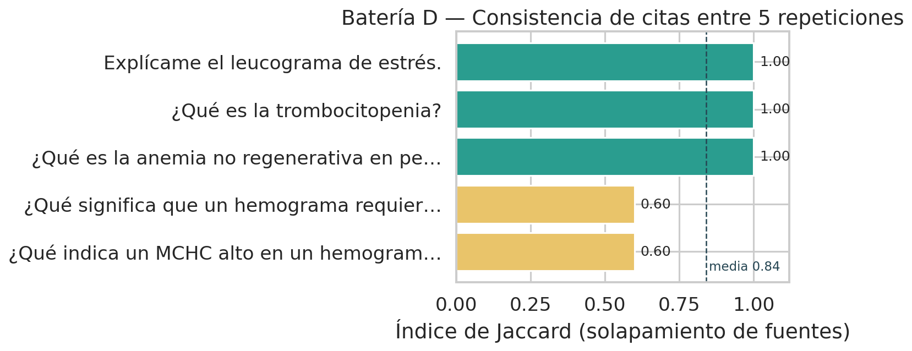
*Figura 6.20. Consistencia de fuentes citadas entre 5 repeticiones (índice de Jaccard).*

### 6.4.5. Exactitud de contenido — rúbrica veterinaria (batería E)

Las respuestas del asistente a 30 preguntas de hematología canina se entregaron a dos médicos
veterinarios, quienes las calificaron de forma independiente y ciega en tres dimensiones:
correctitud clínica, adecuación de la cita y seguridad clínica.

| Dimensión | Veterinario 1 | Veterinario 2 |
| :---- | ----: | ----: |
| Respuestas seguras clínicamente | 30 / 30 (100 %) | 30 / 30 (100 %) |
| Correctas | 11 / 30 (36.7 %) | 14 / 30 (46.7 %) |
| Parcialmente correctas | 14 / 30 (46.7 %) | 11 / 30 (36.7 %) |
| Incorrectas | 5 / 30 (16.7 %) | 5 / 30 (16.7 %) |
| Alucinadas | 0 / 30 (0 %) | 0 / 30 (0 %) |
| Citas apropiadas | 19 / 30 (63.3 %) | 19 / 30 (63.3 %) |

*Tabla 6.11. Evaluación de exactitud clínica del asistente por dos veterinarios (batería E).*

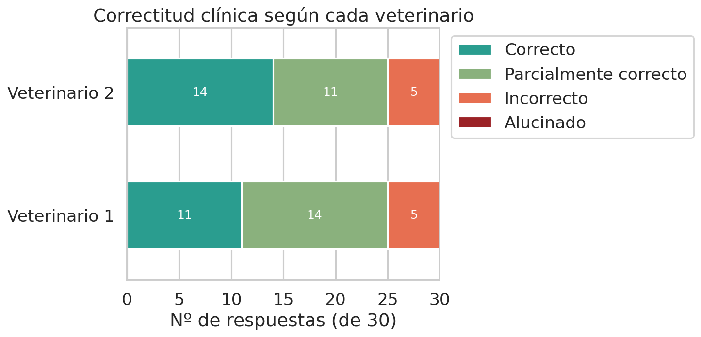
*Figura 6.21. Distribución de la correctitud clínica según cada veterinario.*

*Figura 6.22. Seguridad clínica y adecuación de citas.*

Ambos evaluadores coincidieron en que las 30 respuestas son clínicamente seguras: el asistente no
emite diagnósticos definitivos ni recomendaciones de tratamiento y remite al veterinario cuando
corresponde. Tomando el juicio más conservador de ambos, el 83.3 % de las respuestas son correctas
o parcialmente correctas (IC 95 % bootstrap: 70–97 %), sin ninguna respuesta alucinada. El 16.7 %
restante son cinco respuestas que ambos marcaron como incorrectas; en todos los casos son errores
de contenido —definiciones imprecisas o un mecanismo fisiológico mal atribuido— y no fallas de
seguridad, y quedan registrados para corrección del corpus y el *prompt*.

La concordancia entre los dos veterinarios fue casi perfecta (27 de 30 casos idénticos en
correctitud; los tres desacuerdos, todos entre categorías vecinas):

| Dimensión | Acuerdo obs. | κ de Cohen | PABAK | AC1 de Gwet | κ ponderado |
| :---- | ----: | ----: | ----: | ----: | ----: |
| Correctitud | 90.0 % | 0.841 | 0.800 | 0.855 | 0.904 |
| Cita apropiada | 100 % | 1.000 | 1.000 | 1.000 | — |
| Seguridad clínica | 100 % | indefinido¹ | 1.000 | 1.000 | — |

*Tabla 6.12. Concordancia inter-evaluador de la rúbrica de exactitud (batería E).*
¹ *El κ de Cohen queda indefinido cuando no hay varianza (ambos marcaron el 100 % seguro); por eso
se reportan PABAK y AC1 de Gwet, robustos a los marginales desbalanceados (paradoja de kappa).*

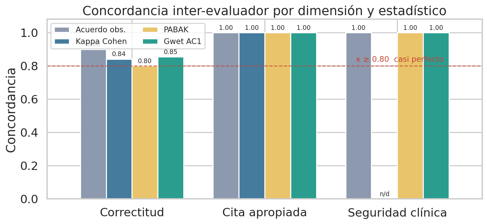
*Figura 6.23. Concordancia inter-evaluador por dimensión y estadístico.*

En conjunto, el módulo LLM/RAG respeta sus límites de seguridad tras el refuerzo, es robusto ante
errores de escritura, mantiene consistencia de fuentes y es clínicamente seguro y mayoritariamente
exacto según el juicio veterinario, con margen de mejora en la adecuación de las citas. Debe
mantenerse con pruebas adversariales recurrentes, validación de salida y monitoreo de
conversaciones, y su validación de exactitud se declara de carácter piloto (2 evaluadores, 30
preguntas; ver limitaciones en el Capítulo VII).

## 6.5. Resultados de rendimiento técnico y pruebas

El benchmark de inferencia midió 1000 solicitudes in-process del motor ML, excluyendo HTTP,
autenticación, base de datos y RAG. La latencia media fue 28.73 ms, con p50 de 27.93 ms y p95 de
33.9 ms. Estos valores indican que la inferencia del modelo no constituye el cuello de botella
principal del sistema; los tiempos de usuario dependerán más de extracción, persistencia, red y
generación conversacional.

| Indicador | Valor |
| :---- | :---- |
| Solicitudes medidas | 1000 |
| Warmup | 50 |
| Latencia mínima | 9.98 ms |
| Latencia media | 28.73 ms |
| p50 | 27.93 ms |
| p95 | 33.9 ms |
| p99 | 137.95 ms |
| Pruebas backend | 25 passed, 114 warnings in 1.45s |

*Tabla 6.13. Resultados de rendimiento de inferencia y pruebas backend.*

El reporte de pruebas backend indicó 25 passed, 114 warnings in 1.45s. Aunque la presencia de
advertencias por deprecación no invalida el resultado, sí representa una recomendación técnica para
mantenimiento futuro, especialmente por el uso de datetime.utcnow en componentes de persistencia.

## 6.6. Resultados del módulo de vigilancia poblacional

El módulo de vigilancia poblacional se evaluó sobre una cohorte de 200 registros en una ventana de
30 días. El estado general fue warn, con 3 señales en pass, 2 señales en warn y 0 señales en fail.
El resultado demuestra que el módulo puede producir señales agregadas, pero evidencia limitaciones
de geocodificación y concentración territorial.

| Señal | Valor | Baseline | Estado | Acción recomendada |
| :---- | :---- | :---- | :---- | :---- |
| no_prediction_rate | 0.000 | 0.000 | pass | Revisar salud de artefactos, disponibilidad de modelo y calidad de parsing del extractor. |
| partial_imputation_rate | 0.000 | 0.000 | pass | Auditar cobertura de campos CBC nucleares por fuente y reforzar normalizacion de ingesta. |
| qc_flag_rate | 0.350 | 0.365 | pass | Escalar revision de laboratorio: aumentar verificaciones de frotis y control pre-analitico. |
| geocoded_rate | 0.000 | — | warn | Mejorar captura de ubicacion para vigilancia geoespacial reproducible. |
| top_location_share | 1.000 | — | warn | Verificar sesgo de muestreo geografico y ampliar cobertura territorial de captura. |

*Tabla 6.14. Señales del reporte de vigilancia poblacional.*

La vigilancia poblacional debe comunicarse como orientación agregada de los registros cargados en
HemoVet, no como prevalencia real, incidencia epidemiológica ni diagnóstico confirmado. La ausencia
de geocodificación efectiva y la concentración de localización desconocida impiden realizar
inferencias territoriales robustas. Por ello, el módulo es funcional como prototipo de monitoreo,
pero requiere mejorar la captura de ubicación, los umbrales de privacidad y la cobertura territorial
antes de utilizarse como herramienta epidemiológica.

## 6.7. Resultados de la validación de usabilidad del prototipo

Se aplicó una encuesta de usabilidad a 44 participantes que usaron el prototipo. El instrumento
constó de 13 afirmaciones en escala Likert de 1 a 5, organizadas según el recorrido del usuario
(pantalla principal, proceso de análisis, resultados y comprensión, y ayuda/utilidad), más tres
preguntas abiertas. La muestra es representativa del público objetivo: el 50 % son dueños de
mascota y el 77 % nunca había visto un hemograma, es decir, usuarios legos.

### 6.7.1. Resultados cuantitativos

La valoración fue consistentemente positiva: media global de 4.37/5, equivalente a un índice de
usabilidad de 84/100 (normalizando la media como `(media−1)/4×100`). El 81.6 % de las respuestas
fueron favorables (4 o 5) y ninguna fue desfavorable (no se registró ningún 1 ni 2 en los 13
ítems).

| Dimensión | Media | % favorable | Índice /100 |
| :---- | ----: | ----: | ----: |
| Pantalla principal y diseño | 4.33 | 82.6 % | 83.3 |
| Proceso de análisis | 4.40 | 82.6 % | 85.0 |
| Resultados y comprensión | 4.45 | 84.1 % | 86.2 |
| Ayuda, confianza y utilidad | 4.27 | 76.5 % | 81.8 |
| Global | 4.37 | 81.6 % | 84.3 |

*Tabla 6.15. Usabilidad percibida por dimensión (n = 44).*

*Figura 6.24. Índice de usabilidad (0–100) por dimensión.*

*Figura 6.25. Media por afirmación (13 ítems, escala 1–5).*

*Figura 6.26. Distribución de respuestas por afirmación (solo se registraron valores 3–5).*

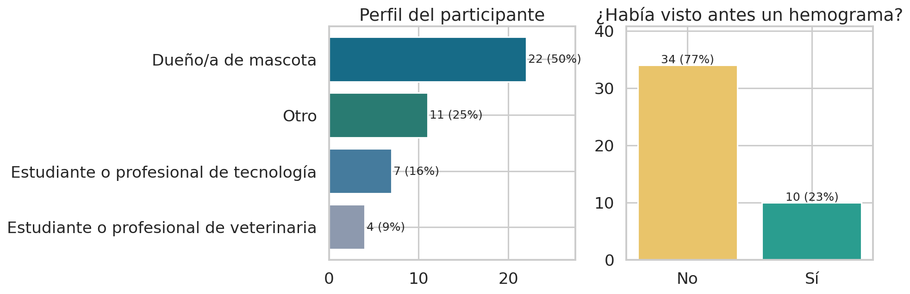
*Figura 6.27. Perfil de los participantes.*

Las afirmaciones mejor valoradas fueron que los resultados son fáciles de entender (4.52), el
lenguaje es claro para una persona no experta (4.45) y que el usuario entendió que debía revisar
los valores antes de confirmar (4.43). Estas cifras respaldan dos decisiones de diseño centrales:
la traducción del hemograma a lenguaje llano y la revisión humana obligatoria.

### 6.7.2. Resultados cualitativos

Los aciertos más citados coinciden con las decisiones de diseño intencionales: el diccionario/
glosario, la guía de 3 pasos, poder corregir los valores mal leídos, el resumen final, los colores
semánticos de los resultados, el aviso de que no reemplaza al veterinario y el modo invitado. Las
confusiones y mejoras solicitadas son concretas y accionables, y varias confirman limitaciones ya
conocidas (velocidad y memoria del chat —latencia en CPU—, dudas sobre si las fuentes del chat son
reales, que la validación veterinaria confirmó reales).

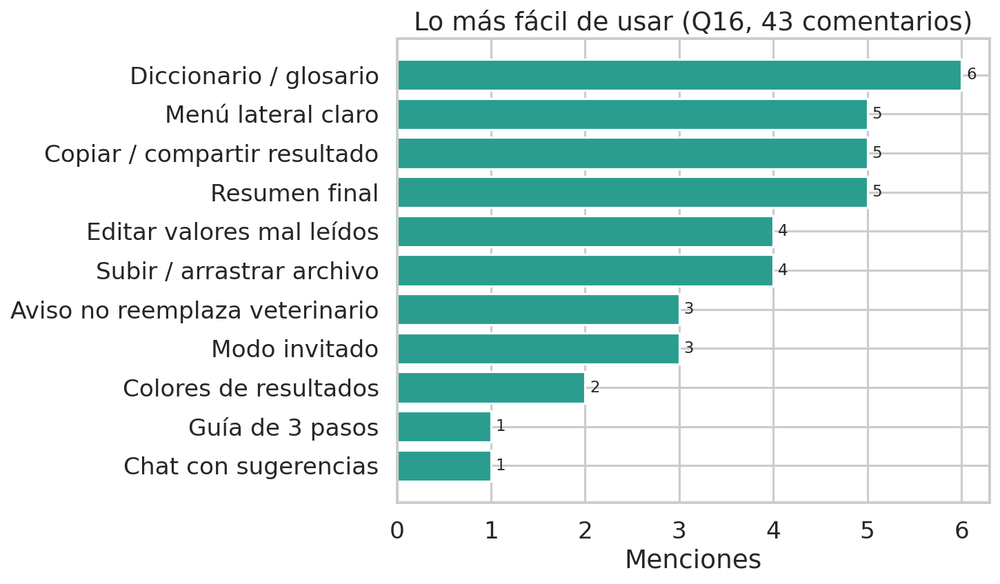
*Figura 6.28. Aspectos mejor valorados por los participantes.*

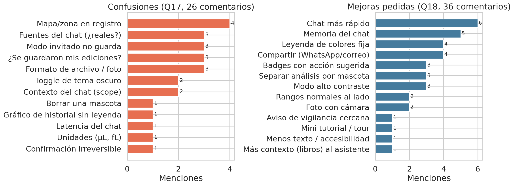
*Figura 6.29. Temas más mencionados en confusiones y mejoras solicitadas.*

Esta validación es de usabilidad percibida, con muestra de conveniencia (n = 44) e instrumento
propio (no un cuestionario SUS estandarizado); no incluye medición cronometrada de tareas ni tasa
de error observada. Las mejoras solicitadas alimentan las recomendaciones del Capítulo VII.

## 6.8. Síntesis crítica de resultados

Los resultados muestran que HemoVet alcanzó un desempeño técnico alto en el conjunto de prueba, con
PR-AUC macro superior a 0.95 y F1 macro superior a 0.87. El comportamiento por etiqueta confirma
fortaleza en patrones inflamatorios, leucograma de estrés, anemia no regenerativa, hemólisis/MCHC y
policitemia, con cautela particular en QC_REQUIERE_FROTIS y PATRON_ANEMIA_REGENERATIVA.

La validación externa DAP no permitió medir desempeño supervisado, pero sí aportó evidencia de
coherencia biológica y de desplazamiento de dominio. La validación clínica fue más exigente: mostró
que el modelo puede aproximarse al criterio veterinario, pero también que la interpretación humana
presenta variabilidad y que algunas etiquetas mantienen desacuerdos relevantes. Por tanto, el
sistema debe mantenerse como herramienta de orientación y control de calidad, no como sistema de
diagnóstico autónomo.

El módulo LLM/RAG, evaluado sobre el pipeline real y por dos médicos veterinarios, demostró ser
clínicamente seguro (30/30 respuestas seguras según ambos evaluadores) y mayoritariamente exacto
(83.3 % correcto o parcial, sin alucinaciones), con margen de mejora en las citas; su seguridad
frente a manipulación mejoró de forma sustancial tras el refuerzo de guardrails. El motor de
inferencia presentó latencia suficientemente baja para uso interactivo. La vigilancia poblacional
quedó funcional como componente exploratorio, pero con limitaciones de localización. Finalmente, la
validación de usabilidad (n = 44) mostró una percepción alta (índice 84/100, sin valoraciones
desfavorables) entre usuarios mayoritariamente legos, con mejoras accionables identificadas.

En conjunto, la evidencia respalda que HemoVet se encuentra listo para demostración y uso controlado
con limitaciones, siempre que se mantenga la advertencia de no sustitución del criterio veterinario y
se continúe la validación clínica y de contenido con nuevos casos y evaluadores.
